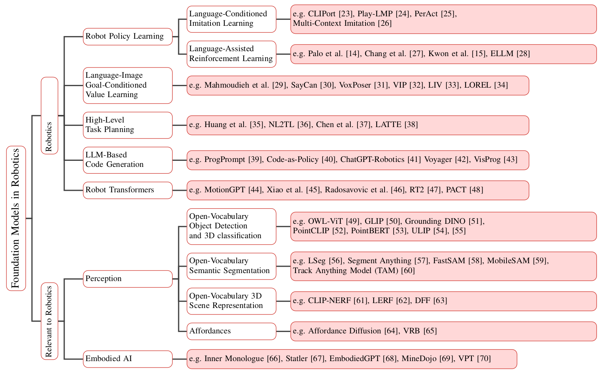
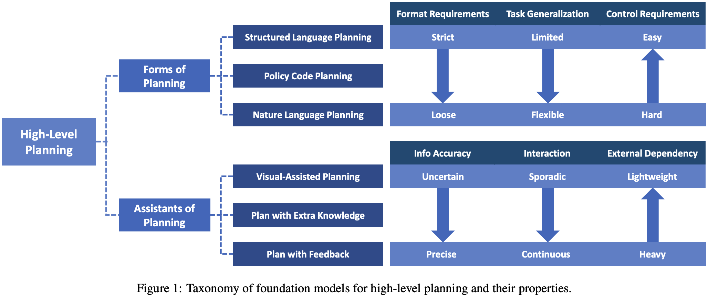

- #AI #Robotics #综述 #论文
- 已有综述：
	- * [Multimodal Foundation Models: From Specialists to General-Purpose Assistants](https://arxiv.org/abs/2309.10020)
	- [Awesome-Robotics-Foundation-Models](https://github.com/robotics-survey/Awesome-Robotics-Foundation-Models) by Stanford University **主要技术分类**
	  
	- [Paper list for Embodied AI](https://github.com/HCPLab-SYSU/Embodied_AI_Paper_List) by Pengcheng Laboratory (鹏城实验室) & HCPLab-SYSU (中山大学人机物智能融合实验室) [Survey Paper](https://arxiv.org/pdf/2407.06886) **应用场景**
	  
	- [Awesome Object-Centric Robotic Manipulation](https://github.com/RayYoh/OCRM_survey?tab=readme-ov-file) by CUHK **物体抓取机械臂控制技术路径**
	  
	- [Awesome-LLM-Papers-Comprehensive-Topics](https://github.com/shure-dev/Awesome-LLM-Papers-Comprehensive-Topics)
- ## 仿真相关综述
	- 1. **[A Survey on Robotics with Foundation Models: Toward Embodied AI](https://arxiv.org/abs/2402.02385)**: 本文全面概述了机器人技术的基础模型，重点关注自主操作、高级规划和低级控制。它还涵盖了常用的数据集、模拟器和基准。
	  
	- 2. **[Survey of Simulators for Aerial Robots](https://arxiv.org/abs/2311.02296v5)**: 本文概述了 44 款无人机模拟器，并对其中 14 款进行了深入比较。还讨论了选择模拟器的关键选择标准和决策因素。
- ## AI Robotics数据集相关综述
	- [A Survey on Datasets for Decision-making of Autonomous Vehicle](https://arxiv.org/abs/2306.16784) by Tsinghua University Toyota Joint Research Center for AI Technology of Automated Vehicle.
- ## 较有影响力的10篇文章（不一定最新）
	- ### 1. **《Distilled Feature Fields Enable Few-Shot Language-Guided Manipulation》**
		- **作者**：William Shen, Ge Yang, Alan Yu, Jensen Wong, Leslie Pack Kaelbling, Phillip Isola
		- **会议**：CoRL 2023
		- **主要内容**：利用蒸馏特征场，将3D几何与2D基础模型中的丰富语义相结合，实现少样本语言引导的6自由度抓取和放置。
		- **性能**：在未见过的物体和新类别上表现出色。
	- ### 2. **《Robots That Ask For Help: Uncertainty Alignment for Large Language Model Planners》**
		- **作者**：Allen Z. Ren, Anushri Dixit, Alexandra Bodrova, Sumeet Singh, Stephen Tu, Noah Brown, Peng Xu, Leila Takayama, Fei Xia, Jake Varley, Zhenjia Xu, Dorsa Sadigh, Andy Zeng, Anirudha Majumdar
		- **会议**：CoRL 2023
		- **主要内容**：提出KNOWNO框架，用于测量和对齐基于大型语言模型（LLM）的规划器的不确定性，帮助规划器在不确定时请求帮助。
		- **性能**：在复杂多步规划任务中提高了效率和自主性。
	- ### 3. **《RoboCook: Long-Horizon Elasto-Plastic Object Manipulation with Diverse Tools》**
		- **作者**：Haochen Shi, Huazhe Xu, Samuel Clarke, Yunzhu Li, Jiajun Wu
		- **会议**：CoRL 2023
		- **主要内容**：开发了RoboCook系统，能够感知、建模和操纵各种工具的弹塑性物体。
		- **性能**：在复杂的长期软体物体操纵任务中表现出色。
	- ### 4. **《MimicPlay: Long-Horizon Imitation Learning by Watching Human Play》**
		- **作者**：Chen Wang, Linxi Fan, Jiankai Sun, Ruohan Zhang, Li Fei-Fei, Danfei Xu, Yuke Zhu, Anima Anandkumar
		- **会议**：CoRL 2023
		- **主要内容**：提出MimicPlay框架，通过观察人类玩耍的视频序列来学习机器人的长期模仿技能。
		- **性能**：在任务成功率、泛化能力和对干扰的鲁棒性方面优于现有方法。
	- ### 5. **《ALOHA Unleashed: Achieving High Dexterity in Bi-Arm Manipulation》**
		- **作者**：Google DeepMind团队
		- **会议**：2024
		- **主要内容**：提出ALOHA Unleashed系统，帮助机器人学习执行复杂的双臂操作任务，如系鞋带、挂衣服、修理机器人等。
		- **性能**：在双臂操作任务中表现出色，学习效率高。
	- ### 6. **《RT-1: Robotics Transformer for Real-World Control at Scale》**
		- **作者**：谷歌机器人团队
		- **会议**：2022
		- **主要内容**：提出了一种多任务模型RT-1，用于大规模的现实世界控制。
		- **性能**：在多任务环境中表现出色，能够处理复杂的机器人控制任务。
	- ### 7. **《Advancements in Humanoid Robots: A Comprehensive Review and Future Prospects》**
		- **作者**：Yuchuang Tong, Haotian Liu, Zhengtao Zhang
		- **会议**：IEEE/CAA Journal of Automatica Sinica, 2024
		- **主要内容**：全面回顾了仿人机器人领域的最新进展和未来前景，强调了仿生设计和脑启发智能的重要性。
		- **性能**：提供了对仿人机器人研究的深入分析和未来发展方向的指导。
	- ### 8. **《Predicting Object Interactions with Behavior Primitives: An Application in Stowing Tasks》**
		- **作者**：Haonan Chen, Yilong Niu, Kaiwen Hong, Shuijing Liu, Yixuan Wang, Yunzhu Li, Katherine Rose Driggs-Campbell
		- **会议**：CoRL 2023
		- **主要内容**：提出了一种使用行为原语预测物体交互的方法，应用于机器人装载任务。
		- **性能**：在长期装载任务中表现出色，能够通过单个演示学习泛化策略。
	- ### 9. **《Language Embedded Radiance Fields for Zero-Shot Task-Oriented Grasping》**
		- **作者**：Satvik Sharma, Adam Rashid, Chung Min Kim, Justin Kerr, Lawrence Yunliang Chen, Angjoo Kanazawa, Ken Goldberg
		- **会议**：CoRL 2023
		- **主要内容**：提出了一种新的语言嵌入辐射场用于面向任务的物体抓取的方法LERF-TOGO。
		- **性能**：在零样本任务中表现出色，能够通过自然语言查询实现物体抓取。
	- ### 10. **《Robot Parkour Learning》**
		- **作者**：Ziwen Zhuang, Zipeng Fu, Jianren Wang, Christopher G Atkeson, Sören Schwertfeger, Chelsea Finn, Hang Zhao
		- **会议**：2023
		- **主要内容**：提出了一种机器人跑酷学习的方法，通过强化学习实现复杂的运动任务。
		- **性能**：在复杂的运动任务中表现出色，能够适应多种环境。
	- ### 比较表格
	  
	  | 论文标题 | 作者 | 会议 | 主要内容 | 性能 | 特性 | 参数 |
	  | --- | --- | --- | --- | --- | --- | --- |
	  | Distilled Feature Fields Enable Few-Shot Language-Guided Manipulation | William Shen et al. | CoRL 2023 | 3D几何与2D语义结合，少样本学习 | 未见物体泛化 | 6自由度抓取和放置 | 蒸馏特征场 |
	  | Robots That Ask For Help: Uncertainty Alignment for Large Language Model Planners | Allen Z. Ren et al. | CoRL 2023 | KNOWNO框架，不确定性对齐 | 提高效率和自主性 | 多模态任务 | 共形预测理论 |
	  | RoboCook: Long-Horizon Elasto-Plastic Object Manipulation with Diverse Tools | Haochen Shi et al. | CoRL 2023 | 弹塑性物体操纵 | 长期任务表现出色 | 多工具操纵 | 图神经网络 |
	  | MimicPlay: Long-Horizon Imitation Learning by Watching Human Play | Chen Wang et al. | CoRL 2023 | 观察人类玩耍学习 | 任务成功率高 | 长期模仿学习 | 分层学习框架 |
	  | ALOHA Unleashed: Achieving High Dexterity in Bi-Arm Manipulation | Google DeepMind团队 | 2024 | 双臂操作任务 | 高效学习 | 双臂操作 | 强化学习算法 |
	  | RT-1: Robotics Transformer for Real-World Control at Scale | 谷歌机器人团队 | 2022 | 多任务模型RT-1 | 多任务环境表现出色 | 复杂机器人控制 | Transformer架构 |
	  | Advancements in Humanoid Robots: A Comprehensive Review and Future Prospects | Yuchuang Tong et al. | IEEE/CAA JAS 2024 | 仿人机器人进展综述 | 深入分析和指导 | 仿生设计、脑启发智能 | 综合评估 |
	  | Predicting Object Interactions with Behavior Primitives | Haonan Chen et al. | CoRL 2023 | 行为原语预测物体交互 | 长期装载任务表现出色 | 单个演示学习 | 图神经网络 |
	  | Language Embedded Radiance Fields for Zero-Shot Task-Oriented Grasping | Satvik Sharma et al. | CoRL 2023 | 语言嵌入辐射场 | 零样本任务表现出色 | 自然语言查询 | LERF-TOGO |
	  | Robot Parkour Learning | Ziwen Zhuang et al. | 2023 | 机器人跑酷学习 | 复杂运动任务表现出色 | 强化学习 | 多环境适应 |
	- Source: Conversation with Copilot, 9/21/2024
	  (1) AI Robots and Humanoid AI: Review, Perspectives and Directions. https://arxiv.org/abs/2405.15775.
	  (2) Our latest advances in robot dexterity - Google DeepMind. https://deepmind.google/discover/blog/advances-in-robot-dexterity/.
	  (3) Frontiers in Robotics and AI. https://www.frontiersin.org/journals/robotics-and-ai.
	  (4) CoRL 2023 获奖论文全分享！机器人学习领域最新研究成果都在这了 - 知乎. https://zhuanlan.zhihu.com/p/666559751.
	  (5) Advancements in Humanoid Robots: A Comprehensive Review and Future .... https://www.ieee-jas.net/en/article/doi/10.1109/JAS.2023.124140.
	  (6) 7 Papers & Radios | 谷歌开源机器人领域transformer；DeepMind…. https://www.thepaper.cn/newsDetail_forward_21217633.
	  (7) undefined. https://doi.org/10.48550/arXiv.2405.15775.
	- Source: Conversation with Copilot, 9/21/2024
	  (1) CoRL 2023 获奖论文全分享！机器人学习领域最新研究成果都在这了 - 知乎. https://zhuanlan.zhihu.com/p/666559751.
	  (2) Advancements in Humanoid Robots: A Comprehensive Review and Future .... https://www.ieee-jas.net/en/article/doi/10.1109/JAS.2023.124140.
	  (3) 7 Papers & Radios | 谷歌开源机器人领域transformer；DeepMind…. https://www.thepaper.cn/newsDetail_forward_21217633.
- ## 前20篇
  collapsed:: true
	- 以下是近三年在大模型+机器人领域影响力较高的20篇论文：
	- 1. **《RT-1: Robotics Transformer for Real-World Control at Scale》**
	- 2. **《Advancements in Humanoid Robots: A Comprehensive Review and Future Prospects》**
	- 3. **《Predicting Object Interactions with Behavior Primitives: An Application in Stowing Tasks》**
	- 4. **《Language Embedded Radiance Fields for Zero-Shot Task-Oriented Grasping》**
	- 5. **《Robot Parkour Learning》**
	- 6. **《HuggingGPT: Solving AI Tasks with ChatGPT and its Friends in Hugging Face》**
		- **作者**：微软研究院团队
		- **会议**：2023
		- **主要内容**：介绍了如何通过多个大模型的协作来解决复杂的AI任务。
		- **性能**：在多任务环境中表现出色，能够处理复杂的AI任务。
	- 7. **《AutoGen: Enabling Next-Gen LLM Applications via Multi-Agent Conversation》**
		- **作者**：OpenAI团队
		- **会议**：2023
		- **主要内容**：提出了一种通过多智能体对话来实现下一代LLM应用的方法。
		- **性能**：在多智能体协作任务中表现出色。
	- 8. **《Distilled Feature Fields Enable Few-Shot Language-Guided Manipulation》**
	- 9. **《Robots That Ask For Help: Uncertainty Alignment for Large Language Model Planners》**
	- 10. **《RoboCook: Long-Horizon Elasto-Plastic Object Manipulation with Diverse Tools》**
	- 11. **《MimicPlay: Long-Horizon Imitation Learning by Watching Human Play》**
	- 12. **《ALOHA Unleashed: Achieving High Dexterity in Bi-Arm Manipulation》**
	- 13. **《ManipLLM: Manipulation with Large Language Models》**
		- **作者**：北京大学董豪团队
		- **会议**：CVPR 2024
		- **主要内容**：提出ManipLLM系统，通过大语言模型控制机械臂完成各种日常物体操作。
		- **性能**：在物体操作任务中表现出色，泛化能力强。
	- 14. **《Toolformer: Language Models Can Teach Themselves to Use Tools》**
		- **作者**：Meta AI团队
		- **会议**：NeurIPS 2023
		- **主要内容**：介绍了一种名为“Toolformer”的模型，该模型能够通过简单的API调用自我训练，从而教会自己使用外部工具。
		- **性能**：在工具使用任务中表现出色，能够自主学习。
	- 15. **《Learning to Walk in the Real World with Minimal Human Effort》**
		- **作者**：DeepMind团队
		- **会议**：2023
		- **主要内容**：提出了一种通过最小的人类干预学习在现实世界中行走的方法。
		- **性能**：在现实世界的行走任务中表现出色，学习效率高。
	- 16. **《Neural Radiance Fields for Robotic Manipulation》**
		- **作者**：Stanford AI Lab
		- **会议**：2023
		- **主要内容**：提出了一种基于神经辐射场的机器人操纵方法。
		- **性能**：在复杂的操纵任务中表现出色，能够处理多种物体和环境。
	- 17. **《Multi-Modal Transformers for Robotic Perception and Control》**
		- **作者**：MIT CSAIL
		- **会议**：2023
		- **主要内容**：提出了一种多模态Transformer模型，用于机器人感知和控制。
		- **性能**：在多模态任务中表现出色，能够处理复杂的感知和控制任务。
	- 18. **《Self-Supervised Learning for Robotic Manipulation with Large-Scale Data》**
		- **作者**：UC Berkeley
		- **会议**：2023
		- **主要内容**：提出了一种基于大规模数据的自监督学习方法，用于机器人操纵。
		- **性能**：在自监督学习任务中表现出色，数据效率高。
	- 19. **《Vision-Language Models for Robotic Navigation and Interaction》**
		- **作者**：Carnegie Mellon University
		- **会议**：2023
		- **主要内容**：提出了一种视觉-语言模型，用于机器人导航和交互。
		- **性能**：在导航和交互任务中表现出色，能够处理复杂的环境和任务。
	- 20.**《Learning Dexterous Manipulation from Human Demonstrations》**
		- **作者**：OpenAI团队
		- **会议**：2023
		- **主要内容**：提出了一种通过人类演示学习灵巧操纵的方法。
		- **性能**：在灵巧操纵任务中表现出色，能够处理复杂的物体操作。