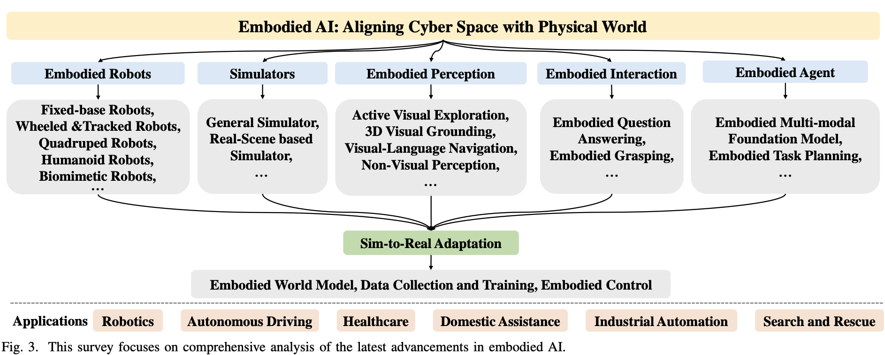

- #AI #Robotics #综述 #论文
- 已有综述：
	- 【优秀survey结构参考：需要对未来的展望/确定方向】 **模型类别分类** [Multimodal Foundation Models: From Specialists to General-Purpose Assistants](https://arxiv.org/abs/2309.10020)
	  
	- **主要技术分类** [Awesome-Robotics-Foundation-Models](https://github.com/robotics-survey/Awesome-Robotics-Foundation-Models) by Stanford University
	  
	- {:height 256, :width 370}{:height 232, :width 378}
	- **应用场景** [Paper list for Embodied AI](https://github.com/HCPLab-SYSU/Embodied_AI_Paper_List) by Pengcheng Laboratory (鹏城实验室) & HCPLab-SYSU (中山大学人机物智能融合实验室) [Survey Paper](https://arxiv.org/pdf/2407.06886)
	  
	- **下游任务分类** [Robot Learning in the Era of Foundation Models: A Survey](https://arxiv.org/pdf/2311.14379) by 同济大学 National Key Laboratory of Autonomous Intelligent Unmanned Systems
	  
	- **物体抓取机械臂控制技术路径分类** [Awesome Object-Centric Robotic Manipulation](https://github.com/RayYoh/OCRM_survey?tab=readme-ov-file) by CUHK
	  
	- [Awesome-LLM-Papers-Comprehensive-Topics](https://github.com/shure-dev/Awesome-LLM-Papers-Comprehensive-Topics)
- ## 仿真相关综述
	- 1. **[A Survey on Robotics with Foundation Models: Toward Embodied AI](https://arxiv.org/abs/2402.02385)**: 本文全面概述了机器人技术的基础模型，重点关注自主操作、高级规划和低级控制。它还涵盖了常用的数据集、模拟器和基准。
	  
	- 2. **[Survey of Simulators for Aerial Robots](https://arxiv.org/abs/2311.02296v5)**: 本文概述了 44 款无人机模拟器，并对其中 14 款进行了深入比较。还讨论了选择模拟器的关键选择标准和决策因素。
- ## AI Robotics数据集相关综述
	- [A Survey on Datasets for Decision-making of Autonomous Vehicle](https://arxiv.org/abs/2306.16784) by Tsinghua University Toyota Joint Research Center for AI Technology of Automated Vehicle.
- ## AI Robotics数据
	- 1. 互联网人类视频数据
		- [ATM](https://xingyu-lin.github.io/atm/), [GVHMR](https://github.com/zju3dv/GVHMR) 通过视频生成动作, [MimicPlay](https://arxiv.org/abs/2302.12422) 视频生成策略（高层次轨迹规划）
	- 2. 合成数据
		- [HumanPlus](https://arxiv.org/abs/2406.10454) 结合机器人仿真数据与人类运动数据, [Eureka & DrEureka](https://arxiv.org/abs/2406.01967) 大语言模型生成奖励函数, [Robot Parkour](https://arxiv.org/abs/2309.05665) 多任务->多教师共同训练学生模型->带视觉深度信息不同动力学约束的强化学习训练，以及技能模型的蒸馏, [RoboGen](https://arxiv.org/abs/2311.01455) 强化学习柔性物体操作任务解决状态空间爆炸问题
	- 3. 动捕数据
		- [UMI](https://arxiv.org/abs/2402.10329), [DexCap](https://arxiv.org/abs/2403.07788), [HumanPlus](https://arxiv.org/abs/2406.10454)
	- 4. 机器人遥操数据
		- [Open-TeleVision](https://arxiv.org/abs/2407.01512), [Mobile ALOHA](https://arxiv.org/abs/2401.02117)
	- 5. 机器人数据组合
		- [HPT](https://arxiv.org/abs/2204.13413)
- ## 较有影响力的10篇文章（不一定最新）
  collapsed:: true
	- ### 1. **《Distilled Feature Fields Enable Few-Shot Language-Guided Manipulation》**
		- **作者**：William Shen, Ge Yang, Alan Yu, Jensen Wong, Leslie Pack Kaelbling, Phillip Isola
		- **会议**：CoRL 2023
		- **主要内容**：利用蒸馏特征场，将3D几何与2D基础模型中的丰富语义相结合，实现少样本语言引导的6自由度抓取和放置。
		- **性能**：在未见过的物体和新类别上表现出色。
	- ### 2. **《Robots That Ask For Help: Uncertainty Alignment for Large Language Model Planners》**
		- **作者**：Allen Z. Ren, Anushri Dixit, Alexandra Bodrova, Sumeet Singh, Stephen Tu, Noah Brown, Peng Xu, Leila Takayama, Fei Xia, Jake Varley, Zhenjia Xu, Dorsa Sadigh, Andy Zeng, Anirudha Majumdar
		- **会议**：CoRL 2023
		- **主要内容**：提出KNOWNO框架，用于测量和对齐基于大型语言模型（LLM）的规划器的不确定性，帮助规划器在不确定时请求帮助。
		- **性能**：在复杂多步规划任务中提高了效率和自主性。
	- ### 3. **《RoboCook: Long-Horizon Elasto-Plastic Object Manipulation with Diverse Tools》**
		- **作者**：Haochen Shi, Huazhe Xu, Samuel Clarke, Yunzhu Li, Jiajun Wu
		- **会议**：CoRL 2023
		- **主要内容**：开发了RoboCook系统，能够感知、建模和操纵各种工具的弹塑性物体。
		- **性能**：在复杂的长期软体物体操纵任务中表现出色。
	- ### 4. **《MimicPlay: Long-Horizon Imitation Learning by Watching Human Play》**
		- **作者**：Chen Wang, Linxi Fan, Jiankai Sun, Ruohan Zhang, Li Fei-Fei, Danfei Xu, Yuke Zhu, Anima Anandkumar
		- **会议**：CoRL 2023
		- **主要内容**：提出MimicPlay框架，通过观察人类玩耍的视频序列来学习机器人的长期模仿技能。
		- **性能**：在任务成功率、泛化能力和对干扰的鲁棒性方面优于现有方法。
	- ### 5. **《ALOHA Unleashed: Achieving High Dexterity in Bi-Arm Manipulation》**
		- **作者**：Google DeepMind团队
		- **会议**：2024
		- **主要内容**：提出ALOHA Unleashed系统，帮助机器人学习执行复杂的双臂操作任务，如系鞋带、挂衣服、修理机器人等。
		- **性能**：在双臂操作任务中表现出色，学习效率高。
	- ### 6. **《RT-1: Robotics Transformer for Real-World Control at Scale》**
		- **作者**：谷歌机器人团队
		- **会议**：2022
		- **主要内容**：提出了一种多任务模型RT-1，用于大规模的现实世界控制。
		- **性能**：在多任务环境中表现出色，能够处理复杂的机器人控制任务。
	- ### 7. **《Advancements in Humanoid Robots: A Comprehensive Review and Future Prospects》**
		- **作者**：Yuchuang Tong, Haotian Liu, Zhengtao Zhang
		- **会议**：IEEE/CAA Journal of Automatica Sinica, 2024
		- **主要内容**：全面回顾了仿人机器人领域的最新进展和未来前景，强调了仿生设计和脑启发智能的重要性。
		- **性能**：提供了对仿人机器人研究的深入分析和未来发展方向的指导。
	- ### 8. **《Predicting Object Interactions with Behavior Primitives: An Application in Stowing Tasks》**
		- **作者**：Haonan Chen, Yilong Niu, Kaiwen Hong, Shuijing Liu, Yixuan Wang, Yunzhu Li, Katherine Rose Driggs-Campbell
		- **会议**：CoRL 2023
		- **主要内容**：提出了一种使用行为原语预测物体交互的方法，应用于机器人装载任务。
		- **性能**：在长期装载任务中表现出色，能够通过单个演示学习泛化策略。
	- ### 9. **《Language Embedded Radiance Fields for Zero-Shot Task-Oriented Grasping》**
		- **作者**：Satvik Sharma, Adam Rashid, Chung Min Kim, Justin Kerr, Lawrence Yunliang Chen, Angjoo Kanazawa, Ken Goldberg
		- **会议**：CoRL 2023
		- **主要内容**：提出了一种新的语言嵌入辐射场用于面向任务的物体抓取的方法LERF-TOGO。
		- **性能**：在零样本任务中表现出色，能够通过自然语言查询实现物体抓取。
	- ### 10. **《Robot Parkour Learning》**
		- **作者**：Ziwen Zhuang, Zipeng Fu, Jianren Wang, Christopher G Atkeson, Sören Schwertfeger, Chelsea Finn, Hang Zhao
		- **会议**：2023
		- **主要内容**：提出了一种机器人跑酷学习的方法，通过强化学习实现复杂的运动任务。
		- **性能**：在复杂的运动任务中表现出色，能够适应多种环境。
	- ### 比较表格
	  
	  | 论文标题 | 作者 | 会议 | 主要内容 | 性能 | 特性 | 参数 |
	  | --- | --- | --- | --- | --- | --- | --- |
	  | Distilled Feature Fields Enable Few-Shot Language-Guided Manipulation | William Shen et al. | CoRL 2023 | 3D几何与2D语义结合，少样本学习 | 未见物体泛化 | 6自由度抓取和放置 | 蒸馏特征场 |
	  | Robots That Ask For Help: Uncertainty Alignment for Large Language Model Planners | Allen Z. Ren et al. | CoRL 2023 | KNOWNO框架，不确定性对齐 | 提高效率和自主性 | 多模态任务 | 共形预测理论 |
	  | RoboCook: Long-Horizon Elasto-Plastic Object Manipulation with Diverse Tools | Haochen Shi et al. | CoRL 2023 | 弹塑性物体操纵 | 长期任务表现出色 | 多工具操纵 | 图神经网络 |
	  | MimicPlay: Long-Horizon Imitation Learning by Watching Human Play | Chen Wang et al. | CoRL 2023 | 观察人类玩耍学习 | 任务成功率高 | 长期模仿学习 | 分层学习框架 |
	  | ALOHA Unleashed: Achieving High Dexterity in Bi-Arm Manipulation | Google DeepMind团队 | 2024 | 双臂操作任务 | 高效学习 | 双臂操作 | 强化学习算法 |
	  | RT-1: Robotics Transformer for Real-World Control at Scale | 谷歌机器人团队 | 2022 | 多任务模型RT-1 | 多任务环境表现出色 | 复杂机器人控制 | Transformer架构 |
	  | Advancements in Humanoid Robots: A Comprehensive Review and Future Prospects | Yuchuang Tong et al. | IEEE/CAA JAS 2024 | 仿人机器人进展综述 | 深入分析和指导 | 仿生设计、脑启发智能 | 综合评估 |
	  | Predicting Object Interactions with Behavior Primitives | Haonan Chen et al. | CoRL 2023 | 行为原语预测物体交互 | 长期装载任务表现出色 | 单个演示学习 | 图神经网络 |
	  | Language Embedded Radiance Fields for Zero-Shot Task-Oriented Grasping | Satvik Sharma et al. | CoRL 2023 | 语言嵌入辐射场 | 零样本任务表现出色 | 自然语言查询 | LERF-TOGO |
	  | Robot Parkour Learning | Ziwen Zhuang et al. | 2023 | 机器人跑酷学习 | 复杂运动任务表现出色 | 强化学习 | 多环境适应 |
	- Source: Conversation with Copilot, 9/21/2024
	  (1) AI Robots and Humanoid AI: Review, Perspectives and Directions. https://arxiv.org/abs/2405.15775.
	  (2) Our latest advances in robot dexterity - Google DeepMind. https://deepmind.google/discover/blog/advances-in-robot-dexterity/.
	  (3) Frontiers in Robotics and AI. https://www.frontiersin.org/journals/robotics-and-ai.
	  (4) CoRL 2023 获奖论文全分享！机器人学习领域最新研究成果都在这了 - 知乎. https://zhuanlan.zhihu.com/p/666559751.
	  (5) Advancements in Humanoid Robots: A Comprehensive Review and Future .... https://www.ieee-jas.net/en/article/doi/10.1109/JAS.2023.124140.
	  (6) 7 Papers & Radios | 谷歌开源机器人领域transformer；DeepMind…. https://www.thepaper.cn/newsDetail_forward_21217633.
	  (7) undefined. https://doi.org/10.48550/arXiv.2405.15775.
	- Source: Conversation with Copilot, 9/21/2024
	  (1) CoRL 2023 获奖论文全分享！机器人学习领域最新研究成果都在这了 - 知乎. https://zhuanlan.zhihu.com/p/666559751.
	  (2) Advancements in Humanoid Robots: A Comprehensive Review and Future .... https://www.ieee-jas.net/en/article/doi/10.1109/JAS.2023.124140.
	  (3) 7 Papers & Radios | 谷歌开源机器人领域transformer；DeepMind…. https://www.thepaper.cn/newsDetail_forward_21217633.
- ## 前20篇
  collapsed:: true
	- 以下是近三年在大模型+机器人领域影响力较高的20篇论文：
	- 1. **《RT-1: Robotics Transformer for Real-World Control at Scale》**
	- 2. **《Advancements in Humanoid Robots: A Comprehensive Review and Future Prospects》**
	- 3. **《Predicting Object Interactions with Behavior Primitives: An Application in Stowing Tasks》**
	- 4. **《Language Embedded Radiance Fields for Zero-Shot Task-Oriented Grasping》**
	- 5. **《Robot Parkour Learning》**
	- 6. **《HuggingGPT: Solving AI Tasks with ChatGPT and its Friends in Hugging Face》**
		- **作者**：微软研究院团队
		- **会议**：2023
		- **主要内容**：介绍了如何通过多个大模型的协作来解决复杂的AI任务。
		- **性能**：在多任务环境中表现出色，能够处理复杂的AI任务。
	- 7. **《AutoGen: Enabling Next-Gen LLM Applications via Multi-Agent Conversation》**
		- **作者**：OpenAI团队
		- **会议**：2023
		- **主要内容**：提出了一种通过多智能体对话来实现下一代LLM应用的方法。
		- **性能**：在多智能体协作任务中表现出色。
	- 8. **《Distilled Feature Fields Enable Few-Shot Language-Guided Manipulation》**
	- 9. **《Robots That Ask For Help: Uncertainty Alignment for Large Language Model Planners》**
	- 10. **《RoboCook: Long-Horizon Elasto-Plastic Object Manipulation with Diverse Tools》**
	- 11. **《MimicPlay: Long-Horizon Imitation Learning by Watching Human Play》**
	- 12. **《ALOHA Unleashed: Achieving High Dexterity in Bi-Arm Manipulation》**
	- 13. **《ManipLLM: Manipulation with Large Language Models》**
		- **作者**：北京大学董豪团队
		- **会议**：CVPR 2024
		- **主要内容**：提出ManipLLM系统，通过大语言模型控制机械臂完成各种日常物体操作。
		- **性能**：在物体操作任务中表现出色，泛化能力强。
	- 14. **《Toolformer: Language Models Can Teach Themselves to Use Tools》**
		- **作者**：Meta AI团队
		- **会议**：NeurIPS 2023
		- **主要内容**：介绍了一种名为“Toolformer”的模型，该模型能够通过简单的API调用自我训练，从而教会自己使用外部工具。
		- **性能**：在工具使用任务中表现出色，能够自主学习。
	- 15. **《Learning to Walk in the Real World with Minimal Human Effort》**
		- **作者**：DeepMind团队
		- **会议**：2023
		- **主要内容**：提出了一种通过最小的人类干预学习在现实世界中行走的方法。
		- **性能**：在现实世界的行走任务中表现出色，学习效率高。
	- 16. **《Neural Radiance Fields for Robotic Manipulation》**
		- **作者**：Stanford AI Lab
		- **会议**：2023
		- **主要内容**：提出了一种基于神经辐射场的机器人操纵方法。
		- **性能**：在复杂的操纵任务中表现出色，能够处理多种物体和环境。
	- 17. **《Multi-Modal Transformers for Robotic Perception and Control》**
		- **作者**：MIT CSAIL
		- **会议**：2023
		- **主要内容**：提出了一种多模态Transformer模型，用于机器人感知和控制。
		- **性能**：在多模态任务中表现出色，能够处理复杂的感知和控制任务。
	- 18. **《Self-Supervised Learning for Robotic Manipulation with Large-Scale Data》**
		- **作者**：UC Berkeley
		- **会议**：2023
		- **主要内容**：提出了一种基于大规模数据的自监督学习方法，用于机器人操纵。
		- **性能**：在自监督学习任务中表现出色，数据效率高。
	- 19. **《Vision-Language Models for Robotic Navigation and Interaction》**
		- **作者**：Carnegie Mellon University
		- **会议**：2023
		- **主要内容**：提出了一种视觉-语言模型，用于机器人导航和交互。
		- **性能**：在导航和交互任务中表现出色，能够处理复杂的环境和任务。
	- 20.**《Learning Dexterous Manipulation from Human Demonstrations》**
		- **作者**：OpenAI团队
		- **会议**：2023
		- **主要内容**：提出了一种通过人类演示学习灵巧操纵的方法。
		- **性能**：在灵巧操纵任务中表现出色，能够处理复杂的物体操作。
- ## **Robotics**
	- ### **Neural Scaling Laws**
		- * Neural Scaling Laws for Embodied AI: Neural Scaling Laws for Embodied AI [Paper](https://arxiv.org/abs/2405.14005)
	- ### **Robot Policy Learning for Decision-Making and Controls**
		- #### **Language-Conditioned Imitation Learning**
			- * CLIPort: What and Where Pathways for Robotic Manipulation [Paper](https://arxiv.org/abs/2109.12098)[Project](https://cliport.github.io/)[Code](https://github.com/cliport/cliport)
			  
			  * Perceiver-Actor: A Multi-Task Transformer for Robotic Manipulation [Paper](https://arxiv.org/abs/2209.05451)[Project](https://peract.github.io/)[Code](https://github.com/peract/peract)
			  
			  * Play-LMP: Learning Latent Plans from Play [Project](https://learning-from-play.github.io/)
			  
			  * Multi-Context Imitation: Language-Conditioned Imitation Learning over Unstructured Data [Project](https://language-play.github.io)
		- #### **Language-Assisted Reinforcement Learning**
			- * Towards A Unified Agent with Foundation Models [Paper](https://arxiv.org/abs/2307.09668)
			  
			  * Reward Design with Language Models [Paper](https://arxiv.org/abs/2303.00001)
			  
			  * Learning to generate better than your llm [Paper](https://arxiv.org/pdf/2306.11816.pdf)[Code](https://github.com/Cornell-RL/tril)
			  
			  * Guiding Pretraining in Reinforcement Learning with Large Language Models [Paper](https://arxiv.org/abs/2302.06692)[Code](https://github.com/yuqingd/ellm)
			  
			  * Motif: Intrinsic Motivation from Artificial Intelligence Feedback [Paper](https://arxiv.org/abs/2310.00166)[Code](https://github.com/facebookresearch/motif)
	- ### **Language-Image Goal-Conditioned Value Learning**
		- * SayCan: Do As I Can, Not As I Say: Grounding Language in Robotic Affordances [Paper](https://arxiv.org/abs/2204.01691)[Project](https://say-can.github.io/)[Code](https://github.com/google-research/google-research/tree/master/saycan)
		  
		  * Zero-Shot Reward Specification via Grounded Natural Language [Paper](https://proceedings.mlr.press/v162/mahmoudieh22a/mahmoudieh22a.pdf)
		  
		  * VoxPoser: Composable 3D Value Maps for Robotic Manipulation with Language Models [Project](https://voxposer.github.io)
		  
		  * VIP: Towards Universal Visual Reward and Representation via Value-Implicit Pre-Training [Paper](https://arxiv.org/abs/2210.00030)[Project](https://sites.google.com/view/vip-rl)
		  
		  * LIV: Language-Image Representations and Rewards for Robotic Control [Paper](https://arxiv.org/abs/2306.00958)[Project](https://penn-pal-lab.github.io/LIV/)
		  
		  * LOReL: Learning Language-Conditioned Robot Behavior from Offline Data and Crowd-Sourced Annotation [Paper](https://arxiv.org/abs/2109.01115)[Project](https://sites.google.com/view/robotlorel)
		  
		  * Text2Motion: From Natural Language Instructions to Feasible Plans [Paper](https://arxiv.org/abs/2303.12153)[Project](https://sites.google.com/stanford.edu/text2motion)
		  
		  * MineDreamer: Learning to Follow Instructions via Chain-of-Imagination for Simulated-World Control [Paper](https://arxiv.org/pdf/2403.12037.pdf)[Project](https://sites.google.com/view/minedreamer/main)[Code](https://github.com/Zhoues/MineDreamer)
	- ### **Robot Task Planning Using Large Language Models**
		- * Language Models as Zero-Shot Planners: Extracting Actionable Knowledge for Embodied Agents [Paper](https://arxiv.org/abs/2201.07207)[Project](https://wenlong.page/language-planner/)
		  
		  * Open-vocabulary Queryable Scene Representations for Real World Planning (NLMap) [Paper](https://arxiv.org/pdf/2209.09874.pdf)[Project](https://nlmap-saycan.github.io/)
		  
		  * NL2TL: Transforming Natural Languages to Temporal Logics using Large Language Models [Paper](https://arxiv.org/pdf/2305.07766.pdf)[Project](https://yongchao98.github.io/MIT-realm-NL2TL/)[Code](https://github.com/yongchao98/NL2TL)
		  
		  * AutoTAMP: Autoregressive Task and Motion Planning with LLMs as Translators and Checkers[Paper](https://arxiv.org/abs/2306.06531)[Project](https://yongchao98.github.io/MIT-REALM-AutoTAMP/)
		  
		  * LATTE: LAnguage Trajectory TransformEr [Paper](https://arxiv.org/abs/2208.02918)[Code](https://github.com/arthurfenderbucker/LaTTe-Language-Trajectory-TransformEr)
		  
		  * Planning with Large Language Models via Corrective Re-prompting [Paper](https://arxiv.org/abs/2211.09935)
		  
		  * Describe, explain, plan and select: interactive planning with LLMs enables open-world multi-task agents [Paper](https://arxiv.org/pdf/2302.01560.pdf)[Code](https://github.com/CraftJarvis/MC-Planner)
		  
		  * JARVIS-1: Open-World Multi-task Agents with Memory-Augmented Multimodal Language Models [Paper](https://arxiv.org/pdf/2311.05997.pdf)[Project](https://craftjarvis.github.io/JARVIS-1/)[Code](https://github.com/CraftJarvis/JARVIS-1)
		  
		  * An Embodied Generalist Agent in 3D World [Paper](https://arxiv.org/pdf/2311.12871.pdf)[Project](https://embodied-generalist.github.io/)[Code](https://github.com/embodied-generalist/embodied-generalist)
		  
		  * LLM+P: Empowering Large Language Models with Optimal Planning Proficiency [Paper](https://arxiv.org/pdf/2304.11477.pdf)[Code](https://github.com/Cranial-XIX/llm-pddl)
		  
		  * MP5: A Multi-modal Open-ended Embodied System in Minecraft via Active Perception [Paper](https://arxiv.org/pdf/2312.07472.pdf)[Project](https://iranqin.github.io/MP5.github.io/)[Code](https://github.com/IranQin/MP5)
	- ### **LLM-Based Code Generation**
		- * ProgPrompt: Generating Situated Robot Task Plans using Large Language Models [Paper](https://arxiv.org/abs/2209.11302)[Project](https://progprompt.github.io/)
		  
		  * Code as Policies: Language Model Programs for Embodied Control [Paper](https://arxiv.org/abs/2209.07753)[Project](https://code-as-policies.github.io/)
		  
		  * ChatGPT for Robotics: Design Principles and Model Abilities [Paper](https://arxiv.org/abs/2306.17582)[Project](https://www.microsoft.com/en-us/research/group/autonomous-systems-group-robotics/articles/chatgpt-for-robotics/)[Code](https://github.com/microsoft/PromptCraft-Robotics)
		  
		  * Voyager: An Open-Ended Embodied Agent with Large Language Models [Paper](https://arxiv.org/abs/2305.16291)[Project](https://voyager.minedojo.org/)
		  
		  * Visual Programming: Compositional visual reasoning without training [Paper](https://arxiv.org/abs/2211.11559)[Project](https://prior.allenai.org/projects/visprog)[Code](https://github.com/allenai/visprog)
		  
		  * Deploying and Evaluating LLMs to Program Service Mobile Robots [Paper](https://arxiv.org/abs/2311.11183)[Project](https://amrl.cs.utexas.edu/codebotler/)[Code](https://github.com/ut-amrl/codebotler)
	- ### **Robot Transformers**
		- * MotionGPT: Finetuned LLMs are General-Purpose Motion Generators [Paper](https://arxiv.org/abs/2306.10900)[Project](https://qiqiapink.github.io/MotionGPT/)
		- RT Series
			- * RT-1: Robotics Transformer for Real-World Control at Scale [Paper](https://robotics-transformer.github.io/assets/rt1.pdf) [Project](https://robotics-transformer.github.io/) [Code](https://github.com/google-research/robotics_transformer)
			- * Rt-2: Vision-language-action models transfer web knowledge to robotic control [Paper](https://arxiv.org/abs/2307.15818) [Project](https://robotics-transformer2.github.io/)
			- Open X-Embodiment: Robotic Learning Datasets and RT-X Models [Paper](https://arxiv.org/pdf/2310.08864)
		- * Masked Visual Pre-training for Motor Control [Paper](https://arxiv.org/abs/2203.06173) [Project](https://tetexiao.com/projects/mvp) [Code](https://github.com/ir413/mvp)
		- * Real-world robot learning with masked visual pre-training [Paper](https://arxiv.org/abs/2210.03109) [Project](https://tetexiao.com/projects/real-mvp)
		- * R3M: A Universal Visual Representation for Robot Manipulation [Paper](https://arxiv.org/abs/2203.12601) [Project](https://sites.google.com/view/robot-r3m/) [Code](https://github.com/facebookresearch/r3m)
		- * Robot Learning with Sensorimotor Pre-training [Paper](https://arxiv.org/abs/2306.10007) [Project](https://robotic-pretrained-transformer.github.io/)
		- * PACT: Perception-Action Causal Transformer for Autoregressive Robotics Pre-Training [Paper](https://arxiv.org/abs/2209.11133)
		- * GROOT: Learning to Follow Instructions by Watching Gameplay Videos [Paper](https://arxiv.org/pdf/2310.08235.pdf) [Project](https://craftjarvis.github.io/GROOT/) [Code](https://github.com/CraftJarvis/GROOT)
		- * Behavior Transformers (BeT): Cloning k modes with one stone [Paper](https://arxiv.org/abs/2206.11251) [Project](https://mahis.life/bet/) [Code](https://github.com/notmahi/bet)
		- * Conditional Behavior Transformers (C-BeT), From Play to Policy: Conditional Behavior Generation from Uncurated Robot Data [Paper](https://arxiv.org/abs/2210.10047) [Project](https://play-to-policy.github.io/) [Code](https://github.com/jeffacce/play-to-policy)
		- * MAGICVFM: Meta-learning Adaptation for Ground Interaction Control with Visual Foundation Models [Paper](https://arxiv.org/abs/2407.12304)
	- ### **In-context Learning for Decision-Making**
		- * A Survey on In-context Learning [Paper](https://arxiv.org/abs/2301.00234)
		  
		  * Large Language Models as General Pattern Machines [Paper](https://arxiv.org/abs/2307.04721)
		  
		  * Chain-of-Thought Predictive Control [Paper](https://arxiv.org/abs/2304.00776)
		  
		  * ReAct: Synergizing Reasoning and Acting in Language Models [Paper](https://arxiv.org/abs/2210.03629)
		  
		  * ICRT: In-Context Imitation Learning via Next-Token Prediction [Paper](https://arxiv.org/abs/2408.15980) [Project](https://icrt.dev/) [Code](https://github.com/Max-Fu/icrt)
	- ### **Open-Vocabulary Robot Navigation and Manipulation**
		- * CoWs on PASTURE: Baselines and Benchmarks for Language-Driven Zero-Shot Object Navigation [Paper](https://arxiv.org/pdf/2203.10421.pdf) [Project](https://cow.cs.columbia.edu/)[Code]()
		  
		  * Open-vocabulary Queryable Scene Representations for Real World Planning (NLMap) [Paper](https://arxiv.org/pdf/2209.09874.pdf) [Project](https://nlmap-saycan.github.io/)
		  
		  * LSC: Language-guided Skill Coordination for Open-Vocabulary Mobile Pick-and-Place [Paper]() [Project](https://languageguidedskillcoordination.github.io/)
		  
		  * L3MVN: Leveraging Large Language Models for Visual Target Navigation [Project](https://arxiv.org/abs/2304.05501)
		  
		  * Open-World Object Manipulation using Pre-trained Vision-Language Models [Paper](https://robot-moo.github.io/assets/moo.pdf)[Project](https://robot-moo.github.io/)
		  
		  * VIMA: General Robot Manipulation with Multimodal Prompts [Paper](https://arxiv.org/abs/2210.03094)[Project](https://vimalabs.github.io/)[Code](https://github.com/vimalabs/VIMA)
		  
		  * Diffusion-based Generation, Optimization, and Planning in 3D Scenes [Paper](https://arxiv.org/pdf/2301.06015.pdf)[Project](https://scenediffuser.github.io/)[Code](https://github.com/scenediffuser/Scene-Diffuser)
		  
		  * LOTUS: Continual Imitation Learning for Robot Manipulation Through Unsupervised Skill Discovery [Paper](http://arxiv.org/abs/2311.02058) [Project](https://ut-austin-rpl.github.io/Lotus/)
		  
		  * Imitating Shortest Paths in Simulation Enables Effective Navigation and Manipulation in the Real World [Paper](https://arxiv.org/abs/2312.02976) [Project](https://spoc-robot.github.io/)
		  
		  * ThinkBot: Embodied Instruction Following with Thought Chain Reasoning [Paper](https://arxiv.org/abs/2312.07062) [Project](https://guanxinglu.github.io/thinkbot/)
		  
		  * CLIP-Fields: Weakly Supervised Semantic Fields for Robotic Memory [Paper](https://arxiv.org/abs/2210.05663) [Project](https://mahis.life/clip-fields) [Code](https://github.com/notmahi/clip-fields)
		  
		  * USA-Net: Unified Semantic and Affordance Representations for Robot Memory [Paper](https://arxiv.org/abs/2304.12164) [Project](https://usa.bolte.cc/) [Code](https://github.com/codekansas/usa)
- ## **Relevant to Robotics (Perception)**
	- ### **Open-Vocabulary Object Detection and 3D Classification**
		- * Simple Open-Vocabulary Object Detection with Vision Transformers [Paper](https://arxiv.org/pdf/2205.06230.pdf)[Code](https://github.com/google-research/scenic/tree/main/scenic/projects/owl_vit)
		  
		  *  Grounded Language-Image Pre-training [Paper](https://openaccess.thecvf.com/content/CVPR2022/papers/Li_Grounded_Language-Image_Pre-Training_CVPR_2022_paper.pdf)[Code](https://github.com/microsoft/GLIP)
		  
		  *  Grounding DINO: Marrying DINO with Grounded Pre-Training for Open-Set Object Detection [Paper](https://arxiv.org/abs/2303.05499)[Code](https://github.com/IDEA-Research/GroundingDINO)
		  
		  *  PointCLIP: Point Cloud Understanding by CLIP [Paper](https://openaccess.thecvf.com/content/CVPR2022/papers/Zhang_PointCLIP_Point_Cloud_Understanding_by_CLIP_CVPR_2022_paper.pdf)[Code](https://github.com/ZrrSkywalker/PointCLIP)
		  
		  *  Point-bert: Pre-training 3d point cloud transformers with masked point modeling [Paper](https://arxiv.org/abs/2111.14819)[Code](https://github.com/lulutang0608/Point-BERT)
		  
		  *  ULIP: Learning a Unified Representation of Language, Images, and Point Clouds for 3D Understanding [Paper](https://arxiv.org/abs/2212.05171)[Project](https://tycho-xue.github.io/ULIP/)[Code](https://github.com/salesforce/ULIP)
		  
		  *  Ulip-2: Towards scalable multimodal pre-training for 3d understanding [Paper](https://arxiv.org/pdf/2305.08275.pdf)[Code](https://github.com/salesforce/ULIP)
		  
		  *  3D-VisTA: Pre-trained Transformer for 3D Vision and Text Alignment [Paper](https://arxiv.org/pdf/2308.04352.pdf)[Project](https://3d-vista.github.io/)[Code](https://github.com/3d-vista/3D-VisTA)
	- ### **Open-Vocabulary Semantic Segmentation**
		- * Language-driven Semantic Segmentation [Paper](https://arxiv.org/abs/2201.03546)[Code](https://github.com/isl-org/lang-seg)
		  
		  * Emerging Properties in Self-Supervised Vision Transformers [Paper](https://arxiv.org/abs/2104.14294)[Code](https://github.com/facebookresearch/dino)
		  
		  * Segment Anything [Paper](https://arxiv.org/abs/2304.02643)[Project](https://segment-anything.com/)
		  
		  * Fast segment anything [Paper](https://arxiv.org/abs/2306.12156)[Code](https://github.com/CASIA-IVA-Lab/FastSAM)
		  
		  * Faster Segment Anything: Towards Lightweight SAM for Mobile Applications [Paper](https://arxiv.org/abs/2306.14289)[Code](https://github.com/ChaoningZhang/MobileSAM)
		  
		  * Track anything: Segment anything meets videos [Paper](https://arxiv.org/abs/2304.11968)[Code](https://github.com/gaomingqi/Track-Anything)
	- ### **Open-Vocabulary 3D Scene Representations**
		- * Open-vocabulary Queryable Scene Representations for Real World Planning (NLMap) [Paper](https://arxiv.org/pdf/2209.09874.pdf)[Project](https://nlmap-saycan.github.io/)
		  
		  * Clip-NeRF: Text-and-image driven manipulation of neural radiance fields [Paper](https://arxiv.org/abs/2112.05139)[Project](https://cassiepython.github.io/clipnerf/)
		  
		  * CLIP-Fields: Weakly Supervised Semantic Fields for Robotic Memory [Paper](https://arxiv.org/abs/2210.05663) [Project](https://mahis.life/clip-fields) [Code](https://github.com/notmahi/clip-fields)
		  
		  * LERF: Language Embedded Radiance Fields [Paper](https://arxiv.org/abs/2303.09553)[Project](https://www.lerf.io/)[Code](https://github.com/kerrj/lerf)
		  
		  * Decomposing nerf for editing via feature field distillation [Paper](https://arxiv.org/abs/2205.15585)[Project](https://pfnet-research.github.io/distilled-feature-fields)
	- ### **Object Representations**
		- * FoundationPose: Unified 6D Pose Estimation and Tracking of Novel Objects [Paper](https://arxiv.org/abs/2312.08344)[Project](https://nvlabs.github.io/FoundationPose/)
		  
		  * BundleSDF: Neural 6-DoF Tracking and 3D Reconstruction of Unknown Objects [Paper](https://arxiv.org/abs/2303.14158)[Project](https://bundlesdf.github.io//)
		  
		  * Neural Descriptor Fields: SE(3)-Equivariant Object Representations for Manipulation [Paper](https://arxiv.org/abs/2112.05124)[Project](https://yilundu.github.io/ndf/)
		  
		  * Distilled Feature Fields Enable Few-Shot Language-Guided Manipulation [Paper](https://arxiv.org/abs/2308.07931)[Project](https://f3rm.github.io/)
		  
		  * You Only Look at One: Category-Level Object Representations for Pose Estimation From a Single Example [Paper](https://arxiv.org/abs/2305.12626)
		  
		  * Zero-Shot Category-Level Object Pose Estimation [Paper](https://arxiv.org/abs/2204.03635)[Code](https://github.com/applied-ai-lab/zero-shot-pose)
		  
		  * VIOLA: Imitation Learning for Vision-Based Manipulation with Object Proposal Priors [Paper](https://arxiv.org/abs/2210.11339)[Project](https://ut-austin-rpl.github.io/VIOLA/)[Code](https://github.com/UT-Austin-RPL/VIOLA)
		  
		  * Learning Generalizable Manipulation Policies with Object-Centric 3D Representations [Paper](http://arxiv.org/abs/2310.14386)[Project](https://ut-austin-rpl.github.io/GROOT/)[Code](https://github.com/UT-Austin-RPL/GROOT)
	- ### **Affordance Information**
		- * Affordance Diffusion: Synthesizing Hand-Object Interactions [Paper](https://arxiv.org/abs/2303.12538)[Project](https://judyye.github.io/affordiffusion-www/)
		  
		  * Affordances from Human Videos as a Versatile Representation for Robotics [Paper](https://arxiv.org/abs/2304.08488)[Project](https://robo-affordances.github.io/)
	- ### **Predictive Models**
		- * Adversarial Inverse Reinforcement Learning With Self-Attention Dynamics Model [Paper](https://ieeexplore.ieee.org/document/9361118)
		  
		  * Connected Autonomous Vehicle Motion Planning with Video Predictions from Smart, Self-Supervised Infrastructure [Paper](https://arxiv.org/pdf/2309.07504.pdf)
		  
		  * Self-Supervised Traffic Advisors: Distributed, Multi-view Traffic Prediction for Smart Cities [Paper](https://arxiv.org/abs/2204.06171)
		  
		  * Planning with diffusion for flexible behavior synthesis [Paper](https://arxiv.org/abs/2205.09991)
		  
		  * Phenaki: Variable-length video generation from open domain textual description [Paper](https://arxiv.org/abs/2210.02399)
		  
		  * Robonet: Large-scale multi-robot learning [Paper](https://arxiv.org/abs/1910.11215)
		  
		  * GAIA-1: A Generative World Model for Autonomous Driving [Paper](https://arxiv.org/abs/2309.17080)
		  
		  * Learning universal policies via text-guided video generation [Paper](https://arxiv.org/abs/2302.00111)
		  
		  * Video language planning [Paper](https://arxiv.org/abs/2310.10625)
		  
		  * MineDreamer: Learning to Follow Instructions via Chain-of-Imagination for Simulated-World Control [Paper](https://arxiv.org/pdf/2403.12037.pdf)[Project](https://sites.google.com/view/minedreamer/main)[Code](https://github.com/Zhoues/MineDreamer)
- ## **Relevant to Robotics (Embodied AI)**
	- * Inner Monologue: Embodied Reasoning through Planning with Language Models [Paper](https://arxiv.org/abs/2207.05608)[Project](https://innermonologue.github.io/)
	  
	  * Statler: State-Maintaining Language Models for Embodied Reasoning [Paper](https://arxiv.org/abs/2306.17840)[Project](https://statler-lm.github.io/)
	  
	  * EmbodiedGPT: Vision-Language Pre-Training via Embodied Chain of Thought [Paper](https://arxiv.org/pdf/2305.15021.pdf)[Project](https://embodiedgpt.github.io/)
	  
	  * MineDojo: Building Open-Ended Embodied Agents with Internet-Scale Knowledge [Paper](https://openreview.net/forum?id=rc8o_j8I8PX)[Code](https://github.com/MineDojo/MineDojo)
	  
	  * Video PreTraining (VPT): Learning to Act by Watching Unlabeled Online Videos [Paper](https://arxiv.org/abs/2206.11795)
	  
	  * Open-World Multi-Task Control Through Goal-Aware Representation Learning and Adaptive Horizon Prediction [Paper](https://arxiv.org/pdf/2301.10034.pdf)[Code](https://github.com/CraftJarvis/MC-Controller)
	  
	  * Describe, explain, plan and select: interactive planning with LLMs enables open-world multi-task agents [Paper](https://arxiv.org/pdf/2302.01560.pdf)[Code](https://github.com/CraftJarvis/MC-Planner)
	  
	  * Voyager: An Open-Ended Embodied Agent with Large Language Models [Paper](https://arxiv.org/abs/2305.16291)[Project](https://voyager.minedojo.org/)[Code](https://github.com/MineDojo/Voyager)
	  
	  * Ghost in the Minecraft: Generally Capable Agents for Open-World Environments via Large Language Models with Text-based Knowledge and Memory [Paper](https://arxiv.org/abs/2305.17144)[Project](https://github.com/OpenGVLab/GITM)
	  
	  * Language Models as Zero-Shot Planners: Extracting Actionable Knowledge for Embodied Agents [Paper](https://arxiv.org/pdf/2201.07207.pdf)[Project](https://wenlong.page/language-planner/)[Code](https://github.com/huangwl18/language-planner)
	  
	  * GROOT: Learning to Follow Instructions by Watching Gameplay Videos [Paper](https://arxiv.org/pdf/2310.08235.pdf)[Project](https://craftjarvis.github.io/GROOT/)[Code](https://github.com/CraftJarvis/GROOT)
	  
	  * JARVIS-1: Open-World Multi-task Agents with Memory-Augmented Multimodal Language Models [Paper](https://arxiv.org/pdf/2311.05997.pdf)[Project](https://craftjarvis.github.io/JARVIS-1/)[Code](https://github.com/CraftJarvis/JARVIS-1)
	  
	  * SQA3D: Situated Question Answering in 3D Scenes [Paper](https://arxiv.org/pdf/2210.07474.pdf)[Project](https://sqa3d.github.io/)[Code](https://github.com/SilongYong/SQA3D)
	  
	  * MP5: A Multi-modal Open-ended Embodied System in Minecraft via Active Perception [Paper](https://arxiv.org/pdf/2312.07472.pdf)[Project](https://iranqin.github.io/MP5.github.io/)[Code](https://github.com/IranQin/MP5)
	  
	  * MineDreamer: Learning to Follow Instructions via Chain-of-Imagination for Simulated-World Control [Paper](https://arxiv.org/pdf/2403.12037.pdf)[Project](https://sites.google.com/view/minedreamer/main)[Code](https://github.com/Zhoues/MineDreamer)
	- ### **Generalist AI**
		- * Generative Agents: Interactive Simulacra of Human Behavior [Paper](https://arxiv.org/abs/2304.03442)
		  
		  * Towards Generalist Robots: A Promising Paradigm via Generative Simulation [Paper](https://arxiv.org/abs/2305.10455)
		  
		  * A generalist agent [Paper](https://arxiv.org/abs/2205.06175)
		  
		  * An Embodied Generalist Agent in 3D World [Paper](https://arxiv.org/pdf/2311.12871.pdf)[Project](https://embodied-generalist.github.io/)[Code](https://github.com/embodied-generalist/embodied-generalist)
	- ### **Simulators**
		- * Gibson Env: real-world perception for embodied agents [Paper](https://arxiv.org/abs/1808.10654)
		  
		  * iGibson 2.0: Object-Centric Simulation for Robot Learning of Everyday Household Tasks [Paper](https://arxiv.org/abs/2108.03272)[Project](https://svl.stanford.edu/igibson/)
		  
		  * BEHAVIOR-1k: A benchmark for embodied AI with 1,000 everyday activities and realistic simulation [Paper](https://openreview.net/forum?id=_8DoIe8G3t)[Project](https://behavior.stanford.edu/behavior-1k)
		  
		  * Habitat: A Platform for Embodied AI Research [Paper](https://arxiv.org/abs/1904.01201)[Project](https://aihabitat.org/)
		  
		  * Habitat 2.0: Training home assistants to rearrange their habitat [Paper](https://arxiv.org/abs/2106.14405)
		  
		  * Robothor: An open simulation-to-real embodied ai platform [Paper](https://arxiv.org/abs/2004.06799)[Project](https://ai2thor.allenai.org/robothor/)
		  
		  * VirtualHome: Simulating Household Activities via Programs [Paper](https://arxiv.org/abs/1806.07011)
		  
		  * ARNOLD: A Benchmark for Language-Grounded Task Learning With Continuous States in Realistic 3D Scenes [Paper](https://arxiv.org/pdf/2304.04321.pdf)[Project](https://arnold-benchmark.github.io/)[Code](https://github.com/arnold-benchmark/arnold)
		  
		  * ALFRED: A Benchmark for Interpreting Grounded Instructions for Everyday Tasks [Paper](https://arxiv.org/abs/1912.01734)[Project](https://askforalfred.com/)[Code](https://github.com/askforalfred/alfred)
		  
		  * LIBERO: Benchmarking Knowledge Transfer in Lifelong Robot Learning [Paper](https://arxiv.org/pdf/2306.03310.pdf)[Project](https://lifelong-robot-learning.github.io/LIBERO/html/getting_started/overview.html)[Code](https://github.com/Lifelong-Robot-Learning/LIBERO)
		  
		  * ProcTHOR: Large-Scale Embodied AI Using Procedural Generation [Paper](https://arxiv.org/abs/2206.06994)[Project](https://procthor.allenai.org/)[Code](https://github.com/allenai/procthor)