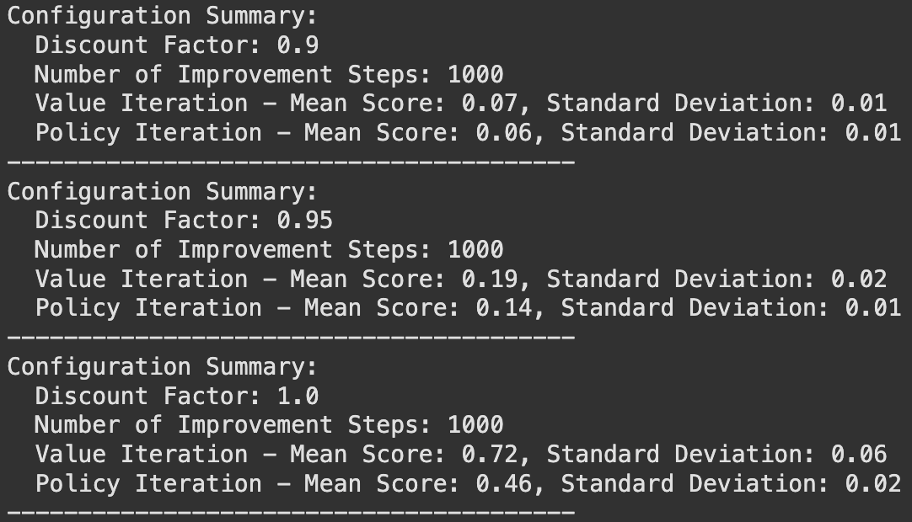

### Problem 1
- To solve this problem, we can use a dynamic programming approach, specifically leveraging the Bellman optimality principle for Markov Decision Processes (MDPs). Let's break down the solution step-by-step.
- ### 1. Bellman Optimality Function
	- The Bellman optimality function captures the value of being in a certain state and taking the best possible action. In our case, the states represent the number of bags left at the beginning of each day, and the actions represent the prices we can set for that day. 
	  
	  Let \( V_t(L_t) \) be the expected maximum revenue we can achieve starting from day \( t \) with \( L_t \) bags of candy left. The Bellman equation can be defined as follows:
	  
	  \[
	  V_t(L_t) = \max_{p_i \in P} \mathbb{E} \left[ R_t(p_i, L_t) + \gamma V_{t+1}(L_{t+1}) \right]
	  \]
	  
	  Where:
	- \( P \) is the set of possible prices \( p_1, p_2, \ldots, p_N \).
	- \( R_t(p_i, L_t) \) is the expected revenue on day \( t \) when setting the price \( p_i \).
	- \( L_{t+1} \) is the number of bags left at the start of the next day, calculated based on the demand \( d_t \).
	- \( \gamma \) is the discount factor, which could be 1 if we consider the immediate revenue without discounting future revenues.
	  
	  The expected revenue for a given price can be computed as:
	  
	  \[
	  R_t(p_i, L_t) = \sum_{k=0}^{L_t} p_i \cdot k \cdot P(d_t = k | p_i)
	  \]
	  
	  Where \( P(d_t = k | p_i) \) follows the Poisson distribution with mean \( \lambda_i \).
- ### 2. Pseudo-code for Optimal Policy
	- To derive the optimal policy, we can use a backward induction approach, starting from the last day and moving backwards to the first day. Here is a Python-like pseudo-code to illustrate the algorithm:
	  
	  ```python
	  def calculate_expected_revenue(price, L, lambda_value):
	    revenue = 0
	    # Calculate expected revenue based on the Poisson distribution
	    for k in range(0, L + 1):
	        probability = (math.exp(-lambda_value) * (lambda_value ** k)) / factorial(k)
	        revenue += price * k * probability
	    return revenue
	  
	  def value_iteration(T, M, prices, lambdas):
	    # V_t(L_t): expected revenue for day t with L_t bags remaining
	    V = [[0] * (M + 1) for _ in range(T + 1)]
	  
	    for t in range(T - 1, -1, -1):  # Backward iteration over days
	        for L in range(M + 1):  # Iterate over all possible bags remaining
	            best_revenue = 0
	            for price_index, price in enumerate(prices):
	                lambda_value = lambdas[price_index]
	                expected_revenue = calculate_expected_revenue(price, L, lambda_value)
	  
	                # Remaining bags after sales
	                remaining_bags = max(0, L - int(lambda_value) + 1)  # Adjusting for max demand
	                expected_revenue += V[t + 1][remaining_bags]  # Add future value
	  
	                best_revenue = max(best_revenue, expected_revenue)
	  
	            V[t][L] = best_revenue  # Store the best revenue for state (t, L)
	  
	    # Policy extraction
	    policy = [[None] * (M + 1) for _ in range(T)]
	    for t in range(T):
	        for L in range(M + 1):
	            # Find the best price for this state
	            best_price = None
	            best_value = V[t][L]
	            for price_index, price in enumerate(prices):
	                lambda_value = lambdas[price_index]
	                expected_revenue = calculate_expected_revenue(price, L, lambda_value)
	                remaining_bags = max(0, L - int(lambda_value) + 1)
	                total_value = expected_revenue + V[t + 1][remaining_bags]
	                
	                if total_value == best_value:
	                    best_price = price
	                    break
	            
	            policy[t][L] = best_price  # Assign best price to the policy
	  
	    return policy
	  
	  # Example usage
	  T = 5  # number of days
	  M = 10  # number of bags
	  prices = [1.0, 2.0, 3.0]  # possible prices
	  lambdas = [2, 4, 6]  # demand means corresponding to prices
	  optimal_policy = value_iteration(T, M, prices, lambdas)
	  ```
- ### Problem 2
	- #### 1. Key Distinctions Between Value Iteration and Policy Iteration
		- **Mechanism**:
			- **Value Iteration**: It repeatedly updates the value function for all states until convergence, implicitly deriving the optimal policy from the values.
			- **Policy Iteration**: It alternates between policy evaluation (computing the value function for the current policy) and policy improvement (updating the policy based on the computed values).
		- **Convergence**:
			- **Value Iteration**: Converges to the optimal value function and then derives the policy, generally requiring more iterations but can converge faster in some cases.
			- **Policy Iteration**: Typically converges in fewer iterations since each iteration improves the policy, but each iteration can be computationally expensive due to the full policy evaluation step.
		- Use **Value Iteration** when the state or action space is large or when you need a quick solution.
		- Use **Policy Iteration** when the state space is smaller, or when you need a more stable and potentially faster convergence in terms of the number of policy updates.
	- #### 2. When Does Policy Iteration End?
		- Policy iteration ends when the policy no longer changes after a policy improvement step; that is, when the policy stabilizes.
		- **Values of the Optimal Policy**:
			- Immediately after policy iteration ends, you do have the values associated with the optimal policy for all states. The final policy is guaranteed to be optimal at that point.
	- #### 3. Effects of Running Only One Iteration of Bellman Update During Policy Iteration
		- If you run only one iteration of the Bellman update during policy iteration (instead of running it until convergence), you will not obtain the value function that corresponds to the optimal policy.
		- **Impact on Optimal Policy**:
			- You will likely get a suboptimal policy because the values used for policy improvement are not fully accurate. The policy could be improved further with additional iterations, potentially leading to a better optimal policy. Therefore, while you might improve the policy, it may not be the best possible one without completing the evaluation step fully.
- ### Problem 3
- #### Part 1: Value Iteration Process
	- **Initialization:**
	  We start by initializing the value function \( V_0 \) for each state based on the maximum expected reward for each action in that state.
	- \( V_0(s_1) = 10.0 \)  (from action \( a_2 \))
	- \( V_0(s_2) = 1.0 \)   (from action \( a_1 \))
	- \( V_0(s_3) = 0.0 \)   (both actions give 0 reward)
	- **Iteration 1:**
		- $$\begin{aligned}
		  V_{1}(s_{1})&=\max(8.0+1\cdot(0.2\cdot V_0(s_1)+0.6\cdot V_0(s_2)+0.2\cdot V_0(s_3)), \\
		  &10.0+1\cdot(0.1\cdot V_0(s_1)+0.2\cdot V_0(s_2)+0.7\cdot V_0(s_3))) \\
		  &=\max\left(8.0+(0.2\cdot10.0+0.6\cdot1.0+0.2\cdot0.0),10.0+(0.1\cdot10.0+0.2\cdot1.0+0.7\cdot0.0)\right) \\
		  &=\max\left(8.0+2.0+0.6,10.0+1.0+0.2\right) \\
		  &=\max\left(10.6,11.2\right)=11.2 \\
		  V_{1}(s_{2})&=\max(1.0+1\cdot(0.3\cdot V_0(s_1)+0.3\cdot V_0(s_2)+0.4\cdot V_0(s_3)), \\
		  &-1.0+1\cdot(0.5\cdot V_0(s_1)+0.3\cdot V_0(s_2)+0.2\cdot V_0(s_3))) \\
		  &=\max\left(1.0+(0.3\cdot10.0+0.3\cdot1.0+0.4\cdot0.0),-1.0+(0.5\cdot10.0+0.3\cdot1.0+0.2\cdot0.0)\right) \\
		  &=\max\left(1.0+3.0+0.3,-1.0+5.0+0.3\right)=\max(4.3,4.3)=4.3 \\
		  V_{1}(s_{3})&=\max(0.0+1\cdot(1.0\cdot V_0(s_3)), \\
		  &0.0+1\cdot(1.0\cdot V_0(s_3))) \\
		  &=\max\left(0.0,0.0\right)=0.0\\
		  \end{aligned}$$
	- **Iteration 2:**
		- $$\begin{aligned}
		  V_{2}(s_{1})&=\max(8.0+1\cdot(0.2\cdot V_1(s_1)+0.6\cdot V_1(s_2)+0.2\cdot V_1(s_3)), \\
		  &10.0+1\cdot(0.1\cdot V_1(s_1)+0.2\cdot V_1(s_2)+0.7\cdot V_1(s_3))) \\
		  &=\max\left(8.0+(0.2\cdot11.2+0.6\cdot4.3+0.2\cdot0.0),10.0+(0.1\cdot11.2+0.2\cdot4.3+0.7\cdot0.0)\right) \\
		  &=\max\left(8.0+2.24+2.58,10.0+1.12+0.86\right) \\
		  &=\max\left(12.82,11.98\right)=12.82 \\
		  V_{2}(s_{2})&=\max(1.0+1\cdot(0.3\cdot V_1(s_1)+0.3\cdot V_1(s_2)+0.4\cdot V_1(s_3)), \\
		  &-1.0+1\cdot(0.5\cdot V_1(s_1)+0.3\cdot V_1(s_2)+0.2\cdot V_1(s_3))) \\
		  &=\max\left(1.0+(0.3\cdot11.2+0.3\cdot4.3+0.4\cdot0.0),-1.0+(0.5\cdot11.2+0.3\cdot4.3+0.2\cdot0.0)\right) \\
		  &=\max\left(1.0+3.36+1.29,-1.0+5.6+1.29\right)=\max(5.65,5.89)=5.89 \\
		  V_{2}(s_{3})&=\max(0.0+1\cdot(1.0\cdot V_1(s_3)), \\
		  &0.0+1\cdot(1.0\cdot V_1(s_3))) \\
		  &=\max\left(0.0,0.0\right)=0.0\\
		  \end{aligned}$$
	- ### Summary of Value Iteration Results
	  After two iterations, the value functions for each state are:
		- \( V_0(s_1) = 10.0 \), \( V_0(s_2) = 1.0 \), \( V_0(s_3) = 0.0 \)
		- \( V_1(s_1) = 11.2 \), \( V_1(s_2) = 4.3 \), \( V_1(s_3) = 0.0 \)
		- \( V_2(s_1) = 12.82 \), \( V_2(s_2) = 5.89 \), \( V_2(s_3) = 0.0 \)
- ### Part 2: Policy Derivation
	- We start with the differences in action-values for state $S1$​ and $S2$:
	  $$
	  \begin{aligned}
	  Q_k\left(S_1, a_1\right)-Q_k\left(S_1, a_2\right)=8-10+(0.2-0.1) \times V_{k-1}\left(S_1\right)+(0.6-0.2) \times V_{k-1}\left(S_2\right) \\
	  =-2+0.1 \times V_{k-1}\left(S_1\right)+0.4 \times V_{k-1}\left(S_2\right), \forall k \geqslant 1 \\
	  Q_k\left(S_2, a_2\right)-Q_k\left(S_2, a_1\right)=-1-1+(0.5-0.3) \times V_{k-1}\left(S_1\right)+(0.3-0.3) \times V_{k-1}\left(S_2\right) \\
	  =-2+0.2 \times V_{k-1}\left(S_1\right), \forall k \geqslant 1
	  \end{aligned}
	  $$
	  We have $V_{k-1}\left(S_1\right) \geqslant 12.82, V_{k-1}\left(S_2\right) \geqslant 5.89$
	  $$
	  \begin{aligned}
	  & \Rightarrow Q_k\left(S_1, a_1\right)-Q_k\left(S_1, a_2\right)>0, Q_k\left(S_2, a_2\right)-Q_k\left(S_2, a_1\right)>0 \\
	  & \Rightarrow Q_k\left(S_1, a_1\right)>Q_k\left(S_1, a_2\right), Q_k\left(S_2, a_2\right)>Q_k\left(S_2, a_1\right) \\
	  & \Rightarrow \pi_k\left(s_1\right)=a_1=\pi_2\left(s_1\right), \pi_k\left(s_2\right)=a_2=\pi_2\left(s_2\right) \\
	  & \Rightarrow \pi_k(s)=\pi_2(s),
	  \end{aligned}
	  $$
	- Thus, we can conclude that the optimal policies are stable across iterations
- ### Problem 4
	- #### Part 1
		- Colab Notebook：
		  https://colab.research.google.com/drive/1PBH2wAblEYS62QIXhmahgYOHHdAYeEcI?usp=sharing
	- #### Part 2
		- {:height 312, :width 530}
		- The experiments reveal that value iteration consistently outperforms policy iteration across various configurations in the Frozen Lake environment, particularly at a discount factor of 1.0, where it achieved a mean score of 0.72 compared to policy iteration's 0.46. This performance advantage is likely due to value iteration's comprehensive evaluation of all possible actions and outcomes, leading to more effective policy updates. In contrast, policy iteration's sensitivity to initial policies and slower convergence can hinder its effectiveness in complex, probabilistic environments. Overall, value iteration proves to be the more capable method for achieving higher scores in this context.