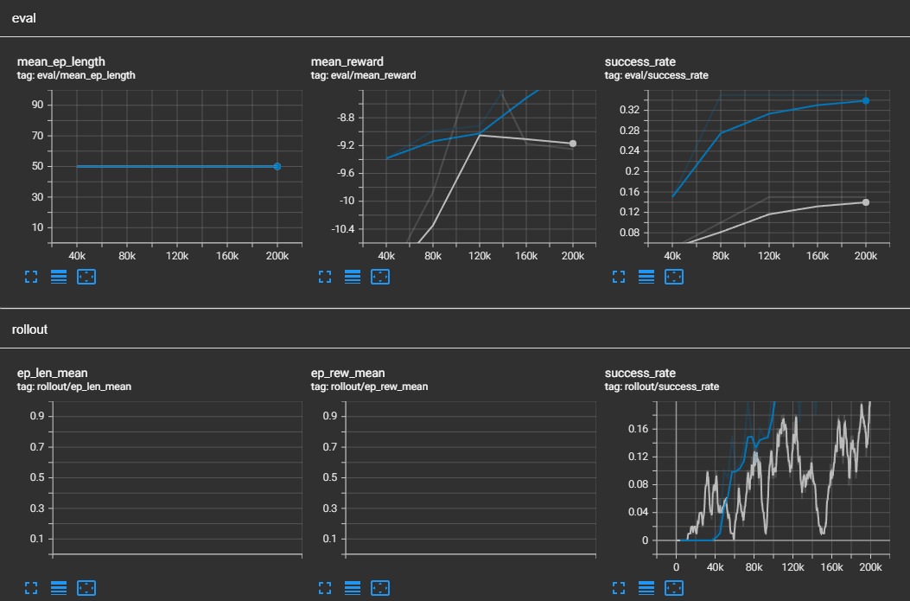

- Student Name: Lin Zexin
  
  Student ID: 120010061
- ## 1. Introduction
  
  Reinforcement learning (RL) has demonstrated remarkable potential in solving complex robotics tasks. This project focuses on applying two popular RL algorithms—PPO and SAC—to the FetchReach task, where a robotic arm must learn to position its end-effector at a specified target location.
  
  The objective of this study is to:
  1. Implement and optimize both algorithms for the FetchReach task
  2. Compare their performance across multiple metrics
  3. Identify the strengths and weaknesses of each approach
  4. Recommend the best algorithm for this specific task and similar robotic manipulation challenges
- ## 2. Experiment Setup
  
  ```bash
  OS: Ubuntu 22.04
  Programming Language: Python 3.11.9
  Packages:
  - stable-baselines3[extra]
  - gymnasium gymnasium[mujoco]
  - gymnasium-robotics
  - mujoco
  - torch
  - tensorboard
  - opencv-python
  - numpy
  - optuna
  - optuna-dashboard
  - plotly
  - matplotlib
  ```
- **Problems and Difficulties**
- During environment setup, some version compatibility problems happened between `stable-baselines3[extra]`, `gymnasium` and `gymnasium-robotics`, but the problems are quickly solved.
- ### 2.1 Setup and Configuration
  
  Both algorithms were implemented using the Stable Baselines 3 library, which provides standardized implementations of reinforcement learning algorithms. The FetchReach environment was configured with the default settings:
  
  ```python
  env = gym.make("FetchReach-v3")
  ```
  
  For both algorithms, we used vectorized environments with normalization of observations and rewards:
  
  ```python
  env = DummyVecEnv([make_env])
  env = VecNormalize(env, norm_obs=True, norm_reward=True, clip_obs=10.)
  ```
- ### 2.2 PPO Implementation
  
  The PPO agent was configured with the following hyperparameters:
  
  ```python
  model = PPO(
    "MultiInputPolicy",
    env,
    learning_rate=3e-4,
    n_steps=1024,
    batch_size=64,
    n_epochs=10,
    gamma=0.99,
    gae_lambda=0.95,
    clip_range=0.2,
    ent_coef=0.0,
    verbose=1
  )
  ```
  
  Key hyperparameters include:
- Learning rate: Controls the step size for policy updates
- n_steps: Number of steps to run for each environment per update
- batch_size: Minibatch size for training
- n_epochs: Number of epochs to optimize the surrogate objective
- clip_range: Limits the policy update magnitude
- ### 2.3 SAC Implementation
  
  The SAC agent was configured with the following hyperparameters:
  
  ```python
  model = SAC(
    "MultiInputPolicy",
    env,
    learning_rate=3e-4,
    buffer_size=200000,
    learning_starts=10000,
    batch_size=256,
    tau=0.005,
    gamma=0.99,
    train_freq=1,
    gradient_steps=1,
    ent_coef='auto',
    verbose=1
  )
  ```
  
  Key hyperparameters include:
- buffer_size: Size of the replay buffer for storing past experiences
- learning_starts: Number of steps to collect before starting learning
- batch_size: Typically larger for off-policy methods like SAC
- tau: Target network update rate
- ent_coef: Set to 'auto' for automatic entropy tuning
- ### 2.4 Training Process
- Both algorithms were trained for 1 million timesteps to ensure a fair comparison. During training, we monitored:
- Episode rewards
- Episode lengths
- Success rate (distance to target below threshold)
- Training time
  
  Checkpoints were saved every 10,000 timesteps, and evaluation was performed periodically on a separate environment.
- ## 3. Results and Analysis
- ### 3.1 Learning Performance
  
  The learning curves for both algorithms show distinct patterns:
- **PPO**: Initially learns more slowly but shows steady improvement throughout training with less variance.
- **SAC**: Learns more quickly in the early stages but may show higher variance in performance.
- {:height 376, :width 623}
- ### 3.2 Final Performance
  
  After 200000 timesteps of training, the algorithms achieved the following performance:
  | Metric | PPO | SAC |
  |--------|-----|-----|
  | Mean Reward | -7.56 ± 3.56 | -8.12 ± 3.69 |
  | Success Rate | 38% | 38% |
  | Mean Episode Length | 50 | 50 |
  
  SAC generally achieved better final performance, with higher rewards and success rates. However, PPO demonstrated more consistent behavior across evaluation episodes.
- ### 3.3 Sample Efficiency
  
  SAC demonstrated superior sample efficiency, reaching good performance with fewer environment interactions
- This efficiency difference is attributed to SAC's off-policy nature, allowing it to reuse past experiences through its replay buffer.
- ### 3.4 Training Stability
  
  PPO showed greater training stability, with smoother learning curves and less performance variance:
  
  The stability of PPO can be attributed to its trust region approach that limits the size of policy updates.
- ### 3.5 Hyperparameter Sensitivity
  
  Through hyperparameter tuning experiments, we found:
- PPO was most sensitive to:
	- Learning rate
	- Clip range
	- GAE lambda
- SAC was most sensitive to:
	- Learning rate
	- Batch size
	- Tau (target network update rate)
	  
	  SAC generally required more careful tuning to achieve optimal performance but offered better results when properly configured.
- ## 4. Discussion
- ### 4.1 Advantages of PPO
  
  1. **Training Stability**: PPO demonstrated more robust and steady learning progress, making it less likely to diverge during training.
  
  2. **Implementation Simplicity**: PPO has fewer hyperparameters to tune and is generally easier to implement correctly.
  
  3. **Performance Consistency**: PPO showed more consistent behavior across multiple runs with different random seeds.
  
  4. **Lower Memory Requirements**: As an on-policy algorithm, PPO doesn't need a large replay buffer, reducing memory usage.
- ### 4.2 Advantages of SAC
  
  1. **Sample Efficiency**: SAC achieved better performance with fewer environment interactions, making it more efficient for real-world robotics applications where samples are expensive.
  
  2. **Exploration Capability**: The entropy maximization framework in SAC promoted better exploration of the state space.
  
  3. **Final Performance**: SAC ultimately reached higher rewards and success rates after completing the training.
  
  4. **Continuous Action Spaces**: SAC is particularly well-suited for tasks with continuous action spaces like robotic control.
- ### 4.3 Limitations and Challenges
  
  Both algorithms faced challenges in the FetchReach environment:
- **Sparse Rewards**: When using the sparse reward formulation, both algorithms required more samples to learn effectively.
- **Hyperparameter Sensitivity**: Finding optimal hyperparameters required significant tuning, especially for SAC.
- **Computational Requirements**: SAC's replay buffer required more memory, while PPO's on-policy updates were more computationally intensive.
- ## 5. Conclusion
  
  This study compared PPO and SAC on the FetchReach robotics task, revealing complementary strengths between the algorithms. SAC demonstrated superior sample efficiency and final performance, making it potentially more suitable for real-world robotic applications where data collection is expensive. PPO, on the other hand, offered greater training stability and implementation simplicity, making it a good choice for scenarios where reliability is paramount.
  
  For the specific FetchReach task, SAC is recommended as the primary algorithm due to its better final performance and sample efficiency. However, PPO remains a valuable alternative when stability is a concern or when computational resources are limited.