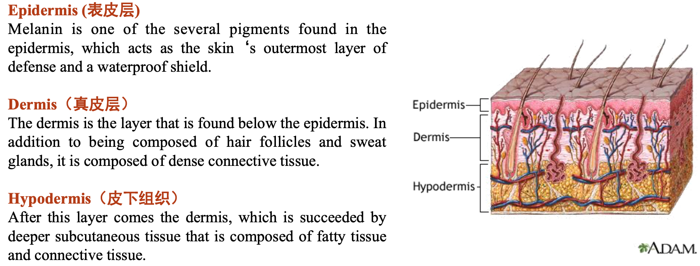
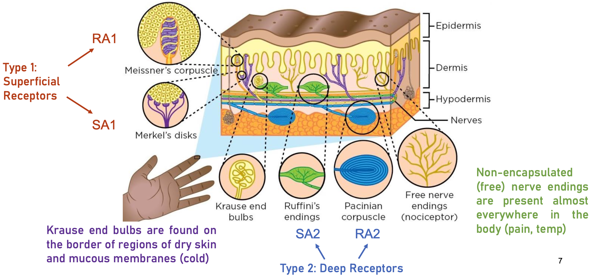
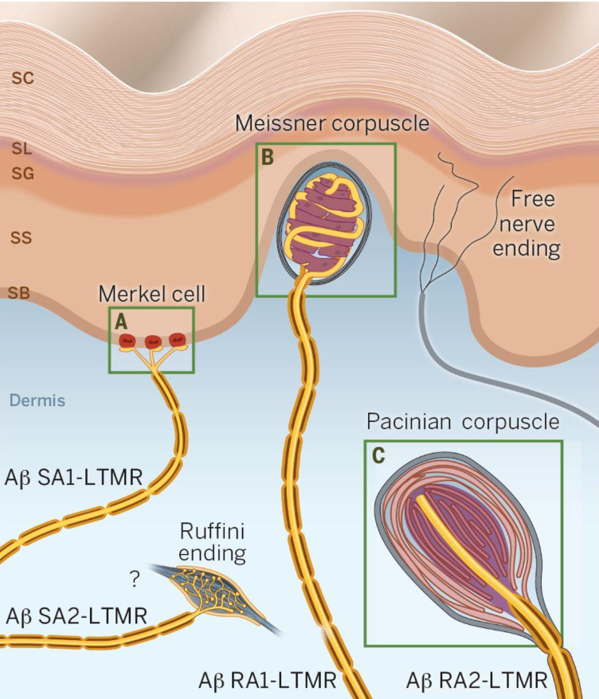
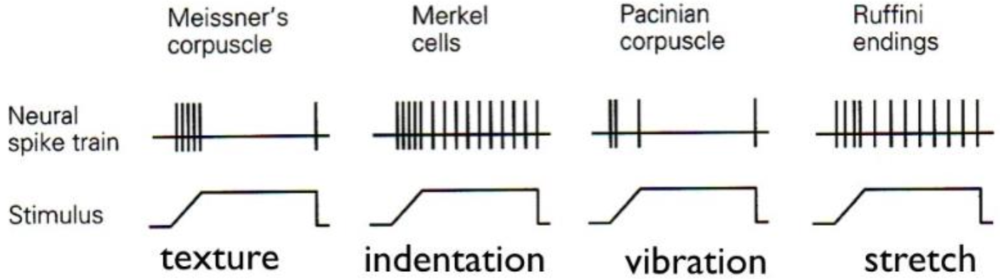
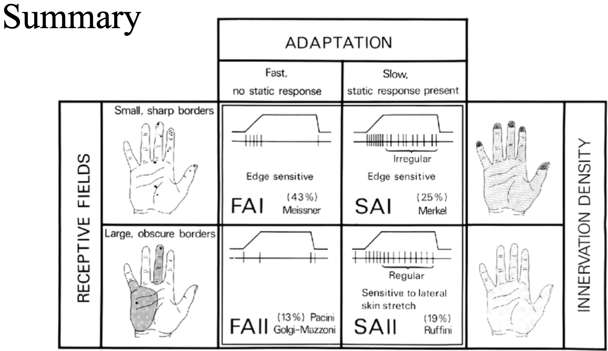
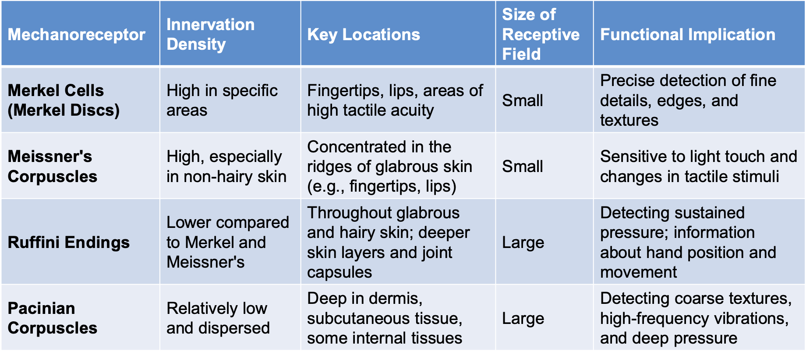

- #Revision
- Haptics is the coordination of touch perception and action.
- tactile is considered part of haptic sensing, which is the
  detection of force on the skin surface. For example, to sense the texture of a surface.
- Touch is private, Inherent, Personal, Emotion-related
- It relates to the sense of touch, triggered by spatio-temporal variations
  of stimuli resulting in higher brain functions (pain, emotions, etc.)
- 
- Mechanoreceptors are specialized nerve endings in the skin
  responsible for sensing mechanical changes like pressure, vibration,
  and stretch.
	- • There are four main types of mechanoreceptors:
	  • Merkel cells
	  • Meissner's corpuscles
	  • Ruffini endings
	  • Pacinian corpuscles.
- 
-
- Merkel discs
- Meissner corpuscles
- Ruffini Ending
- Pacinian corpuscles
- {:height 397, :width 324}
- 
- 
- 