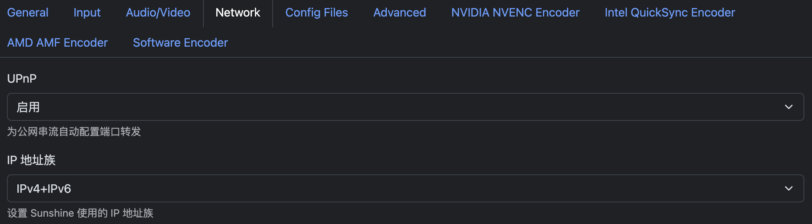
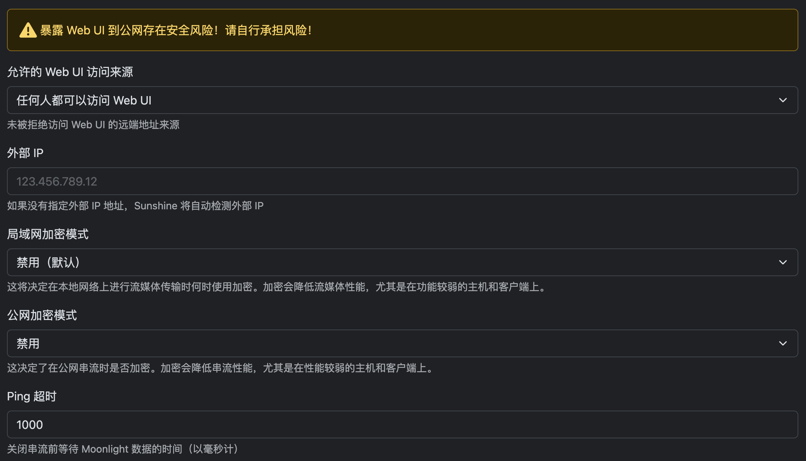
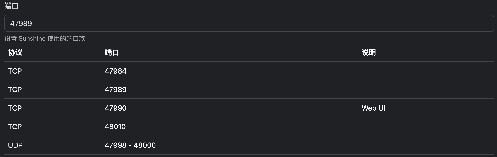

- #Moonlight #Sunshine #远程桌面 #RDP
- 下载Moonlight：[Moonlight官网](https://moonlight-stream.org/)
- 下载Sunshine：[Sunshine Github仓库](https://github.com/LizardByte/Sunshine)
- 服务端安装符合平台的Sunshine，启动后设置用户名与密码，进入 配置（configuration）> General 可设置中文语言。进入 配置 > Network 设置 UPnP->启用、IP地址族->IPv4+IPv6、允许任何人访问Web UI、关闭局域网与公网加密。
   
- ## 公网IP访问
	- 如有家用动态公网IP，需要在路由器设置端口转发，端口设置为47989时配置如下（默认）
	  
	- 除以上端口外还需要设置`UDP | 48002`与`UDP | 5353`
	-
-