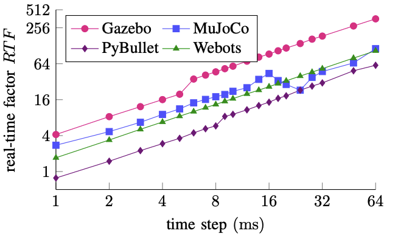

- MuJoCo 和 PhysX 是两种不同的物理引擎，并不完全可以互相替代。
- ### MuJoCo
	- **专注于机器人和生物力学仿真**：MuJoCo（Multi-Joint dynamics with Contact）特别适合复杂的机器人运动和控制仿真，常用于强化学习和机器人控制研究²。
	- **高效的物理计算**：MuJoCo 以其高效的物理计算和精确的接触动力学模拟而闻名，适合需要高精度和高性能的仿真任务²。
- ### PhysX
	- **广泛应用于游戏和图形仿真**：PhysX 是由 NVIDIA 开发的物理引擎，广泛应用于游戏和图形仿真，提供逼真的物理效果¹。
	- **硬件加速**：PhysX 可以利用 NVIDIA GPU 进行硬件加速，从而提高仿真速度和性能¹。
- ### 主要区别
	- **应用领域**：MuJoCo 更适合机器人和生物力学仿真，而 PhysX 更适合游戏和图形仿真²。
	- **性能优化**：MuJoCo 在处理复杂的多关节动力学和接触动力学方面表现出色，而 PhysX 在图形和游戏物理效果方面具有优势²。
- 如果主要从事机器人仿真和控制研究，MuJoCo 可能更适合。如果需要进行游戏开发或图形仿真，PhysX 可能是更好的选择。
  
  ¹: [Comparing Popular Simulation Environments](https://arxiv.org/pdf/2103.04616)
  ²: [Simulation Tools for Model-Based Robotics](https://homes.cs.washington.edu/~todorov/papers/ErezICRA15.pdf)
  
  Source: Conversation with Copilot, 8/18/2024
  (1) Simulation Tools for Model-Based Robotics: Comparison of Bullet, Havok .... https://homes.cs.washington.edu/~todorov/papers/ErezICRA15.pdf.
  (2) Comparing Popular Simulation Environments in the Scope of Robotics and .... https://arxiv.org/pdf/2103.04616.
  (3) A Review of Nine Physics Engines for Reinforcement Learning Research. https://arxiv.org/html/2407.08590v1.
- 