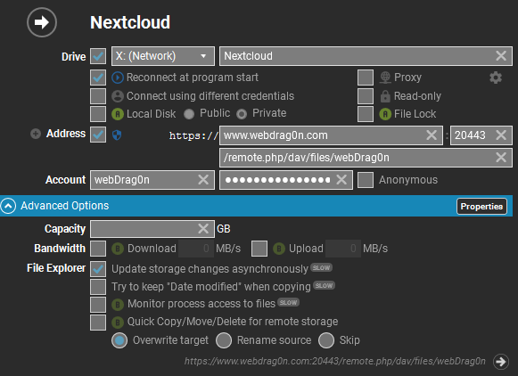

- Configuration Parameters
	- Documentation link: https://docs.nextcloud.com/server/19/admin_manual/configuration_server/config_sample_php_parameters.html?highlight=overwrite%20cli%20url
- 如何增加信任域名
	- https://help.nextcloud.com/t/howto-add-a-new-trusted-domain/26
- 在apache2版本中几个重要的配置文件位置
	- nextcloud自身配置文件
	- apache2配置文件
		- /etc/apache2/sites-available/nextcloud.conf
		- /etc/apache2/sites-enabled/nextcloud.conf
		- 以上两个文件内容相同，ssl证书位置和允许通过什么域名访问的设置都在里面，在available文件夹中为可选未启动，放入enabled文件夹中以后并执行
			- ```bash
			  sudo service apache2 restart
			  ```
			- 完成配置
- ### 数据目录权限
- {{embed ((62fc9ef9-95bb-4877-ae90-50aaf730c887))}}
- ### Nextcloud + Raidrive DAV客户端
	- 
- ### 数据硬盘迁移
	- 挂载新硬盘
	- 设置启动时自动挂载
		- ```bash
		  vim /etc/fstab
		  
		  + /dev/sdb1 /new ext4 defaults 0 0
		  ```
	- 重启
	- 复制文件
		- ```bash
		  cp -r /original/* /new
		  
		  # 确认复制隐藏文件
		  cp /original/.htaccess /original/.ocdata /CloudStorage/
		  ```
	- 更改文件夹与子文件夹所有权
		- ```bash
		  chown -hR www-data:www-data /new
		  ```
	- 修改 nextcloud 配置文件中的数据存储目录位置，配置文件路径为 */data/wwwroot/nextcloud/config* （部分旧版镜像的配置文件路径为：*/data/wwwroot/default/nextcloud/config*）
		- `'datadirectory' => '/CloudStorage'`