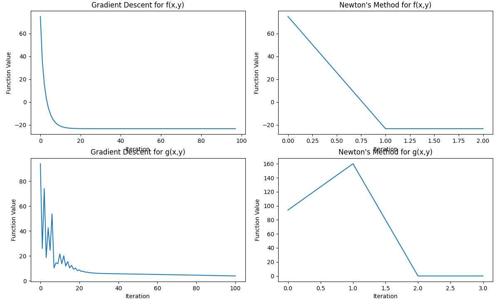

- #Homework
- Course Code: DDA5002
  Name: Lin Zexin
  Student ID: 120010061
- ## DDA 5002/CIE 6010 Optimization Homework 5 Solutions
- ### Problem 1
  
  (a) 
  
  The first constraint defines a circle with center $(1,1)$ and radius 1.
  
  The second constraint defines a circle with center $(1,-1)$ and radius 1.
  
  The objective function $f(x) = x_1^2 + x_2^2$ has level sets that are circles centered at the origin. The optimal point is the feasible point closest to the origin.
  
  From geometric inspection, the optimal point is $x^* = (1,0)$ which lies on the boundary of both constraint circles.
  
  Verification:
- For constraint 1: $(1-1)^2 + (0-1)^2 = 0 + 1 = 1 \leq 1$ ✓
- For constraint 2: $(1-1)^2 + (0+1)^2 = 0 + 1 = 1 \leq 1$ ✓
  
  The optimal value is $p^* = x_1^{*2} + x_2^{*2} = 1^2 + 0^2 = 1$.
- (b)
  
  The Lagrangian is:
  
  $$L(x, \lambda) = x_1^2 + x_2^2 + \lambda_1[(x_1-1)^2 + (x_2-1)^2 - 1] + \lambda_2[(x_1-1)^2 + (x_2+1)^2 - 1]$$
  
  KKT conditions:
  
  1. Stationarity: $\nabla_x L(x^*, \lambda^*) = 0$
	- $\frac{\partial L}{\partial x_1} = 2x_1 + 2\lambda_1(x_1-1) + 2\lambda_2(x_1-1) = 0$
	- $\frac{\partial L}{\partial x_2} = 2x_2 + 2\lambda_1(x_2-1) + 2\lambda_2(x_2+1) = 0$
	  
	  2. Primal feasibility:
	- $(x_1^*-1)^2 + (x_2^*-1)^2 \leq 1$
	- $(x_1^*-1)^2 + (x_2^*+1)^2 \leq 1$
	  
	  3. Dual feasibility:
	- $\lambda_1^* \geq 0$
	- $\lambda_2^* \geq 0$
	  
	  4. Complementary slackness:
	- $\lambda_1^*[(x_1^*-1)^2 + (x_2^*-1)^2 - 1] = 0$
	- $\lambda_2^*[(x_1^*-1)^2 + (x_2^*+1)^2 - 1] = 0$
	  
	  At $x^* = (1,0)$, both constraints are active. Substituting into stationarity conditions:
- $2 + 2\lambda_1(0) + 2\lambda_2(0) = 0$
- $0 + 2\lambda_1(-1) + 2\lambda_2(1) = 0$
  
  From the first equation: $2 = 0$ (contradiction)
  
  Therefore, there do not exist Lagrange multipliers that satisfy the KKT conditions at $x^* = (1,0)$, meaning we cannot prove optimality via KKT conditions. This is because the constraint qualification fails at this point (the gradients of the active constraints are linearly dependent).
- (c)
  
  The Lagrangian is:
  
  $$L(x, \lambda) = x_1^2 + x_2^2 + \lambda_1[(x_1-1)^2 + (x_2-1)^2 - 1] + \lambda_2[(x_1-1)^2 + (x_2+1)^2 - 1]$$
  
  Expanding:
  
  $$L(x, \lambda) = x_1^2 + x_2^2 + \lambda_1[x_1^2 - 2x_1 + 1 + x_2^2 - 2x_2 + 1 - 1] + \lambda_2[x_1^2 - 2x_1 + 1 + x_2^2 + 2x_2 + 1 - 1]$$
  
  $$L(x, \lambda) = x_1^2 + x_2^2 + \lambda_1[x_1^2 - 2x_1 + x_2^2 - 2x_2 + 1] + \lambda_2[x_1^2 - 2x_1 + x_2^2 + 2x_2 + 1]$$
  
  $$L(x, \lambda) = (1+\lambda_1+\lambda_2)x_1^2 + (1+\lambda_1+\lambda_2)x_2^2 - 2(\lambda_1+\lambda_2)x_1 - 2\lambda_1x_2 + 2\lambda_2x_2 + \lambda_1 + \lambda_2$$
  
  To find the dual function $g(\lambda)$, we minimize $L(x,\lambda)$ with respect to $x$. Setting the gradient to zero:
  
  $$\frac{\partial L}{\partial x_1} = 2(1+\lambda_1+\lambda_2)x_1 - 2(\lambda_1+\lambda_2) = 0$$
  
  $$\frac{\partial L}{\partial x_2} = 2(1+\lambda_1+\lambda_2)x_2 - 2\lambda_1 + 2\lambda_2 = 0$$
  
  Solving for $x_1$ and $x_2$:
  
  $$x_1 = \frac{\lambda_1+\lambda_2}{1+\lambda_1+\lambda_2}$$
  
  $$x_2 = \frac{\lambda_1-\lambda_2}{1+\lambda_1+\lambda_2}$$
  
  Substituting back into Lagrangian to get the dual function:
  
  $$g(\lambda) = \frac{(\lambda_1+\lambda_2)^2}{1+\lambda_1+\lambda_2} + \frac{(\lambda_1-\lambda_2)^2}{1+\lambda_1+\lambda_2} - 2(\lambda_1+\lambda_2)\frac{\lambda_1+\lambda_2}{1+\lambda_1+\lambda_2} - 2\lambda_1\frac{\lambda_1-\lambda_2}{1+\lambda_1+\lambda_2} + 2\lambda_2\frac{\lambda_1-\lambda_2}{1+\lambda_1+\lambda_2} + \lambda_1 + \lambda_2$$
  
  After simplification:
  
  $$g(\lambda) = -\frac{(\lambda_1+\lambda_2)^2 + (\lambda_1-\lambda_2)^2}{1+\lambda_1+\lambda_2} + \lambda_1 + \lambda_2 = -\frac{2\lambda_1^2 + 2\lambda_2^2}{1+\lambda_1+\lambda_2} + \lambda_1 + \lambda_2$$
  
  The dual problem is:
  
  $$\max_{\lambda \geq 0} g(\lambda) = -\frac{2\lambda_1^2 + 2\lambda_2^2}{1+\lambda_1+\lambda_2} + \lambda_1 + \lambda_2$$
  
  From the dual function, the maximum occurs at $\lambda_1 = \lambda_2 = \frac{1}{2}$, giving $g(\lambda^*) = \frac{1}{2}$.
  
  Since the primal optimal value is $p^* = 1$ and the dual optimal value is $d^* = \frac{1}{2}$, we have $p^* \neq d^*$, so strong duality does not hold. This confirms our earlier finding that the KKT conditions cannot be satisfied.
- ### Problem 2
  
  **(a) Show the above problem is a convex optimization problem.**
  
  Objective function: $f(x) = 4x_1^2 + x_2^2 - x_1 - 2x_2$
  
  Since all eigenvalues (8 and 2) are positive, the Hessian is positive definite, which means the objective function is strictly convex.
  
  Constraints:
- $2x_1 + x_2 \leq 1$: This is a linear constraint, which defines a half-space, and half-spaces are convex.
- $x_1^2 \leq 1$: This is equivalent to $-1 \leq x_1 \leq 1$, which defines an interval for $x_1$, and intervals are convex.
  
  Since the objective function is convex and the constraints define a convex set, this is a convex optimization problem.
  
  **(b) Show that Slater's condition is satisfied for the above problem.**
  
  Consider the point $x = (0, 0)$:
- $2x_1 + x_2 = 2(0) + 0 = 0 < 1$ ✓
- $x_1^2 = 0^2 = 0 < 1$ ✓
  
  Since there exists a point where all inequality constraints are strictly satisfied, Slater's condition is met for this problem.
  
  **(c) Derive the KKT conditions for the above problem and find all KKT points.**
  
  The Lagrangian is:
  
  $$L(x, \lambda) = 4x_1^2 + x_2^2 - x_1 - 2x_2 + \lambda_1(2x_1 + x_2 - 1) + \lambda_2(x_1^2 - 1)$$
  
  KKT conditions:
  
  1. Stationarity:
	- $\frac{\partial L}{\partial x_1} = 8x_1 - 1 + 2\lambda_1 + 2\lambda_2 x_1 = 0$
	- $\frac{\partial L}{\partial x_2} = 2x_2 - 2 + \lambda_1 = 0$
	  
	  2. Primal feasibility:
	- $2x_1 + x_2 \leq 1$
	- $x_1^2 \leq 1$
	  
	  3. Dual feasibility:
	- $\lambda_1 \geq 0$
	- $\lambda_2 \geq 0$
	  
	  4. Complementary slackness:
	- $\lambda_1(2x_1 + x_2 - 1) = 0$
	- $\lambda_2(x_1^2 - 1) = 0$
	  
	  From the second stationarity condition: $x_2 = 1 - \frac{\lambda_1}{2}$
	  
	  There are several cases to consider:
	  
	  Case 1: $\lambda_1 = 0, \lambda_2 = 0$
- From stationarity: $8x_1 - 1 = 0 \implies x_1 = \frac{1}{8}$
- And $2x_2 - 2 = 0 \implies x_2 = 1$
- Checking constraints: $2(\frac{1}{8}) + 1 = \frac{1}{4} + 1 = \frac{5}{4} > 1$ (violates first constraint)
  
  Case 2: $\lambda_1 > 0, \lambda_2 = 0$
- From complementary slackness: $2x_1 + x_2 = 1$
- From stationarity: $8x_1 - 1 + 2\lambda_1 = 0$
- Solving these with $x_2 = 1 - \frac{\lambda_1}{2}$:
	- $2x_1 + 1 - \frac{\lambda_1}{2} = 1$
	- $2x_1 = \frac{\lambda_1}{2}$
	- $8x_1 - 1 + 2\lambda_1 = 0$
	- Substituting: $8x_1 - 1 + 4x_1 = 0$
	- $12x_1 = 1$
	- $x_1 = \frac{1}{12}$
	- $\lambda_1 = \frac{1}{3}$
	- $x_2 = 1 - \frac{1}{6} = \frac{5}{6}$
- Checking constraints: $x_1^2 = (\frac{1}{12})^2 < 1$ ✓
  
  Case 3: $\lambda_1 = 0, \lambda_2 > 0$
- From complementary slackness: $x_1^2 = 1 \implies x_1 = \pm 1$
- From stationarity with $\lambda_1 = 0$:
	- $8x_1 - 1 + 2\lambda_2 x_1 = 0$
	- $x_1(8 + 2\lambda_2) = 1$
	- For $x_1 = 1$: $8 + 2\lambda_2 = 1 \implies \lambda_2 = -\frac{7}{2}$ (violates dual feasibility)
	- For $x_1 = -1$: $-8 - 2\lambda_2 = 1 \implies \lambda_2 = -\frac{9}{2}$ (violates dual feasibility)
	  
	  Case 4: $\lambda_1 > 0, \lambda_2 > 0$
- From complementary slackness: $2x_1 + x_2 = 1$ and $x_1^2 = 1 \implies x_1 = \pm 1$
- For $x_1 = 1$: $2(1) + x_2 = 1 \implies x_2 = -1$
- For $x_1 = -1$: $2(-1) + x_2 = 1 \implies x_2 = 3$
- Checking stationarity for $x_1 = 1, x_2 = -1$:
	- $8(1) - 1 + 2\lambda_1 + 2\lambda_2(1) = 0 \implies 7 + 2\lambda_1 + 2\lambda_2 = 0$
	- $2(-1) - 2 + \lambda_1 = 0 \implies \lambda_1 = 4$
	- Substituting: $7 + 2(4) + 2\lambda_2 = 0 \implies 15 + 2\lambda_2 = 0 \implies \lambda_2 = -\frac{15}{2}$ (violates dual feasibility)
- Checking stationarity for $x_1 = -1, x_2 = 3$:
	- $8(-1) - 1 + 2\lambda_1 - 2\lambda_2 = 0 \implies -9 + 2\lambda_1 - 2\lambda_2 = 0$
	- $2(3) - 2 + \lambda_1 = 0 \implies \lambda_1 = -4$ (violates dual feasibility)
	  
	  The only valid KKT point is from Case 2: $x^* = (\frac{1}{12}, \frac{5}{6})$ with $\lambda_1 = \frac{1}{3}, \lambda_2 = 0$.
	  
	  **(d) Does this problem have a unique global solution? Briefly explain your answer!**
	  
	  Yes, this problem has a unique global solution. The objective function is strictly convex (as shown by the positive definite Hessian), and the constraint set is convex. For strictly convex objective functions over convex domains, if an optimal solution exists, it must be unique. We found a single KKT point $x^* = (\frac{1}{12}, \frac{5}{6})$ that satisfies all conditions, confirming this is the unique global minimum.
- ### Problem 3
  
  We need to show that $\nabla f_0(x^*)^T(x-x^*) \geq 0$ for all feasible $x$.
  
  From the KKT conditions, we have:
  
  $$\nabla f_0(x^*) + \sum_{i=1}^m \lambda_i^* \nabla f_i(x^*) = 0$$
  
  Rearranging:
  
  $$\nabla f_0(x^*) = -\sum_{i=1}^m \lambda_i^* \nabla f_i(x^*)$$
  
  Taking the inner product with $(x-x^*)$:
  
  $$\nabla f_0(x^*)^T(x-x^*) = -\sum_{i=1}^m \lambda_i^* \nabla f_i(x^*)^T(x-x^*)$$
  
  For each constraint function $f_i$, by convexity:
  
  $$f_i(x) \geq f_i(x^*) + \nabla f_i(x^*)^T(x-x^*)$$
  
  Since $x$ is feasible, $f_i(x) \leq 0$, and from KKT conditions, either $f_i(x^*) = 0$ or $\lambda_i^* = 0$. Thus:
  
  $$\nabla f_i(x^*)^T(x-x^*) \leq -f_i(x^*) \leq 0$$
  
  Since $\lambda_i^* \geq 0$, we have:
  
  $$-\lambda_i^* \nabla f_i(x^*)^T(x-x^*) \geq 0$$
  
  Therefore:
  
  $$\nabla f_0(x^*)^T(x-x^*) = -\sum_{i=1}^m \lambda_i^* \nabla f_i(x^*)^T(x-x^*) \geq 0$$
  
  This proves the required inequality.
- ### Problem 4
  
  Results:
  
  Bisection method: x* = -2.131821, f(x*) = -2.043637, iterations = 21
  
  Golden section method: x* = 4.939560, f(x*) = -6.598378, iterations = 29
- ### Problem 5
  
  **(a) Write down the main step in each iteration of the gradient descent algorithm for solving the above MLE optimization model.**
  
  The log-likelihood function is:
  
  $$f(\mu) = \log p(x_1, \ldots, x_n) = \sum_{i=1}^n \log\left(e^{-\mu} \frac{\mu^{x_i}}{x_i!}\right) = \sum_{i=1}^n (-\mu + x_i\log\mu - \log(x_i!))$$
  
  The gradient is:
  
  $$\nabla f(\mu) = \frac{df}{d\mu} = \sum_{i=1}^n \left(-1 + \frac{x_i}{\mu}\right) = -n + \frac{1}{\mu}\sum_{i=1}^n x_i$$
  
  Gradient descent update:
  
  $$\mu^{(k+1)} = \mu^{(k)} + \alpha^{(k)} \nabla f(\mu^{(k)}) = \mu^{(k)} + \alpha^{(k)} \left(-n + \frac{1}{\mu^{(k)}}\sum_{i=1}^n x_i\right)$$
  
  where $\alpha^{(k)}$ is the step size at iteration $k$.
  
  **(b) Write down the main step in each iteration of the Newton's method for solving the above MLE optimization model.**
  
  The second derivative (Hessian) is:
  
  $$\nabla^2 f(\mu) = \frac{d^2f}{d\mu^2} = -\frac{1}{\mu^2}\sum_{i=1}^n x_i$$
  
  Newton's method update:
  
  $$\mu^{(k+1)} = \mu^{(k)} - \frac{\nabla f(\mu^{(k)})}{\nabla^2 f(\mu^{(k)})} = \mu^{(k)} - \frac{-n + \frac{1}{\mu^{(k)}}\sum_{i=1}^n x_i}{-\frac{1}{(\mu^{(k)})^2}\sum_{i=1}^n x_i}$$
  
  Simplifying:
  
  $$\mu^{(k+1)} = \mu^{(k)} - \frac{-n\mu^{(k)} + \sum_{i=1}^n x_i}{-\frac{1}{\mu^{(k)}}\sum_{i=1}^n x_i} = \mu^{(k)} + \frac{-n\mu^{(k)} + \sum_{i=1}^n x_i}{\frac{1}{\mu^{(k)}}\sum_{i=1}^n x_i} = \frac{\sum_{i=1}^n x_i}{n}$$
  
  Interestingly, Newton's method converges in just one iteration to the analytical solution $\mu = \frac{1}{n}\sum_{i=1}^n x_i$.
  
  **(c) Write down the main step in each iteration of the stochastic gradient descent for solving the above MLE optimization model, assuming each mini-batch is one sample.**
  
  For stochastic gradient descent with batch size 1, we randomly select a single sample $x_j$ at each iteration and compute the gradient based on that sample:
  
  $$\nabla f_j(\mu) = -1 + \frac{x_j}{\mu}$$
  
  SGD update:
  
  $$\mu^{(k+1)} = \mu^{(k)} + \alpha^{(k)} \nabla f_j(\mu^{(k)}) = \mu^{(k)} + \alpha^{(k)} \left(-1 + \frac{x_j}{\mu^{(k)}}\right)$$
  
  where $j$ is randomly chosen from $\{1, 2, \ldots, n\}$ at each iteration.
  
  **(d) Will gradient descent converge to a local optimum or a global optimum in the above problem? Explain your answer.**
  
  The log-likelihood function for Poisson distribution is concave (the second derivative is negative for all $\mu > 0$). For concave functions, any local maximum is also a global maximum. Therefore, gradient descent will converge to the global optimum (maximum) of the log-likelihood function, which is $\mu^* = \frac{1}{n}\sum_{i=1}^n x_i$.
- ### Problem 6
  
  Function f, Gradient Descent: x* = [ 7.42857096 -4.85714266], f(x*) = -23.285714285714082, iterations = 97
  
  Function f, Newton's Method: x* = [ 7.42857143 -4.85714286], f(x*) = -23.285714285714285, iterations = 2
  
  Function g, Gradient Descent: x* = [-2.9905611   2.03599732], g(x*) = 3.921527085694765, iterations = 100
  
  Function g, Newton's Method: x* = [-3.  4.], g(x*) = 0.0, iterations = 3
  
  