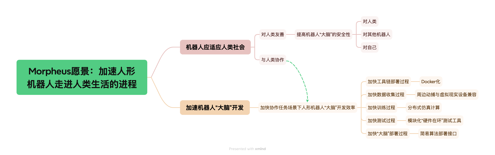
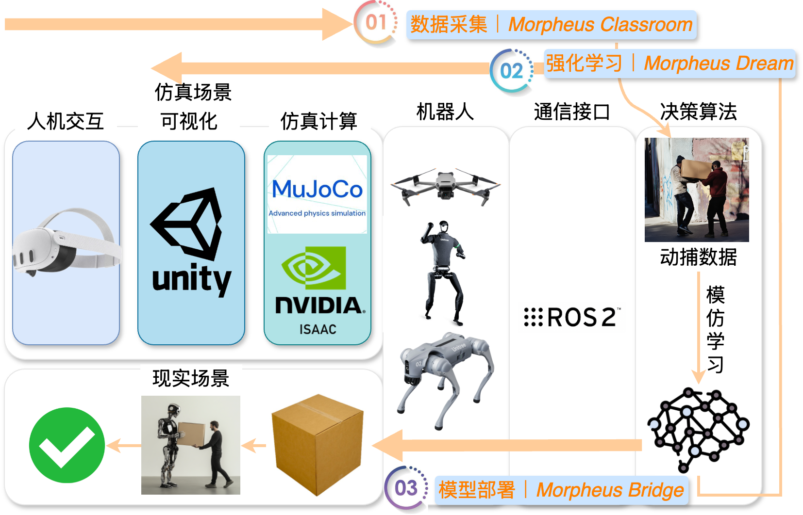
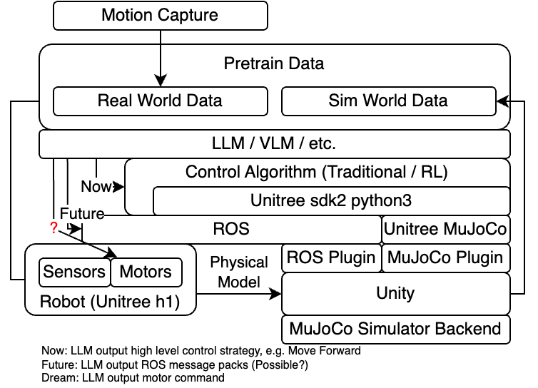
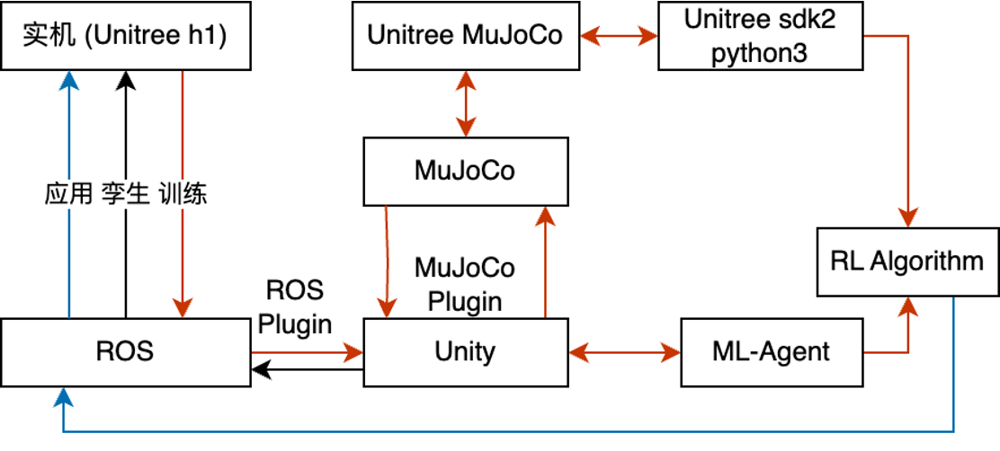

- 背景资料：[[机器人仿真]] [[MuJoCo]]
- ## Project Morpheus: 基于 ROS、Unity 和 MuJoCo 的机器人数字基座平台开发
- ## 简介
	- ### 愿景：加速人形机器人成为家庭成员的进程
		- 我们认为人形机器人加入普通家庭必然会发生
		- Morpheus的名字取自希腊神话梦神，我们希望该仿真环境能够“让仿生人梦见电子羊”，实现意识从无到有的跨越，从`被动-任务驱动`到`主动-事件驱动`。
		- 机器人应适应人类社会，对人类友善，像其他人类同伴一样与你协作
		  加快[[多智能体协同人类完成任务]]场景下人形机器人“大脑”开发效率，提高机器人“大脑”的安全性-对人类及对自己
		  加快工具链部署过程，加快数据收集过程，加快训练过程，加快测试过程，加快“大脑”部署过程
		  Docker化，周边动捕与虚拟现实设备兼容，分布式仿真计算，模块化“硬件在环”测试工具，简易算法部署接口
		  
	- ### 概述
		- **本项目的目标是开发一个专注于人-机协同任务的机器人仿真环境**，集成ROS（Robot Operating System）、Unity和MuJoCo的仿真平台，具备高精度的物理仿真、灵活的环境建模、传感器模拟以及基于大语言模型的AI动作绑定和人机协作。通过容器化简化部署，并集成Hololens 2进行场景可视化和人体动作捕捉。该平台还支持通过照片生成场景并扩展类似场景，以及优化人机协作的数据集生成流程。
		  {:height 537, :width 824}
		- 机器人通常在以人类安全为重的环境中运行。模拟环境允许研究人员和开发人员测试各种场景，而不会对人类造成身体伤害。在医疗保健、自动驾驶汽车或制造业等机器人与人类一起工作的行业中，全面的测试环境可确保更安全的部署。
		- 随着机器人越来越融入日常生活，确保互动符合道德规范且为社会所接受至关重要。模拟环境允许在各种社交环境中测试 HRI，包括了解对用户的潜在情感、心理或文化影响。
	- ### 竞品分析
		- | **Simulation Platform**      | **主要用途**              | **人类模型** | **HRI 重点** | **传感器仿真** | **情感/社交互动** | **AI/ML 集成** | **HRI 场景** | **VR/AR 支持** |
		  |------------------------------|--------------------------|--------------|--------------|----------------|------------------|----------------|--------------|----------------|
		  | **Isaac Gym**                 | 强化学习，大规模物理任务      | 2            | 3            | 3              | 1                | 5              | 3            | 1              |
		  | **Isaac Sim**                 | 真实感的机器人开发和测试     | 5            | 5            | 5              | 3                | 5              | 5            | 5              |
		  | **Isaac Lab**                 | 面向实验的 HRI 研究        | 4            | 5            | 4              | 5                | 5              | 5            | 4              |
		  | **Gazebo**                    | 通用机器人仿真平台           | 2            | 3            | 3              | 1                | 3              | 3            | 2              |
		  | **V-REP (CoppeliaSim)**       | 多功能的机器人仿真平台       | 3            | 4            | 4              | 2                | 3              | 4            | 2              |
		  | **Webots**                    | 易于使用，真实感的机器人仿真 | 3            | 3            | 4              | 2                | 3              | 3            | 2              |
		  | **Unity 3D (with Robotics Toolkit)** | 高保真仿真，基于游戏引擎开发 | 5            | 5            | 5              | 5                | 5              | 5            | 5              |
		  | **MuJoCo**                    | 基于物理的动力学，机器人研究 | 3            | 3            | 3              | 1                | 4              | 3            | 2              |
		  | **ROS/MoveIt! with OpenRAVE** | 机器人运动规划与控制         | 2            | 3            | 2              | 1                | 4              | 3            | 1              |
		  | **MORSE**                     | 机器人研究，开源仿真平台      | 2            | 3            | 3              | 1                | 3              | 3            | 2              |
		  | **CARLA**                     | 自动驾驶仿真平台            | 4            | 3            | 5              | 2                | 4              | 3            | 2              |
		  | **AIRSim**                    | 空中和地面车辆仿真平台        | 4            | 3            | 5              | 2                | 4              | 3            | 5              |
		  | **SimSpark**                  | 仿真类人机器人，AI 与竞赛     | 2            | 3            | 2              | 1                | 3              | 3            | 1              |
		  | **AnyLogic**                  | 多方法仿真（离散、基于代理）    | 3            | 4            | 2              | 2                | 4              | 4            | 2              |
		  | **Choreonoid**                | 机器人行为仿真与开发         | 3            | 4            | 3              | 2                | 3              | 4            | 2              |
		- | **仿真平台**      | **主要用途**                                  | **人类模型**                                      | **HRI 重点**                                      | **传感器仿真**                              | **情感/社交互动**                          | **AI/ML 集成**                                  | **HRI 场景**                                             | **VR/AR 支持**                             |
		  |------------------------------|---------------------------------------------|------------------------------------------------|-----------------------------------------------|--------------------------------------------|-----------------------------------------|---------------------------------------------------|----------------------------------------------------------|-----------------------------------------|
		  | **Isaac Gym**                 | 强化学习，大规模物理任务                        | 基本的用于物理任务的人类模型                          | 物理互动，协作的操控任务                              | 基本传感器仿真                                | 有限（专注于物理互动）                            | 用于物理任务的强化学习                               | 物理协作任务                                              | 无                                        |
		  | **Isaac Sim**                 | 真实感的机器人开发和测试                         | 高保真的人类虚拟形象，具有详细的动作                     | 协作、安全、基于传感器驱动的互动                        | 广泛的传感器仿真（摄像头、LiDAR 等）                  | 基本的社交互动（如肢体语言）                        | 感知和决策的 AI 模型                               | 共享工作空间、安全性、服务型机器人                              | 支持用于沉浸式 HRI 训练                        |
		  | **Isaac Lab**                 | 面向实验的 HRI 研究                            | 可定制的人类模型和行为                               | 基于 AI 的互动研究                                 | 与 Sim 集成以使用传感器                            | 面向情感/社交 HRI 的定制研究                        | 用于人类感知和互动的实验性 AI 模型                        | 定制的 HRI 实验，先进的社交/行为 AI                      | 可与 Sim 集成                                |
		  | **Gazebo**                    | 通用机器人仿真平台                               | 基本的人类虚拟形象                                   | 物理协作、共享工作空间互动                              | 基本传感器仿真（摄像头、LiDAR）                      | 有限的社交互动                                   | 有限的 AI 集成，可以与 ROS 集成                     | 协作机器人测试，基本 HRI                                     | 有限                                      |
		  | **V-REP (CoppeliaSim)**       | 多功能的机器人仿真平台                             | 具有详细动作的人类虚拟形象                              | 协作性 HRI，机器人-人类互动                            | 支持多种传感器                                   | 基本（专注于物理协作）                             | 基本 AI 集成，允许脚本编写 HRI 行为                    | 服务型机器人、工业机器人、医疗机器人                           | 有限                                      |
		  | **Webots**                    | 易于使用，真实感的机器人和环境仿真                    | 预构建的人类模型                                     | 人类-机器人协作，基础 HRI                              | 支持多种传感器，支持人类感知                            | 基本的社交互动                                   | 基本 AI，适用于原型 HRI 系统的开发                     | 行人仿真、移动机器人                                        | 有限，但可以集成                                 |
		  | **Unity 3D (with Robotics Toolkit)** | 高保真的仿真，基于游戏引擎的开发                     | 高保真的人类虚拟形象和手势                              | 实时 HRI，社交机器人，基于 VR/AR 的培训                   | 支持自定义传感器仿真                                 | 高级社交互动（通过定制脚本实现）                        | 实时 HRI 的 AI/ML 模型                               | 社交机器人、自主系统、培训场景                                  | 完全支持 VR/AR                              |
		  | **MuJoCo**                    | 基于物理的动力学，机器人研究                          | 用于人体动力学仿真的人类模型                             | 物理协作，操控任务                                    | 基本传感器集成                                   | 有限的社交互动                                   | 强化学习，物理任务培训                                 | 协作机器人（cobots），操控任务                                | 有限                                      |
		  | **ROS/MoveIt! with OpenRAVE** | 机器人运动规划与控制                                | 用于任务共享的基本人类模型                               | 协作操控，导航互动                                   | 有限的传感器仿真                                   | 有限                                        | 通过 ROS 和外部库强集成 AI/ML                         | 操控任务，协作机器人，导航系统                                  | 无                                        |
		  | **MORSE**                     | 机器人研究，开源仿真平台                              | 用于互动的人类虚拟形象                                   | 物理协作，任务共享                                    | 支持传感器集成（摄像头、深度传感器等）                        | 有限（基本的手势互动）                              | 可与 ROS 集成实现 AI 驱动的互动                          | 服务型机器人，辅助机器人，协作系统                               | 有限                                      |
		  | **CARLA**                     | 自动驾驶仿真平台                                     | 详细的行人模型                                       | 车辆-行人互动，城市交通互动                               | 强大的传感器集成（摄像头、LiDAR）                         | 基本的行人行为建模                                   | 用于车辆互动的强化学习                                 | 行人行为，自主车辆测试                                        | 有限，更专注于车辆互动                                |
		  | **AIRSim**                    | 空中和地面车辆仿真平台                                 | 逼真的人类虚拟形象                                     | 车辆-行人互动，无人机 HRI                               | 高质量的传感器仿真，特别是面向车辆                          | 有限的人类行为建模                                   | 基于 AI 驱动的自主系统互动                               | 无人机 HRI，自主驾驶，基于 VR 的 HRI 研究                        | 支持 VR                                    |
		  | **SimSpark**                  | 仿真类人机器人，AI 与机器人竞赛                          | 基本的类人虚拟形象                                    | 类人机器人基本 HRI，多代理 HRI                            | 有限的传感器集成                                   | 有限                                        | 用于机器人足球或多代理系统的基本 AI                         | 类人机器人，多代理互动（如足球）                                 | 无                                        |
		  | **AnyLogic**                  | 多方法仿真（离散事件、基于代理）                          | 可定制的人类代理模型                                   | 大规模 HRI，基于代理的人类-机器人互动                        | 有限的传感器仿真（更多专注于代理模型）                         | 有限的社交互动                                   | 用于基于代理的人类-机器人系统的自定义 AI 模型                   | 人类-代理-机器人协作，物流，疏散系统                               | 有限                                      |
		  | **Choreonoid**                | 机器人行为仿真与开发平台                                 | 用于共享任务的人类虚拟形象                                | 协作机器人，任务共享，物理 HRI                            | 基本的传感器仿真                                   | 基本的社交互动                                   | 可集成外部 AI 库实现 HRI                               | 协作机器人，工业机器人仿真                                    | 有限                                      |
		- 实验室内多个项目都需要进行机器人仿真，每次都重新开发并配置环境的时间成本高，然而现有仿真方案存在缺陷：
			- **原生MuJoCo**：无易用的api接口和图形交互方式
			- **Gazebo**：虽然 Gazebo 是一个开源平台，广泛用于学术研究，但其物理引擎在高精度仿真方面存在一定局限。我们的平台将利用 MuJoCo 的高效物理计算，提供更高的仿真精度。
			- **Webots**：Webots 提供了用户友好的界面，但在复杂环境建模和多机器人协同仿真方面存在不足。我们的平台将利用 Unity 的强大图形引擎，创建更逼真的仿真环境。
			- **Isaac Sim**：Isaac Sim 在大规模并行训练、图形和物理仿真方面表现出色，但其硬件要求较高，闭源收费，且学习曲线陡峭。此平台将通过优化和简化用户界面，降低使用门槛。
	- ### 风险
		- 考虑到中美关系导致商业软件可能被禁用的可能性，基于开源的MuJoCo风险较低。虽然该方案中Unity也是商业软件，但是：
			- Unity已在国内有特供版团结引擎，彻底禁用可能较小。
			  logseq.order-list-type:: number
			- 单Unity替换难度较小，即便禁用依然可以较小成本迁移至开源前端引擎，如 [[Godot]]
			  logseq.order-list-type:: number
	- ### 先进性
		- 相比之下本项目方案有如下先进性：
			- 兼顾ROS通信，Unity易用性，MuJoCo接触动力学仿真，且Unity中同时有ROS和MuJoCo官方插件
			- [ROS Unity插件](https://github.com/Unity-Technologies/Unity-Robotics-Hub/blob/main/tutorials/ros_unity_integration/README.md)
			- [MuJoCo Unity插件](https://github.com/google-deepmind/mujoco/tree/main/unity)
			- 人类行为建模
	- 本项目将通过集成[[ROS2]]、[[MuJoCo]]和[[Unity]]，结合高效物理仿真、NeRF场景生成和Hololens 2的可视化交互，提供一个功能强大、易于部署的多传感器、多机器人仿真平台。通过引入大语言模型进行场景、人体模型和动作生成，平台将能够自动化生成复杂的人机协作场景和数据集，并通过容器化技术简化部署，提升易用性。为实验室的所有项目提供统一、高效的仿真环境。
- ## 设计应用场景
	- 零件分拣
	  logseq.order-list-type:: number
	- 真实部件装配
	  logseq.order-list-type:: number
	- 需要有较强时空重叠，体现人机、机机协作
	- Demo测试任务：实验者戴Hololens2能看到仿真环境中的Unitree H1机器人和箱子，与机器人各抬一边把箱子搬到目标位置。
- ## 目标
	- 1. **开发一个集成 ROS、Unity 和 MuJoCo 的仿真平台**，实现高精度的物理仿真和灵活的环境建模。
	- 2. **提供统一的接口和工具**，方便不同项目的快速部署和测试。
	- 3. **与现有平台进行比较**，展示新平台在性能、精度和易用性方面的优势。
	- 4. 尽可能容器化，简化部署难度
	- 5. **解决以下关键技术难题**，如多机器人协同仿真、复杂环境下的传感器数据生成和高效的物理计算。
	- 6. 加入NeRF辐射场实时建模
	- 7. 加入多种传感器
	- 8. 语言生成模型+AI动作绑定
	- 9. 多机协作优化
	- 10. 人机协作优化，基于Hololens2的机器人和场景可视化，以及人体动作捕捉，触觉反馈
	- 11. 人机协作数据集生产优化
- ## 技术难题
	- **用户友好的图形交互界面**（之前在机器人仿真领域没有人在乎界面）
	  logseq.order-list-type:: number
		- Hololens2 MR交互，二维码定位，动作捕捉
		  logseq.order-list-type:: number
	- **多机器人协同仿真**：在复杂环境中实现多机器人协同工作，涉及到高效的通信和同步机制。
	  logseq.order-list-type:: number
	- **人员数字孪生模型**：模仿真人运动和操作，参考CMU动捕数据集设计运动链，做到**肌肉**动力学仿真
	  logseq.order-list-type:: number
	- **复杂环境建模与生成**：利用 Unity 的强大图形引擎，开发可引导的场景生成算法，创建大量可交互仿真环境，并与 MuJoCo 的高精度物理引擎无缝集成。
	  logseq.order-list-type:: number
	- **高效物理计算**：优化 MuJoCo 的物理计算性能，确保在大规模仿真场景下的实时性。
	  logseq.order-list-type:: number
	- **仿真传感器数据生成**：开发高精度的传感器模型，包括机器人自带传感器，如激光雷达，深度相机，3D测绘仪等，实时生成并仿真传感器数据，用于机器人感知和导航算法测试。
	  logseq.order-list-type:: number
	- **现实传感器数据传入**：实时获取高精度的机器人运动数据、空间数据和人体动作捕捉数据
	  logseq.order-list-type:: number
	- 支持AutomationML和AAS Explorer搭建机器人信息模型，实现虚实同步
	  logseq.order-list-type:: number
	- 触觉反馈
	  logseq.order-list-type:: number
	- 肌肉 眼镜 质检院-多机协同 具身控制 有结构有观点 算力
	  logseq.order-list-type:: number
- ## 相关研究
	- (Tencent, 2024) Lifelike Agility and Play in Quadrupedal Robots using Reinforcement Learning and Generative Pre-trained Models
	- (Mohammad, 2021) A Scalable Approach to Predict Multi-Agent Motion for Human-Robot Collaboration
		- 人体动作预测-下个动作帧序列
	- (Takumi Hara, 2023) Uncertainty-Aware Haptic Shared Control With Humanoid Robots for Flexible Object Manipulation
		- 人体动作预测-计算概率分布调整输出功率
	- 由(Mohammad, 2021)与(Takumi Hara, 2023)可能可开发更好的Human-Aware Control，增加人机协同的安全性
	- (Tianyuan Dai, 2024) ACDC: Automated Creation of Digital Cousins for Robust Policy Learning
	- (META, 2023) HABITAT 3.0: A CO-HABITAT FOR HUMANS, AVATARS AND ROBOTS
	- Multimodal Human-Human-Robot Interactions (MHHRI) Dataset for Studying Personality and Engagement
	- Gesture-Informed Robot Assistance via Foundation Models
- ## 技术路径
	- 1. 技术架构设计
		- 1.1 核心架构组件
			- ROS 2：ROS 2（Robot Operating System）是目前机器人系统中广泛使用的开源框架。它支持分布式系统，适合多传感器、多机器人协同仿真。官方文档和教程可以参考ROS 2文档。
			- MuJoCo：MuJoCo是一款著名的物理引擎，用于机器人控制与仿真，支持精确的动力学模拟。相关的研究论文有《MuJoCo: A physics engine for model-based control》【Todorov, Emanuel et al. 2012】。官方开源版本的GitHub仓库提供了最新代码。
			- Unity：Unity作为强大的3D开发平台，广泛用于虚拟仿真与可视化。借助Unity的ROS插件（Unity Robotics Hub），可以轻松集成ROS消息传递系统，搭建复杂的仿真场景。
		- 1.2 容器化与部署
			- Docker 容器化：Docker已成为容器化部署的标准工具。其成熟的生态系统允许将ROS 2、MuJoCo和Unity等组件打包为独立容器。可以参考Docker官方文档来构建适应不同环境的容器。
			  实现方案参考：
				- ROS 2的Docker镜像：在OSRF的ROS Docker中有可用的ROS镜像。
				- Unity的Docker镜像：可参考Unity Build Docker进行Unity项目的容器化打包。
				- Kubernetes 集群支持：Kubernetes是容器编排工具，适合复杂的分布式仿真部署。可以参考Kubernetes官方文档学习如何在集群中管理Docker容器。
		- 1.3 高效物理计算与多传感器仿真
			- 物理计算优化：MuJoCo的GPU加速功能可以通过CUDA库优化大规模仿真计算，相关的论文和文档可以参考《GPU-accelerated Simulation for Physics-based Modeling in Robotics and AI》【Kaufman et al., 2018】。另外，使用开源框架如PyTorch与MuJoCo结合进行机器学习加速。
			  实现方案参考：
				- MuJoCo的GitHub仓库中包含了如何进行GPU加速的指导。
				- CUDA加速可以参考NVIDIA的CUDA文档，并通过库如CuPy简化与MuJoCo的整合。
				- 多传感器仿真：传感器仿真需要多个插件和模块同步工作，可以使用Gazebo与ROS 2集成来模拟多种传感器（如激光雷达、相机等）。Gazebo提供了广泛的传感器插件库，参考Gazebo的传感器仿真模块。
				- 实现方案参考：
					- Unity ROS插件支持多传感器仿真，可参考Unity Robotics Hub。
					- 也可以参考开源库AirSim进行无人机或汽车的多传感器仿真。
	- 2. 功能模块设计
		- 2.1 照片生成场景和场景扩展
		- 照片生成场景：使用计算机视觉中的NeRF（Neural Radiance Fields）技术，可以从照片生成3D场景。NeRF的相关研究论文《NeRF: Representing Scenes as Neural Radiance Fields for View Synthesis》【Mildenhall, 2020】阐述了该技术。开源代码可参考NeRF的GitHub仓库。
		  实现方案参考：
			- NeRF的预训练模型可以通过torch-ngp等开源库快速生成场景。
			- Unity可以通过自定义插件将NeRF生成的3D模型导入环境中进行交互。
			- 场景扩展生成：结合GAN（生成对抗网络）技术，使用模型如StyleGAN2来生成场景的扩展。相关论文包括《Analyzing and Improving the Image Quality of StyleGAN》【Karras et al., 2020】。开源代码可以参考NVlabs的StyleGAN2。
			- 实现方案参考：
				- 通过StyleGAN2和类似框架生成多样化的场景图片。
				- 使用Unity结合生成图片来扩展3D场景。
		- 2.2 Hololens 2 的集成与场景可视化
			- Hololens 2 集成：微软提供了Hololens的开发者工具，支持与Unity的集成。可以参考微软的Mixed Reality Toolkit (MRTK)进行开发。
			  实现方案参考：
				- 使用Hololens 2的MRTK开发AR场景的交互与可视化。
				- AR 场景交互：可以结合Unity的XR插件（如AR Foundation）进行AR交互开发，具体参考Unity的AR Foundation文档与相关的AR场景交互示例代码。
		- 2.3 大语言模型 + AI 动作生成
			- 文字生成场景的大语言模型：使用OpenAI的GPT-4或Meta的LLaMA等大语言模型可以实现从文字描述生成场景的功能。相关论文如《Language Models are Few-Shot Learners》【Brown et al., 2020】。开源实现可以参考OpenAI GPT-3 API或LLaMA的开源实现。
			  实现方案参考：
				- GPT系列模型可通过Hugging Face Transformers进行场景生成的语言处理。
				- Unity中可将生成的场景描述与实际场景生成结合，参考Unity生成场景插件。
				- 文字生成人体模型的大语言模型：通过NLP和3D建模结合，文字生成的3D模型可以基于类似Blender的自动化模型生成库实现，参考Blender API。
				  实现方案参考：
					- 利用Blender生成人体模型，结合大语言模型从文本生成场景。
					- 文字生成人类行为的大语言模型：OpenAI的Codex模型可以根据描述生成具体动作逻辑，结合ROS 2与MuJoCo，实现自动动作生成。
					- 实现方案参考：
						- 使用Codex生成动作逻辑，结合MuJoCo的控制系统执行。
	- 3. 关键技术难点与解决方案
		- 3.1 多传感器同步仿真
			- 难点：多个传感器的仿真要求在复杂场景中同步工作，尤其是涉及视觉、雷达、IMU等多模态传感器时，数据流的整合与传输是关键挑战。
			- 解决方案：通过ROS 2的多节点架构，将不同传感器的数据处理拆分成独立节点，分别进行仿真和数据发布，再通过中心节点整合多模态传感器的数据流，确保仿真过程中各传感器间的数据同步与协调。
			  实现方案参考：
				- ROS 2多节点框架。
				- 使用Gazebo提供的传感器仿真工具来模拟多模态传感器的工作。可以参考Gazebo传感器仿真文档和其相关插件库。
		- 3.2 高效物理计算
			- 难点：在复杂的物理交互和多机器人操作场景中，物理引擎的计算负载可能导致性能瓶颈，尤其是需要精确模拟复杂环境下的动力学时。
			- 解决方案：使用MuJoCo的GPU加速功能，结合CUDA库加速物理仿真计算。对于高复杂度场景，还可以考虑结合分布式计算框架（如Ray）分担不同物理仿真任务。相关技术方案包括MuJoCo GPU加速与NVIDIA CUDA库。
			  实现方案参考：
				- MuJoCo GPU加速文档提供了关于使用CUDA优化仿真计算的详细指南。
				- 使用Ray进行分布式计算，分担仿真负载。
		- 3.3 人机协作场景建模与动作捕捉
			- 难点：人机协作仿真要求对人体动作进行实时捕捉，并确保仿真场景中的机器人能与人类的动作和行为无缝协同。这需要高效的动作捕捉和场景交互技术。
			- 解决方案：通过Hololens 2和Mixed Reality Toolkit（MRTK）进行人体动作捕捉，结合ROS 2与Unity实时同步人体的动作信息并反映到仿真场景中。Hololens 2捕捉的数据可以通过ROS传输至仿真环境，实时控制机器人的反应。
			  实现方案参考：
				- Hololens 2开发工具包MRTK支持实时人体动作捕捉与交互。
				- 使用ROS MoveIt和Unity结合，实现机器人与人体动作的同步控制。
		- 3.4 人机协作数据集生成
			- 难点：人机协作场景数据集的生成需要涵盖各种复杂场景、动作和行为，生成高质量且大规模的训练数据集是一个挑战。
			- 解决方案：利用自动化的仿真系统生成大量人机协作数据集，通过Unity和ROS 2自动化生成不同场景，并使用Hololens 2与动作捕捉技术生成相关动作数据。此外，结合大语言模型，自动生成场景描述与行为脚本，来扩展数据集的多样性。
			  实现方案参考：
				- 通过Unity Perception生成多样化的仿真数据集，结合Hololens 2与ROS生成复杂的人机协作数据。
				- 使用开源大语言模型如Hugging Face的Transformers进行场景脚本和行为生成。
	- 4. 未来优化与扩展方向
		- 多机协同优化：可以通过进一步优化分布式仿真系统，使多机器人之间的协作更加高效。使用ROS 2的多节点架构结合Ray分布式计算可以更好地管理多机器人的协同工作。
		- NeRF技术优化：通过优化NeRF算法的渲染效率，进一步加速场景的生成和动态更新。可以参考基于NeRF的最新优化研究，如《Instant Neural Graphics Primitives with a Multiresolution Hash Encoding》【Müller et al., 2022】。可在torch-ngp中找到相关优化实现。
		- 大语言模型与仿真系统的深度集成：进一步集成最新的大语言模型（如GPT-4或LLaMA），使得系统可以通过更加复杂的自然语言指令生成精确的场景、行为和动作。例如，可以将OpenAI的GPT-4 API与Unity和ROS结合，生成复杂的仿真场景并自动控制机器人行为。
- ## 项目计划
	- 1. **需求分析和设计**（第1-2个月）：确定平台的功能需求和技术架构。
	- 2. **平台开发**（第3-6个月）：集成 ROS、Unity 和 MuJoCo，开发核心功能模块。
	- 3. **测试和优化**（第7-9个月）：在不同应用场景下进行测试，优化性能和用户体验。
	- 4. **文档编写和发布**（第10-12个月）：编写用户手册和技术文档，发布平台并进行推广。
	- 第一阶段：Unity-MuJoCo-ROS2联合仿真控制
	- 第二阶段：通过Hololens 2看到Unity内物体、机器人，并能够与之产生物理交互
	- 第三阶段：基于本平台及其他动捕设备捕捉两个人协作完成一系列任务的数据集
	- 第四阶段：开发人形机器人控制模型进行模仿学习，参考[腾讯论文](https://www.nature.com/articles/s42256-024-00861-3)
- ## 预期成果
	- 1. **一个高效、灵活的机器人仿真基座平台**，供实验室所有项目使用。
	- 2. **多篇高质量的学术论文**，发表在机器人和仿真领域的顶级会议和期刊上。
	- 3. **丰富的技术文档和用户手册**，方便其他研究人员和开发者使用和扩展平台。
- ## GitHub仓库
	- [Morpheus](https://github.com/webDrag0n/Morpheus)
	- [MorpheusROS2EndPoint](https://github.com/webDrag0n/MorpheusROS2EndPoint)
- ## 实现进展
- ### 架构图
	- {:height 247, :width 314} {:height 253, :width 466}
- ## 开发文档
	- ### Roadmap
		- ✅ MuJoCo
			- Unity端插件部署完成
		- ✅ [[Unitree MuJoCo]]
			- 部署完成
		- ✅ [[Unitree sdk2]] [[Unitree sdk2 python]]
		- ✅ ML-Agent
		- ✅ ROS Plugin：Unity-Robotics-Hub
			- ROS2（foxy）与Unity通信完成测试，相关过程记录在 [[Unity-Robotics-Hub]]
		- ▶️ Isaac Sim RL Sim2Sim测试
			- ✅ 环境部分部署完成
			- 缺失依赖待解决
		- ▶️ Hololens 2 连接Unity
			- ✅ Microsoft-MRTK3.0 OpenXR技术栈部署完成
			- ▶️ Hololens 2连接Unity（相机输出）
			- ⏸️ Hololens 2手部输入反控仿真物体
		- ⏸️ 动捕数据录制模块
		- ⏸️ Unitree H1仿真数据录制模块
	- ### 部署
		- #### Unity-Robotics-Hub
			- [[Unity-Robotics-Hub]]
		- #### 渲染
		- #### Hololens2
		- #### 动作捕捉
	-
	-