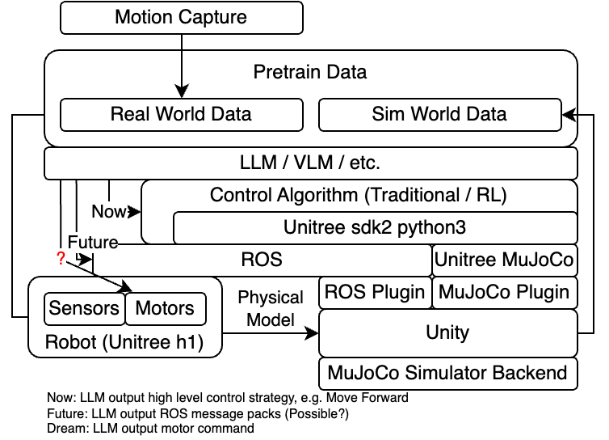

- #[[Project Morpheus]]
- ## 架构
- {:height 306, :width 401}
- ## Roadmap
	- ✅ MuJoCo
		- Unity端插件部署完成
	- ✅ [[Unitree MuJoCo]]
		- 部署完成
	- ✅ [[Unitree sdk2]] [[Unitree sdk2 python]]
	- ✅ ML-Agent
	- ✅ ROS Plugin：Unity-Robotics-Hub
		- ROS2（foxy）与Unity通信完成测试，相关过程记录在 [[Unity-Robotics-Hub]]
	- ▶️ Isaac Sim RL Sim2Sim测试
		- ✅ 环境部分部署完成
		- 缺失依赖待解决
	- ▶️ Hololens 2 连接Unity
		- ✅ Microsoft-MRTK3.0 OpenXR技术栈部署完成
		- ▶️ Hololens 2连接Unity（相机输出）
		- ⏸️ Hololens 2手部输入反控仿真物体
	- ⏸️ 动捕数据录制模块
	- ⏸️ Unitree H1仿真数据录制模块
- ## 部署
	- #### 后端
		- [见Morpheus文档](https://github.com/webDrag0n/Morpheus?tab=readme-ov-file#how-to-build)
		- Manual Install
			- [[Unity-Robotics-Hub]]
	- #### 渲染
	- #### Hololens2
	- #### 动作捕捉
	-
	-