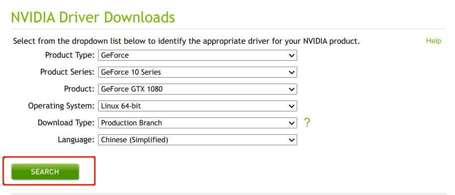
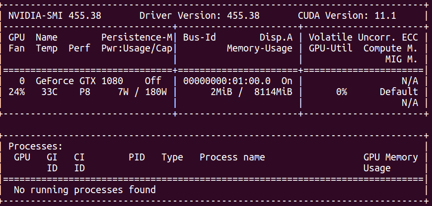
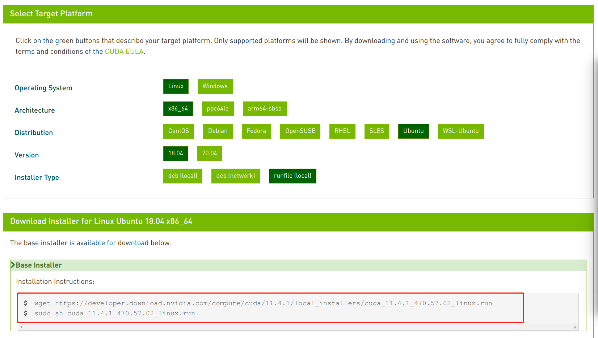
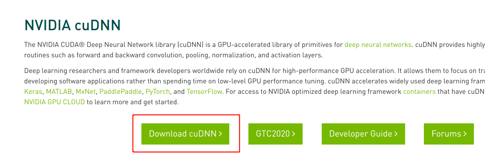

- #Ubuntu #NVIDIA #CUDA #CUDNN
- [参考网页](https://qii404.me/2021/07/03/ubuntu-install-nvidia-driver.html)
- ## 显卡驱动安装
	- ### 1、下载对应型号显卡驱动
		- 首先查看自己机器显卡型号
		- ```
		  lspci | grep -i nvidia
		  ```
		- 得到如下输出，其中`GeForce GTX 1080`就是型号
		- ```
		  01:00.0 VGA compatible controller: NVIDIA Corporation GP104 [GeForce GTX 1080] (rev a1)
		  01:00.1 Audio device: NVIDIA Corporation GP104 High Definition Audio Controller (rev a1)
		  ```
		- 然后去[https://www.nvidia.cn/Download/index.aspx](https://www.nvidia.cn/Download/index.aspx)官网选择型号下载，得到类似`NVIDIA-Linux-x86_64-450.80.02.run`这样的执行文件
		- 
	- ### 2、删除可能存在的Nvidia驱动
		- ```
		  sudo apt-get remove --purge nvidia*
		  ```
	- ### 3、禁用原有开源显卡驱动
		- ```
		  sudo vi /etc/modprobe.d/blacklist-nouveau.conf
		  ```
		- 然后将下面内容添加进去[存在则追加]，即将nouveau驱动拉黑
		- ```
		  blacklist nouveau
		  options nouveau modeset=0
		  ```
		- 保存后，执行如下命令更新改动
		- ```
		  sudo update-initramfs -u
		  ```
		- 执行`sudo reboot`**重启**电脑，nouveau驱动应该已被禁用，执行下面命令没有输出才对
		- ```
		  lsmod | grep nouveau
		  ```
	- ### 4、切换至控制台
		- 按下`Ctrl+Alt+f1`切换到tty1控制台，输入用户名密码进行登录。
		- PS: 如果是**server**版本的系统[无可视化桌面系统]，或者是**远程登录**到本机，请忽略该步骤
	- ### 5、关闭桌面系统
		- 桌面系统即`X Server`，用于在Linux下显示桌面和其他相关可视化环境。安装显卡驱动时必须要将目前的桌面服务关闭才能成功，同理如果是server版本则无需此操作。
		- ```
		  sudo service lightdm stop
		  ```
	- ### 6、安装驱动
		- 进入之前下载驱动文件的目录，执行如下命令
		- ```
		  # 换成自己下载的文件名
		  sudo ./NVIDIA-Linux-x86_64-450.80.02.run
		  ```
		- 每次安装都会出现如下提示，实际上pre-install固定会失败的，目的就是为了让你知道你自己在干嘛，选择`Continue installation`
		- ```
		  The distribution-provided pre-install script failed!  Are you sure you want to continue?
		  ```
		- 
		- 如下提示是否需要32位兼容，不需要，`no`即可
		- ```
		  Install NVIDIA's 32-bit compatibility libraries?
		  ```
		- 或者有时会出现如下提示，直接`ok`忽略即可，32位兼容的问题
		- ```
		  Unable to find a suitable destination to install 32-bit compatibility libraries. Your system may not be set up for 32-bit compatibility. 32-bit compatibility files will not be installed; if you wish to install them, re-run the installation and set a valid directory with the --compat32-libdir option.
		  ```
		- DKMS注册内核模块，直接`no`不需要
		- ```
		  Would you like to register the kernel module sources with DKMS? This will allow DKMS to automatically build a new module, if you install a different kernel later
		  ```
		- 
		- 然后会有如下过程提示
		- 
		- 是否运行Nvidia-xconfig来配置X configuration文件，选择`yes`
		- ```
		  Would you like to run the nvidia-xconfig utility to automatically update your X configuration file so that the
		   NVIDIA X driver will be used when you restart X?  Any pre-existing X configuration file will be backed up.
		  ```
		- 
		- Tips: 如果提示这个Error，说明Xserver还没关，重新执行上面的第5步关闭Xserver
		- ```
		  ERROR: You appear to be running an X server; please exit X before installing.  For further     
		  details, please see the section INSTALLING THE NVIDIA DRIVER in the README available on 
		  the Linux driver download page at [www.nvidia.com](http://www.nvidia.com/).
		  ```
		- 
	- ### 6、验证安装
		- 执行`nvidia-smi`命令能看到显卡相关信息即可，其中的`CUDA Version: 11.1`为最高能支持到的cuda版本，并非当前系统安装的cuda版本
		- 
- ## Cuda安装
	- ### 1、从官网下载
		- 下载地址为[https://developer.nvidia.com/cuda-downloads](https://developer.nvidia.com/cuda-downloads)，选择自己的版本，按照命令执行即可，`Installer Type`一般选择`runfile`，然后执行最下面提示的两句命令
		- 
	- ### 2、按照1步骤的提示下载并执行
		- 1步骤中的两句命令一般如下
		- ```
		  # 下载文件
		  wget [https://developer.download.nvidia.com/compute/cuda/xxx/local_installers/cuda_xxx_linux.run](https://developer.download.nvidia.com/compute/cuda/xxx/local_installers/cuda_xxx_linux.run)
		  # 进行安装
		  sudo sh cuda_xxx_linux.runfile
		  ```
		- 一开始会让你阅读一大堆说明，直接连续按**空格**到最下面即可，会有如下提示：
		- 输入`accept`接受协议
		- ```
		  Do you accept the previously read EULA?
		  accept/decline/quit:
		  ```
		- 是否安装显卡驱动，由于上面我们自己安装过了，所以这里选择输入`n`
		- ```
		  Install NVIDIA Accelerated Graphics Driver for Linux-x86_64 410.48?
		  (y)es/(n)o/(q)uit:
		  ```
		- 是否安装toolkit，输入`y`
		- ```
		  Install the CUDA 10.0 Toolkit?
		  (y)es/(n)o/(q)uit:
		  ```
		- 输入toolkit安装目录，默认即可，按`enter`
		- ```
		  Enter Toolkit Location
		   [ default is /usr/local/cuda-10.0 ]:
		  ```
		- 是否创建cuda软连接，输入`y`，这里一定要是y，会创建`/usr/local/cuda/`软链指向真正的cuda目录
		- ```
		  Do you want to install a symbolic link at /usr/local/cuda?
		  (y)es/(n)o/(q)uit:
		  ```
		- 是否安装cuda样例，如果有测试需求可以`y`，当然`n`问题也不大，选择y的话下一步会确认安装目录，直接enter即可
		- ```
		  Install the CUDA 10.0 Samples?
		  (y)es/(n)o/(q)uit:
		  ```
	- ### 3、添加环境变量
		- 执行`vi ~/.bashrc`，在文件尾部追加如下内容
		- ```
		  export PATH=$PATH:$PATH:/usr/local/cuda/bin
		  export LD_LIBRARY_PATH=$LD_LIBRARY_PATH:/usr/local/cuda/lib64
		  export CUDA_HOME=$CUDA_HOME:/usr/local/cuda
		  ```
		- 保存后执行`source ~/.bashrc`使其生效
	- ### 4、验证安装
		- 执行下面命令会看到cuda版本
		- ```
		  nvcc --version
		  # 如下输出
		  nvcc: NVIDIA (R) Cuda compiler driver
		  Copyright (c) 2005-2018 NVIDIA Corporation
		  Built on Sat_Aug_25_21:08:01_CDT_2018
		  Cuda compilation tools, release 10.0, V10.0.130
		  ```
- ## Cudnn安装
	- > Cudnn安装即下载文件复制到Cuda目录的过程，故实际上并未真正安装软件
	- ### 1、下载文件
		- 下载地址为[https://developer.nvidia.com/cudnn](https://developer.nvidia.com/cudnn)，不过需要注册才能下载，点击Download
		- 
		- 勾选 `I Agree` 那一行之后，根据自己上面安装的Cuda版本选择对应的Cudnn版本下载，这里选择的是`cuDNN Library for Linux (x86)`，下载后得到类似`cudnn-10.0-linux-x64-v7.6.5.32.tgz`的压缩文件
		- 
		- 执行如下命令解压，会自动解压到cuda文件夹中
		- ```
		  # 换成你下载的文件
		  tar -zxvf cudnn-10.0-linux-x64-v7.6.5.32.tgz
		  ```
		- 执行如下操作将头文件和so文件拷贝到cuda目录下即完成安装
		- ```
		  # 注意下面的cuda-10.0目录换成上面安装的版本号
		  sudo cp cuda/include/cudnn.h /usr/local/cuda-10.0/include
		  sudo cp cuda/lib64/libcudnn* /usr/local/cuda-10.0/lib64
		  # 增加读取权限
		  sudo chmod a+r /usr/local/cuda-10.0/include/cudnn.h 
		  sudo chmod a+r /usr/local/cuda-10.0/lib64/libcudnn*
		  ```
- ## Cuda版本切换
	- 如果机器上安装了多个版本的cuda，则会在`/usr/local/`中存在多个cuda-xx的文件夹，如下：
	- 
	- 其中`/usr/local/cuda`文件夹是个软链接，链接到目前的cuda版本目录，所以如果要切换版本的话，只需要将原来cuda软链删除，重新建立指向另一个cuda-xx目录即可
- ## 关于NVIDIA-SMI失效
	- 有时候执行`nvidia-smi`命令时会报错`NVIDIA-SMI has failed because it couldn't communicate with the NVIDIA driver. Make sure that the latest NVIDIA driver is installed and running`，这种可能是由于最近升级内核导致的新内核无法启动驱动，如下处理：
	- 1.查看之前安装的nvidia驱动版本
	- ```
	  ls /usr/src | grep nvidia
	  # 得到如下输出
	  nvidia-srv-510.47.03
	  ```
	- 2.使用dkms重新安装
	- ```
	  # 有些机器需要安装dkms，如果已安装则忽略
	  sudo apt-get install dkms
	  # 使用dkms重新编译
	  # 注意 -v 后面的版本号，就是第一步中 nvidia- 后面的内容，如果上面输出是 nvidia-510.47 ，那就得 -v 510.47
	  sudo dkms install -m nvidia -v srv-510.47.03
	  ```
	- 3.重启电脑，再执行`nvidia-smi`就恢复正常了