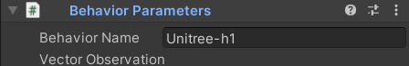

- #Unity
- Github：
- ## 安装
  id:: 66ca022b-abac-414b-af0b-b3fcfaa975ae
  该教程采用Unity ML-Agent v2.0.1，不同版本的部分方法可能有不同名称，请确认版本。
- ## 设置Unity场景与Agent
	- Agent需要`Behavior Parameters`与`Decision Requester`组件才能正常运行，对人形机器人控制，二者的典型配置如下：
- ## Agent编写
	- Unity ML-Agent依赖程序员自行实现一个继承自`Unity.MLAgents`的`Agent`类，如：
	  ```c#
	  public class SomeAgent : Agent {}
	  ```
	- 其中需要实现四个较为重要的方法：
	  ```c#
	  # 观察
	  public override void CollectObservations(VectorSensor sensor)
	  # 重初始化
	  public override void OnEpisodeBegin()
	  # 手动覆盖控制
	  public override void Heuristic(in ActionBuffers actionsOut)
	  # 执行
	  public override void OnActionReceived(ActionBuffers actionBuffers)
	  ```
	  请注意如 ((66ca022b-abac-414b-af0b-b3fcfaa975ae)) 部分所述，不同版本的Unity ML-Agent的这三个方法可能有不同的名称。
- ## 训练
	- ### 模型设置
		- 可以用yaml配置文件对模型类型，参数等进行设置，如：
		   
		  ```yaml
		  behaviors:
		    # 注意此处 Unitree-h1 为配置名称
		    # Unity中Behavior Parameters组件内Behavior Name需要与此一致
		    Unitree-h1:
		      trainer_type: sac
		      keep_checkpoints: 10
		      # 2.5e6
		      max_steps: 2.0e7
		      time_horizon: 1000
		      summary_freq: 10000
		      threaded: true
		  
		      network_settings:
		        normalize: false
		        hidden_units: 64
		        # 2
		        num_layers: 3
		        vis_encode_type: simple
		  
		      hyperparameters:
		        batch_size: 2048
		        buffer_size: 20480
		        # 3.0e-4
		        learning_rate: 3.0e-3
		  
		        # SAC specific hyperparameters
		        buffer_init_steps: 0
		        tau: 0.005
		        steps_per_update: 10.0
		        save_replay_buffer: false
		        init_entcoef: 0.5
		        reward_signal_steps_per_update: 10.0
		  
		        learning_rate_schedule: linear
		  
		      reward_signals:
		        extrinsic:
		          gamma: 0.99
		          strength: 1.0
		        curiosity:
		          strength: 0.02
		          gamma: 0.99
		          encoding_size: 256
		          learning_rate: 3.0e-3
		  ```
	- 打开安装有Unity ML-Agent的python3环境，输入命令：
	  ```bash
	  mlagents-learn <yaml配置文件路径> --run-id=<你想要设定的训练识别名>
	  ```
	- 如已存在相同id记录将无法启动训练，此时有两种可能：
	- 恢复中断的训练：
	  ```bash
	  mlagents-learn <yaml配置文件路径> --run-id=<你想要设定的训练识别名> --resume
	  ```
	- 强制覆盖旧训练记录：
	  ```bash
	  mlagents-learn <yaml配置文件路径> --run-id=<你想要设定的训练识别名> --force
	  ```
- ## 推理
	- 将训练得到的`.onnx`模型文件拖入`Behavior Parameters`组件的`Model`槽内，直接启动Unity Play即可。
- ## 与 [[MuJoCo]] 联合使用：
	- [MuJoCo Unity插件Github](https://github.com/google-deepmind/mujoco/tree/main/unity)
	-