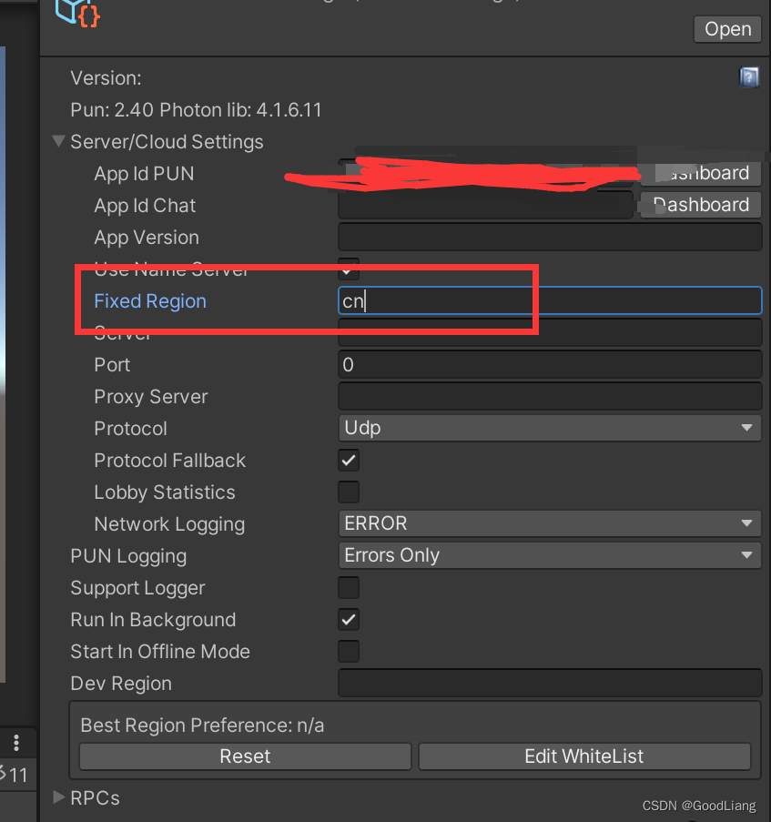
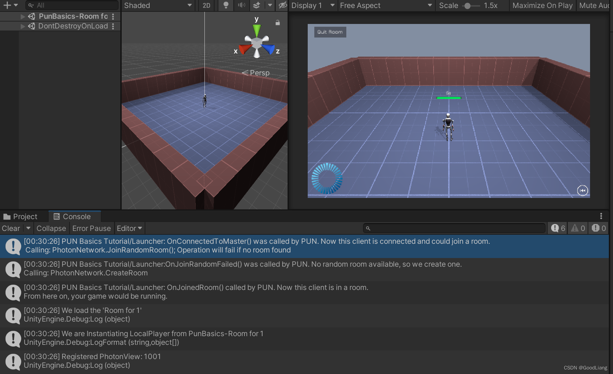

- #Unity #Photon
- 参考：[photon pun2 设置中国区 - 非递归电饭煲的博客](https://blog.csdn.net/qq_37350725/article/details/124657623)
- ## photon 网址
  
  >  https://dashboard.photonengine.com/zh-CN
  
  先创建一个app，这里的appid等等会用到
- ## 中国区
- > https://vibrantlink.com/
- ## 步骤
- 访问中国区官网
  
- 填写信息，填写之前复制的appid，一般两个工作日
- 按正常流程安装配置Unity photon插件
- 搜索LoadBalancingClient.cs
  {:height 241, :width 620}
- 修改 NameServerHost， 由 ns.exitgames.io 改为 ns.photonengine.cn
  
- PhotonServerSettings 的 Fixed Region 设置为 cn
  
  
- ## 测试
  可以将配置文件的日志打开，载入自带的demo
  
  