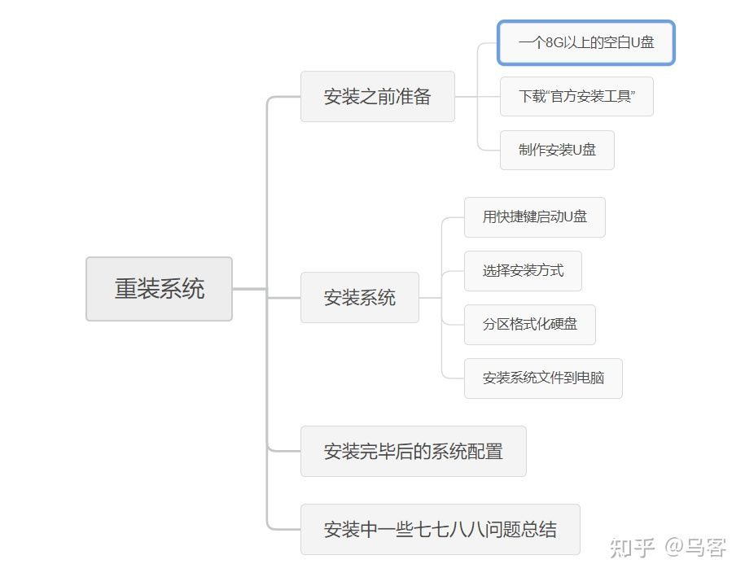

- #Windows
- ### 重装Windows10系统
	- 参考资料：[手把手教你如何重装win10系统···](https://zhuanlan.zhihu.com/p/108156241)
	- 
	- #### 制作安装U盘
		- 前往[Windows10 官方下载页面](https://www.microsoft.com/zh-cn/software-download/windows10)下载Windows10安装工具
		- 
		- 接受许可条款
		- 
		- 
		- 这里去掉“对这台电脑使用推荐的选项”的勾 可以对win10的版本和体系进行选择。如果是DIY主机，建议选择“专业版”。如果你重装的机器是品牌机带有原装的系统，建议选择家庭版即可（原装系统一般都是家庭版，功能区别不大。选择家庭版可以免去激活过程）
		- 
		- 
		- U盘接下来会自动安装，提示安装完成后弹出并拔掉U盘
		- 将U盘插入希望重装的电脑上，并进入引导选项（大部分电脑是开机狂按`F12`，可以查一下自己的型号），部分电脑需要按住`fn`键再按`F12`
		  
		-
		-
	-