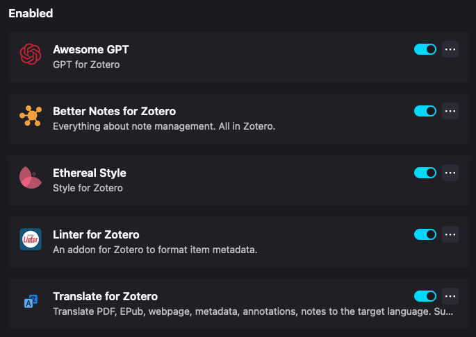

## 百科全书
	- https://zotero-chinese.com/user-guide/
- ## 快速外链搜索
	- https://qnscholar.github.io/2020-12/Zotero-Connected-Papers/
	- https://zhuanlan.zhihu.com/p/662725136
	- 打开Zotero安装文件夹，进入Zotero/locate
	  编辑engines.json，加入：
	  ```json
	  {
	  		"_name": "N-Connected Papers",
	  		"_alias": "Connected Papers文献网络",
	  		"_description": "Connected Papers文献网络",
	  		"_icon": "https://www.connectedpapers.com/favicon.ico",
	  		"_hidden": false,
	  		"_urlTemplate": "https://www.connectedpapers.com/search?q={z:title}+{z:year}",
	  		"_urlParams": [],
	  		"_urlNamespaces": {
	  			"rft": "info:ofi/fmt:kev:mtx:journal",
	  			"z": "http://www.zotero.org/namespaces/openSearch#",
	  			"": "http://a9.com/-/spec/opensearch/1.1/"
	  		},
	  		"_iconSourceURI": "https://www.connectedpapers.com/favicon.ico"
	  },
	  ```
- ## 插件
	- [How to use Logseq's Zotero Integration](https://blog.logseq.com/citation-needed-how-to-use-logseqs-zotero-integration/)
	- https://zotero-chinese.com/
	- https://zotero-chinese.com/plugins/
	- 建议安装：
	  
	-
- /zotero