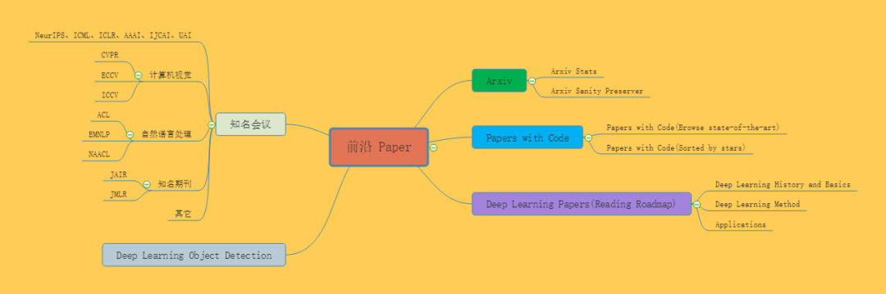

- 
- ## 数学
  collapsed:: true
	- 数学基础：高等数学
	- https://zhuanlan.zhihu.com/p/36311622
	- 数学基础：线性代数
	- https://zhuanlan.zhihu.com/p/36584206
	- 数学基础：概率论与数理统计
	- https://zhuanlan.zhihu.com/p/36584335
- ## 编程
  collapsed:: true
	- 代码规范：
	- https://zhuanlan.zhihu.com/p/59763076
	- numpy练习题：
	- https://zhuanlan.zhihu.com/p/57872490
	- pandas练习题：
	- https://zhuanlan.zhihu.com/p/56644669
- ## 数据分析/挖掘
- 
- 数据分析的基础书籍
	- 《利用python进行数据分析》
	- 这本书含有大量的实践案例，你将学会如何利用各种Python库（包括NumPy，Pandas、Matplotlib以及IPython等）高效地解决各式各样的数据分析问题。如果把代码都运行一次，基本上就能解决数据分析的大部分问题了。
- 特征工程
	- https://blog.csdn.net/Datawhale/article/details/83033869
- 数据挖掘项目
	- https://blog.csdn.net/datawhale/article/details/80847662
- ## 机器学习
	- 
	- 吴恩达《Machine Learning》
	- 这绝对是机器学习入门的首选课程，没有之一！即便你没有扎实的机器学习所需的扎实的概率论、线性代数等数学基础，也能轻松上手这门机器学习入门课，并体会到机器学习的无穷趣味。
	- **课程主页：**
	- https://www.coursera.org/learn/machine-learning
	- **中文视频：**
	- 网易云课堂搬运了这门课，并由黄海广等人翻译了中文字幕。
	- **中文笔记及作业代码：**
	- https://github.com/fengdu78/Coursera-ML-AndrewNg-Notes
	-
	- 吴恩达 CS229
	- 吴恩达在斯坦福教授的机器学习课程 CS229 与 吴恩达在 Coursera 上的《Machine Learning》相似，但是有**更多的数学要求和公式的推导**，难度稍难一些。该课程对机器学习和统计模式识别进行了广泛的介绍。
	- **课程主页：**
	- http://cs229.stanford.edu/
	- **中文视频：**
	- http://open.163.com/special/opencourse/machinelearning.html
	- **中文笔记：**
	- https://kivy-cn.github.io/Stanford-CS-229-CN/#/
	- **速查表：**
	- 这份给力的资源贡献者是一名斯坦福的毕业生 Shervine Amidi。作者整理了一份超级详细的关于 CS229的速查表
	- https://zhuanlan.zhihu.com/p/56534902
	- **作业代码：**
	- https://github.com/Sierkinhane/CS229-ML-Implements
	-
	- 林轩田《机器学习基石》
	- 台湾大学林轩田老师的《机器学习基石》课程由浅入深、内容全面，基本涵盖了机器学习领域的很多方面。其作为机器学习的入门和进阶资料非常适合。而且林老师的教学风格也很幽默风趣，总让读者在轻松愉快的氛围中掌握知识。这门课比 Ng 的《Machine Learning》稍难一些，侧重于机器学习理论知识。
	- **中文视频：**
	- https://www.bilibili.com/video/av36731342
	- **中文笔记：**
	- https://redstonewill.com/category/ai-notes/lin-ml-foundations/
	- **配套教材**
	- 配套书籍为《Learning From Data》，在线书籍主页：http://amlbook.com/
	-
	- 林轩田《机器学习技法》
	- 《机器学习技法》课程是《机器学习基石》的进阶课程。主要介绍了机器学习领域经典的一些算法，包括支持向量机、决策树、随机森林、神经网络等等。难度要略高于《机器学习基石》，具有很强的实用性。
	- **中文视频：**
	- https://www.bilibili.com/video/av36760800
	- **中文笔记：**
	- https://redstonewill.com/category/ai-notes/lin-ml-techniques/
	-
	- 书籍
	- 《机器学习》
	- 周志华的《机器学习》被大家亲切地称为“西瓜书”。这本书非常经典，讲述了机器学习核心数学理论和算法，适合有作为学校的教材或者中阶读者自学使用，入门时学习这本书籍难度稍微偏高了一些。
	- 
	- 配合《机器学习实战》一起学习，效果更好！
	- **读书笔记：**
	- https://www.cnblogs.com/limitlessun/p/8505647.html#_label0
	- **公式推导：**
	- https://datawhalechina.github.io/pumpkin-book/#/
	- **课后习题：**
	- https://zhuanlan.zhihu.com/c_1013850291887845376
	- 《统计学习方法》
	- 李航的这本《统计学习方法》堪称经典，包含更加完备和专业的机器学习理论知识，作为夯实理论非常不错。
	- .jpg)
	- **讲课 PPT：**
	- https://github.com/fengdu78/lihang-code/tree/master/ppt
	- **读书笔记：**
	- http://www.cnblogs.com/limitlessun/p/8611103.html
	- https://github.com/SmirkCao/Lihang
	- **参考笔记：**
	- https://zhuanlan.zhihu.com/p/36378498
	- **代码实现：**
	- https://github.com/fengdu78/lihang-code/tree/master/code
	- 书籍
	- 《Scikit-Learn 与 TensorFlow 机器学习实用指南》
	- 在经过前面的学习之后，这本《Scikit-Learn 与 TensorFlow 机器学习实用指南》非常适合提升你的机器学习实战编程能力。
	- 这本书分为两大部分，第一部分介绍机器学习基础算法，每章都配备 Scikit-Learn 实操项目；第二部分介绍神经网络与深度学习，每章配备 TensorFlow 实操项目。如果只是机器学习，可先看第一部分的内容。
	- .jpg)
	- 全书代码：
	- https://github.com/ageron/handson-ml
	- 实战
	- Kaggle 比赛
	- 比赛是提升自己机器学习实战能力的最有效的方式，**首选 Kaggle 比赛。**
	- **Kaggle 主页:**
	- https://www.kaggle.com/
	- **Kaggle 路线:**
	- https://github.com/apachecn/kaggle
	- 工具
	- Scikit-Learn 官方文档
	- Scikit-Learn 作为机器学习一个非常全面的库，是一份不可多得的实战编程手册。
	- **官方文档：**
	- https://scikit-learn.org/stable/index.html
	- **中文文档（0.19）：**
	- http://sklearn.apachecn.org/#/
- ## 深度学习
	- 
	- 吴恩达《Deep Learning》
	- 在吴恩达开设了机器学习课程之后，发布的《Deep Learning》课程也备受好评，吴恩达老师的课程最大的特点就是将知识循序渐进的传授给你，是入门学习不可多得良好视频资料。
	- 整个专题共包括五门课程：01.神经网络和深度学习；02.改善深层神经网络-超参数调试、正则化以及优化；03.结构化机器学习项目；04.卷积神经网络；05.序列模型。
	- **课程视频**
	- 网易云课堂：
	- https://mooc.study.163.com/university/deeplearning_ai#/c
	- Coursera:
	- https://www.coursera.org/specializations/deep-learning
	- **课程笔记**
	- 之前编写过吴恩达老师机器学习个人笔记黄海广博士带领团队整理了中文笔记：
	- https://github.com/fengdu78/deeplearning_ai_books
	- **参考论文**
	- 吴恩达老师在课程中提到了很多优秀论文，黄海广博士整理如下：
	- https://github.com/fengdu78/deeplearning_ai_books/tree/master/%E5%8F%82%E8%80%83%E8%AE%BA%E6%96%87
	- **课程PPT及课后作业**
	- 吴恩达深度学习课程，包含课程的课件、课后作业和一些其他资料：
	- https://github.com/stormstone/deeplearning.ai
	- 公开课
	- Fast.ai《程序员深度学习实战》
	- 说到深度学习的公开课，与吴恩达《Deep Learning》并驾齐驱的另一门公开课便是由Fast.ai出品的《程序员深度学习实战》。这门课最大的特点便是**“自上而下”**而不是**“自下而上”**,是绝佳的通过实战学习深度学习的课程。
	- **视频地址**
	- B站地址(英文字幕)：
	- https://www.bilibili.com/video/av18904696?from=search&seid=10813837536595120136
	- CSDN地址(2017版中文字幕):
	- https://edu.csdn.net/course/detail/5192
	- **课程笔记**
	- 英文笔记原文：
	- https://medium.com/@hiromi_suenaga/deep-learning-2-part-1-lesson-1-602f73869197
	- 由ApacheCN组织的中文翻译：
	- https://github.com/apachecn/fastai-ml-dl-notes-zh
	- 公开课
	- CS230 Deep Learning
	- 斯坦福的深度学习课程CS230在4月2日刚刚开课，对应的全套PPT也随之上线。从内容来看，今年的课程与去年的差别不大，涵盖了CNNs, RNNs, LSTM, Adam, Dropout, BatchNorm, Xavier/He initialization 等深度学习的基本模型，涉及医疗、自动驾驶、手语识别、音乐生成和自然语言处理等领域。
	- Datawhale整理了该门课程的详细介绍及参考资料:
	- [吴恩达CS230深度学习开课了！视频配套PPT应有尽有](http://mp.weixin.qq.com/s?__biz=MzIyNjM2MzQyNg==&mid=2247484343&idx=1&sn=c2dbdafe4b5c2542b8b7058357776e93&chksm=e870d2fadf075bec6fe0252e9f1a44fde4ad4126d3c71004decd15b3f73ad33fb232219bf90b&scene=21#wechat_redirect)
	- 书籍
	  神经网络与深度学习 - 复旦邱锡鹏
	- 本书是入门深度学习领域的极佳教材，主要介绍了神经网络与深度学习中的基础知识、主要模型（前馈网络、卷积网络、循环网络等）以及在计算机视觉、自然语言处理等领域的应用。
	- [复旦教授邱锡鹏开源发布《神经网络与深度学习》](http://mp.weixin.qq.com/s?__biz=MzIyNjM2MzQyNg==&mid=2247484296&idx=1&sn=ed0cc963ad04783f9b39fe051f61a0f8&chksm=e870d2c5df075bd37971aded1484865686a671058285c76be28030673c7c91d45c57e3d85e2d&scene=21#wechat_redirect)
	- 书籍
	- 《深度学习》
	- 
	- 完成以上学习后，想要更加系统的建立深度学习的知识体系，阅读《深度学习》准没错。该书从浅入深介绍了基础数学知识、机器学习经验以及现阶段深度学习的理论和发展，它能帮助人工智能技术爱好者和从业人员在三位专家学者的思维带领下全方位了解深度学习。
	- **书籍介绍**
	- 《深度学习》通常又被称为花书，深度学习领域最经典的畅销书。由全球知名的三位专家IanGoodfellow、YoshuaBengio和AaronCourville撰写，是深度学习领域奠基性的经典教材。该书被大众尊称为“AI圣经”。
	- **在线阅读**
	- 该书由众多网友众包翻译，电子版在以下地址获得：
	- https://github.com/exacity/deeplearningbook-chinese
	- 书籍
	- 《深度学习 500 问》
	- 当你看完了所有的视频，研习了AI圣经，一定充满了满脑子问号，此时不如来深度学习面试中常见的500个问题。
	- **书籍介绍**
	- DeepLearning-500-questions，作者是川大的一名优秀毕业生谈继勇。该项目以深度学习面试问答形式，收集了 500 个问题和答案。内容涉及了常用的概率知识、线性代数、机器学习、深度学习、计算机视觉等热点问题，该书目前尚未完结，却已经收获了Github 2.4w stars。
	- **项目地址：**
	- https://github.com/scutan90/DeepLearning-500-questions
	- 工具
	- TensorFlow 官方文档
	- 学深度学习一定离不开TensorFlow
	- **官方文档：**
	- https://www.tensorflow.org/api_docs/python/tf
	- **中文文档：**
	- https://github.com/jikexueyuanwiki/tensorflow-zh
	- 工具
	- PyTorch官方文档
	- PyTorch是学深度学习的另一个主流框架
	- **官方文档：**
	- https://pytorch.org/docs/stable/index.html
	- **中文文档(版本0.3)：**
	- https://github.com/apachecn/pytorch-doc-zh
- ## 强化学习
	- 
	- Reinforcement Learning-David Silver
	- 与吴恩达的课程对于机器学习和深度学习初学者的意义相同，David Silver的这门课程绝对是大多数人学习强化学习必选的课程。
	- 课程从浅到深，把强化学习的内容娓娓道来，极其详尽。不过由于强化学习本身的难度，听讲这门课还是有一定的门槛，建议还是在大致了解这个领域之后观看该视频学习效果更佳，更容易找到学习的重点。
	- **视频地址**
	- B站地址(中文字幕)：
	- https://www.bilibili.com/video/av45357759?from=search&seid=9547815852611563503
	- 课程原地址：
	- https://www.youtube.com/watch?v=2pWv7GOvuf0
	- **课程资料**
	- 课程PPT：
	- http://www0.cs.ucl.ac.uk/staff/d.silver/web/Teaching.html
	- 课程笔记：
	- https://www.zhihu.com/people/qqiang00/posts
	- 公开课
	- 李宏毅《深度强化学习》
	- David Silver的课程虽然内容详尽，但前沿的很多内容都没有被包括在内，这时，台大李宏毅的《深度强化学习》就是学习前沿动态的不二之选。
	- **视频地址**
	- B站地址(中文字幕)：
	- https://www.bilibili.com/video/av24724071?from=search&seid=9547815852611563503
	- 课程原地址：
	- https://www.youtube.com/watch?v=2pWv7GOvuf0
	- **课程资料**
	- 课程PPT：
	- http://speech.ee.ntu.edu.tw/~tlkagk/courses_MLDS18.html
	- 课程笔记：
	- https://blog.csdn.net/cindy_1102/article/details/87905272
- ## 论文资源
	- 
	- Arxiv
	- **Arxiv Stats**
	- Arxiv 机器学习最新论文检索主页地址：
	- https://arxiv.org/list/stat.ML/recent?ref=bestofml.com
	- **Arxiv Sanity Preserver**
	- Andrej Karpathy 开发了 Arxiv Sanity Preserver，帮助分类、搜索和过滤特征
	- 主页地址：
	- http://www.arxiv-sanity.com/?ref=bestofml.com
	- 2
	- Papers with Code
	- **Papers with Code(Browse state-of-the-art)**
	- 这个网站叫做 Browse state-of-the-art。它将 ArXiv 上的最新深度学习论文与 GitHub 上的开源代码联系起来。该项目目前包含了 651 个排行榜，1016 个深度学习任务，795 个数据集，以及重磅的 10257 个含复现代码的优秀论文。简直就是一个寻找论文和代码的利器。它将 1016 个深度学习任务分成了 16 大类，涉及了深度学习的各个方面。
	- 主页地址：
	- https://paperswithcode.com/sota
	- 举两个例子：
	- CV：
	- https://paperswithcode.com/area/computer-vision
	- NLP：
	- https://paperswithcode.com/area/natural-language-processing
	- **Papers with Code(Sorted by stars)**
	  这份资源收集了 AI 领域从 2013 - 2018 年所有的论文，并按照在 GitHub 上的标星数量进行排序。
	- GitHub 项目地址：
	- https://github.com/zziz/pwc
	- 3
	- Deep Learning Papers 阅读路线
	- 如果你是深度学习领域的新手，你可能会遇到的第一个问题是“我应该从哪篇论文开始阅读？”下面是一个深入学习论文的阅读路线图！
	- GitHub 项目地址：
	- https://github.com/floodsung/Deep-Learning-Papers-Reading-Roadmap
	- 这份深度学习论文**阅读路线**分为三大块：
	- 1 Deep Learning History and Basics
	- 2 Deep Learning Method
	- 3 Applications
	- 4
	- Deep Learning Object Detection
	- 目标检测（Object Detection）是深度学习 CV 领域的一个核心研究领域和重要分支。纵观 2013 年到 2019 年，从最早的[R-CNN](https://mp.weixin.qq.com/s?__biz=MzA3MzI4MjgzMw==&mid=2650761248&idx=1&sn=25b306cb5e4e39730e960f109bfaf044&chksm=871aac5eb06d2548a75eda9f2accf50aad8be315f71514c347fec2fc0b9b17a3ea898a4ba3eb&mpshare=1&scene=1&srcid=#rd)、Fast R-CNN 到后来的 YOLO v2、YOLO v3 再到今年的 M2Det，新模型层出不穷，性能也越来越好！
	- 本资源对目标检测近几年的发展和相关论文做出一份系统介绍，总结一份超全的文献 paper 列表。
	- 
	- GitHub 项目地址：
	- https://github.com/hoya012/deep_learning_object_detection
	- 5
	- 知名会议
	- **会议**
	- NeurIPS：https://nips.cc/
	- ICML：https://icml.cc/
	- ICLR：https://iclr.cc/
	- AAAI：https://aaai.org/Conferences/AAAI-19/
	- IJCAI：https://www.ijcai.org/
	- UAI：http://www.auai.org/uai2019/index.php
	- **计算机视觉：**
	- CVPR：http://cvpr2019.thecvf.com/
	- ECCV：https://eccv2018.org/program/main-conference/
	- ICCV：http://iccv2019.thecvf.com/
	- **自然语言处理：**
	- ACL：http://www.aclcargo.com/
	- EMNLP：https://www.aclweb.org/portal/content/emnlp-2018
	- NAACL：https://naacl2019.org/
	- **知名期刊:**
	- JAIR：https://www.jair.org/index.php/jair
	- JMLR：http://www.jmlr.org/
	- **其它**
	- 机器人方面，有 CoRL（学习）、ICAPS（规划，包括但不限于机器人）、ICRA、IROS、RSS；
	- 对于更理论性的研究，有 AISTATS、COLT、KDD。
- ## 理论应用
	- 
	- ### 自然语言处理
		- NLP是什么
		- 自然语言处理（NLP，Natural Language Processing）是研究计算机处理人类语言的一门技术，目的是弥补人类交流（自然语言）和计算机理解（机器语言）之间的差距。NLP包含句法语义分析、信息抽取、文本挖掘、[机器翻译](https://mp.weixin.qq.com/s?__biz=MzA3MzI4MjgzMw==&mid=2650761248&idx=1&sn=25b306cb5e4e39730e960f109bfaf044&chksm=871aac5eb06d2548a75eda9f2accf50aad8be315f71514c347fec2fc0b9b17a3ea898a4ba3eb&mpshare=1&scene=1&srcid=#rd)、信息检索、[问答系统](https://mp.weixin.qq.com/s?__biz=MzA3MzI4MjgzMw==&mid=2650761248&idx=1&sn=25b306cb5e4e39730e960f109bfaf044&chksm=871aac5eb06d2548a75eda9f2accf50aad8be315f71514c347fec2fc0b9b17a3ea898a4ba3eb&mpshare=1&scene=1&srcid=#rd)和对话系统等领域。
		- 2
		- 课程推荐
		- **CS224n 斯坦福深度自然语言处理课**
		- 17版中文字幕：
		- https://www.bilibili.com/video/av41393758/?p=1
		- 课程笔记：
		- http://www.hankcs.com/?s=CS224n%E7%AC%94%E8%AE%B0
		- 2019版课程主页：
		- http://web.stanford.edu/class/cs224n/
		  **自然语言处理 - Dan Jurafsky 和 Chris Manning**
		- B站英文字幕版：
		- https://www.bilibili.com/video/av35805262/
		- 学术激流网：
		- http://academictorrents.com/details/d2c8f8f1651740520b7dfab23438d89bc8c0c0ab
		- 3
		- 书籍推荐
		- Python自然语言处理
		- 入门读物，整本书不仅涉及了语料库的操作，也对传统的基于规则的方法有所涉及。全书包括了分词（tokenization）、词性标注（POS）、语块（Chunk）标注、句法剖析与语义剖析等方面，是nlp中不错的一本实用教程。
		- 自然语言处理综论
		- By Daniel Jurafsky和James H. Martin
		- 本书十分权威，是经典的NLP教科书，涵盖了经典自然语言处理、统计自然语言处理、语音识别和计算语言学等方面。
		- 统计自然语言处理基础
		- By Chris Manning和HinrichSchütze
		- 更高级的统计NLP方法，在统计基本部分和n元语法部分介绍得都很不错。
		- 4
		- 博客推荐
		- 我爱自然语言处理
		- 地址：http://www.52nlp.cn/
		- TFIDF、文档相似度等等在这个网站上都有通俗易懂的解释
		- 语言日志博客（Mark Liberman）
		- 地址：
		- http://languagelog.ldc.upenn.edu/nll/
		- natural language processing blog
		- 地址：https://nlpers.blogspot.com/
		- 美国Hal Daumé III维护的一个natural language processing的  博客，经常评论最新学术动态，值得关注。有关于ACL、NAACL等学术会议的参会感想和对论文的点评
		- 5
		- 项目推荐
		- 基于LSTM的中文问答系统
		- https://github.com/S-H-Y-GitHub/QA
		- 基于RNN的文本生成器
		- https://github.com/karpathy/char-rnn
		- 基于char-rnn的汪峰歌词生成器
		- https://github.com/phunterlau/wangfeng-rnn
		- 用RNN生成手写数字
		- https://github.com/skaae/lasagne-draw
		- 6
		- 开源NLP工具包
		- 中文NLP相关：https://github.com/crownpku/Awesome-Chinese-NLP
		- 英文NLP相关：
		- NLTK: http://www.nltk.org/
		- TextBlob: http://textblob.readthedocs.org/en/dev/
		- Gensim: http://radimrehurek.com/gensim/
		- Pattern: http://www.clips.ua.ac.be/pattern
		- Spacy: http://spacy.io
		- Orange: http://orange.biolab.si/features/
		- Pineapple: https://github.com/proycon/pynlpl
		- 7
		- 相关论文
		- 100 Must-Read NLP Papers
		- https://github.com/mhagiwara/100-nlp-papers
	- ### 计算机视觉
		- 课程推荐
		- Stanford CS223B
		- 比较适合基础，适合刚刚入门的同学，跟深度学习的结合相对来说会少一点，不会整门课讲深度学习，而是主要讲计算机视觉，方方面面都会讲到
		- 李飞飞：CS231n课程：
		- https://mp.weixin.qq.com/s/-NaDpXsxvu4DpXqVNXIAvQ
		- 3
		- 书籍推荐
		- 1.入门学习：
		- 《Computer Vision：Models, Learning and Inference》
		- 2.经典权威的参考资料：
		- 《Computer Vision：Algorithms and Applications》
		- 3.理论实践：
		- 《OpenCV3编程入门》
	- ### 推荐系统
		- 推荐系统是什么
		- 推荐系统就是自动联系用户和物品的一种工具，它能够在信息过载的环境中帮助用户发现令他们感兴趣的信息，也能将信息推送给对它们感兴趣的用户。推荐系统属于资讯过滤的一种应用。
		- 2
		- 推荐课程
		- 推荐系统专项课程**《Recommender Systems Specialization》**
		- 这个系列由4门子课程和1门毕业项目课程组成，包括推荐系统导论，最近邻协同过滤，推荐系统评价，矩阵分解和高级技术等。
		- 观看地址：
		- https://www.coursera.org/specializations/recommender-systems
		- 3
		- 书籍推荐
		- 《推荐系统实践》（项亮 著）
		- 《推荐系统》（Dietmar Jannach等 著，蒋凡 译）
		- 《用户网络行为画像》（牛温佳等 著）
		- 《Recommender Systems Handbook》（Paul B·Kantor等 著）
		- 4
		- 算法库
		- **LibRec**
		- LibRec是一个Java版本的覆盖了70余个各类型推荐算法的推荐系统开源算法库，由国内的推荐系统大牛郭贵冰创办，目前已更新到2.0版本，它有效地解决了评分预测和物品推荐两大关键的推荐问题。
		- 项目地址: https://github.com/guoguibing/librec
		- 官网地址： https://www.librec.net/
		- **LibMF**
		- C++版本开源推荐系统，主要实现了基于矩阵分解的推荐系统。针对SGD（随即梯度下降）优化方法在并行计算中存在的 locking problem 和 memory discontinuity问题，提出了一种 矩阵分解的高效算法FPSGD（Fast Parallel SGD），根据计算节点的个数来划分评分矩阵block，并分配计算节点。
		- 项目地址：
		- http://www.csie.ntu.edu.tw/~cjlin/libmf/
		- **SurPRISE**
		- 一个Python版本的开源推荐系统，有多种经典推荐算法
		- 项目地址：http://surpriselib.com/
		- **Neural Collaborative Filtering**
		- 神经协同过滤推荐算法的Python实现
		- 项目地址：
		- https://github.com/hexiangnan/neural_collaborative_filtering
		- **Crab**
		- 基于Python开发的开源推荐软件，其中实现有item和user的协同过滤
		- 项目地址：http://muricoca.github.io/crab/
		- 5
		- 常用数据集
		- **MovieLen**
		- https://grouplens.org/datasets/movielens/
		- MovieLens数据集中，用户对自己看过的电影进行评分，分值为1~5。MovieLens包括两个不同大小的库，适用于不同规模的算法。小规模的库是943个独立用户对1 682部电影作的10 000次评分的数据；大规模的库是6 040个独立用户对3 900部电影作的大约100万次评分。适用于传统的推荐任务
		- **Douban**
		- https://www.cse.cuhk.edu.hk/irwin.king.new/pub/data/douban
		- Douban是豆瓣的匿名数据集，它包含了12万用户和5万条电影数据，是用户对电影的评分信息和用户间的社交信息，适用于社会化推荐任务。
		- **BookCrossing**
		- http://www2.informatik.uni-freiburg.de/~cziegler/BX/
		- 这个数据集是网上的Book-Crossing图书社区的278858个用户对271379本书进行的评分，包括显式和隐式的评分。这些用户的年龄等人口统计学属性(demographic feature)都以匿名的形式保存并供分析。这个数据集是由Cai-Nicolas Ziegler使用爬虫程序在2004年从Book-Crossing图书社区上采集的。
		- 6
		- 推荐论文
		- 经典必读论文整理，包括综述文章、传统经典推荐文章、社会化推荐文章、基于深度学习的推荐系统文章、专门用于解决冷启动的文章、POI相关的论文、利用哈希技术来加速推荐的文章以及推荐系统中经典的探索与利用问题的相关文章等。
		- 项目地址:
		- https://github.com/hongleizhang/RSPapers
		- 7
		- 推荐项目
		- 1.今日头条推荐系统机制介绍，面向内容创作者。分享人：项亮，今日头条推荐算法架构师:
		- https://v.qq.com/x/page/f0800qavik7.html?
		- 2. 3分钟了解今日头条推荐系统原理
		- https://v.qq.com/x/page/g05349lb80j.html?
		- 3.facebook是如何为十亿人推荐好友的
		- https://code.facebook.com/posts/861999383875667/recommending-items-to-more-than-a-billion-people/
		- 4.Netflix的个性化和推荐系统架构
		- http://techblog.netflix.com/2013/03/system-architectures-for.html
	- ### 风控模型
		-