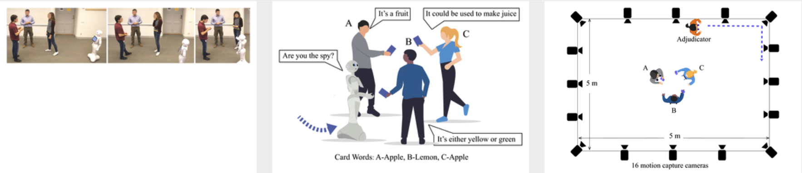
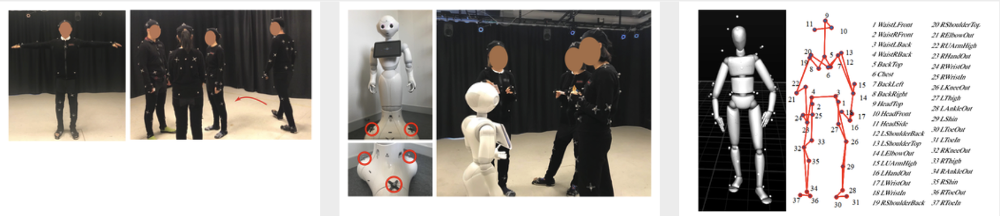
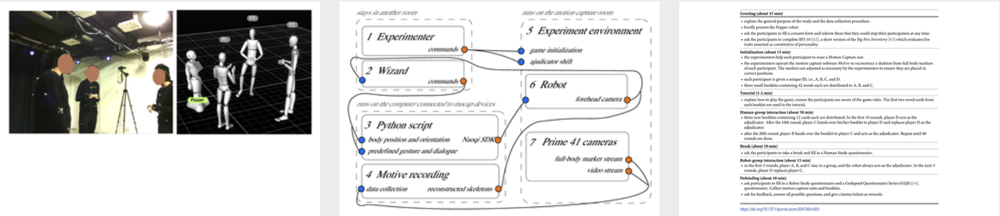

- #人类机器人交互
- Here are some notable datasets and research papers related to human-robot interaction (HRI):
- 1. **[CongreG8 Dataset](https://journals.plos.org/plosone/article?id=10.1371/journal.pone.0247364)**: This dataset includes human-group interaction data, robot-group interaction data, personality data, and custom human/robot interaction questionnaires. It aims to reveal interactions at the group level⁴.
	- Year: 2021
	- KTH Royal Institute of Technology
	- 
	- 
	- 
	-
- 2. **[MHHRI Dataset](https://www.cl.cam.ac.uk/~hg410/MHHRI-TAC2017.pdf)**: The Multimodal Human-Human-Robot-Interactions (MHHRI) dataset focuses on studying personality in both human-human and human-robot interactions and its relationship with engagement⁵.
	- Year: 2017
	- Cambridge University
- 3. **[RH20T Dataset](https://arxiv.org/abs/2307.00595)**: This comprehensive dataset contains over 110,000 contact-rich robot manipulation sequences across diverse skills, contexts, robots, and camera viewpoints. It is designed to help agents generalize to hundreds of real-world skills with multi-modal perception³.
	- Year: 2023
	-
- 4. **HRI Conference Papers**: The ACM/IEEE International Conference on Human-Robot Interaction (HRI) is a premier venue for the latest advances in HRI. The conference covers a broad set of perspectives, including technical, design, behavioral, theoretical, and methodological research¹².
- These resources should provide a solid foundation for exploring various aspects of human-robot interaction. If you need more specific information or have any other questions, feel free to ask!
  Source: Conversation with Copilot, 10/9/2024
  (1) A dataset of human and robot approach behaviors into small free ... - PLOS. https://journals.plos.org/plosone/article?id=10.1371/journal.pone.0247364.
  (2) RH20T: A Comprehensive Robotic Dataset for Learning Diverse Skills in .... https://rh20t.github.io/.
  (3) Computer Laboratory: MHHRI Dataset - University of Cambridge. https://www.cl.cam.ac.uk/research/rainbow/projects/mhhri/.
  (4) Full Papers | HRI2024 - Human-Robot Interaction. https://humanrobotinteraction.org/2024/fullpaper/index.html.
  (5) Full Papers – HRI2023 - Human-Robot Interaction. https://humanrobotinteraction.org/2023/full-papers/index.html.
-