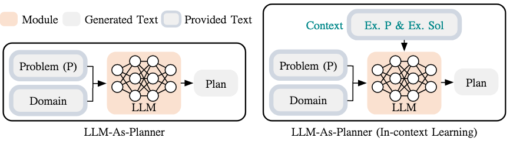
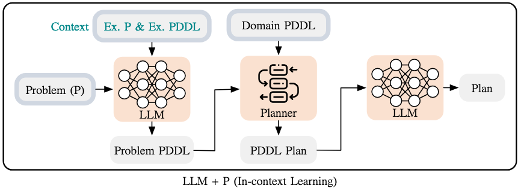

- | 特性                 | A*（1968）                      | STRIPS（1970s）               | Non-Linear Planning（1970s）     | Graphplan（1995）            | HTN（1980s）                    | SATPLAN（1990s）              | PDDL（1998）                  | FF Planning System（2000）    | RL（1980s）                   | LLM（2018）                     |
  |----------------------|----------------------------------|------------------------------|----------------------------------|-----------------------------|---------------------------------|------------------------------|------------------------------|---------------------------------|--------------------------------|
  | **提出时间**          | 1968                             | 1970s                        | 1970s                            | 1995                        | 1980s                           | 1990s                        | 1998                         | 2000                           | 1980s                         | 2018                           |
  | **适应性**            | 低，依赖于启发式函数               | 中，依赖于问题建模和预设规则   | 高，能够处理不确定和复杂情境     | 中，能处理某些非线性问题     | 高，支持分层任务结构           | 高，基于逻辑可扩展              | 中等，规则较固定               | 高，支持大规模问题            | 高，能从环境反馈学习            | 高，适应不同领域和任务         |
  | **长期规划能力**      | 中，适合短期路径规划              | 低，通常处理的是即时目标       | 高，能处理长期任务和复杂约束     | 中，能处理短期任务和路径规划 | 高，能分解复杂任务为子任务     | 中，能处理具有长期目标的规划   | 中，适合明确的目标问题         | 高，优化复杂任务规划           | 高，能够优化长期决策            | 一定程度上可处理，但非专门优化 |
  | **可扩展性**          | 高，广泛应用于路径规划问题         | 低，限制于线性问题             | 中等，复杂问题时困难             | 中，扩展性有限               | 高，能够应对大规模分层任务     | 高，适应不同规模的问题         | 中，处理复杂问题时可能困难     | 高，支持大规模问题            | 高，能够适应不同环境            | 高，支持多领域任务             |
  | **实时性**            | 高，适用于实时路径规划             | 低，通常不适合实时响应         | 低，计划生成较慢                 | 中，较快但不完全适应实时任务 | 低，规划时间较长               | 低，基于SAT求解，实时性差       | 中，取决于问题规模             | 高，基于启发式优化，实时性较好   | 低，训练时间长，实时性差        | 高，实时生成响应                |
  | **精度与优化**        | 高，提供最优路径规划               | 中，依赖于精确建模             | 高，能够通过回溯和尝试获得最优解  | 高，能够优化规划路径         | 高，能够生成结构化任务计划     | 中，基于逻辑的可满足性问题求解   | 中等，受限于规则的表达能力     | 高，快速求解最优解             | 高，能够优化长期回报           | 中，生成的计划缺乏精确控制      |
  | **约束处理能力**      | 中，依赖于启发式函数               | 强，能够表达显式约束           | 强，能够处理复杂的约束和约束之间的关系 | 中，处理复杂约束能力有限     | 强，能够处理任务的层次化约束   | 强，能够通过逻辑推理处理约束    | 强，能够处理丰富的约束和条件   | 强，能够精确处理复杂约束       | 中等，处理约束能力一般          | 较差，处理约束能力有限         |
  | **易用性**            | 高，广泛应用，易于理解和实现       | 低，建模复杂且规则不易理解     | 低，建模复杂，理解较难           | 中，基于图的结构，较难理解   | 中等，建模复杂，需分解任务结构 | 低，较为复杂，基于逻辑推理求解  | 中，依赖于特定的建模方法       | 高，快速开发和应用             | 需要大量的训练数据和调参        | 高，易于通过自然语言与系统交互 |
  | **计算开销**          | 中，适用于较小规模问题             | 低，效率高                     | 高，特别是在问题空间较大时       | 中，计算较为复杂             | 高，层次任务结构较为复杂       | 高，基于SAT求解，计算开销大    | 中等，取决于问题规模           | 高，尤其是在复杂问题时         | 高，计算需求较高               | 高，推理过程计算需求大          |
  | **可解释性**          | 高，路径和决策过程容易解释         | 中等，基于规则推理，容易理解   | 中等，能通过回溯理解过程         | 高，能够展示图结构的决策过程  | 高，分解为层次化任务，容易理解 | 中，基于逻辑公式，推理过程较为抽象 | 中等，规则较为固定，理解容易   | 高，易于解释搜索和优化过程     | 较差，策略可能不透明            | 较差，模型决策缺乏透明性        |
- 说明：
	- **A***: 经典的启发式搜索算法，常用于路径规划，效率较高，但在处理较复杂任务时可能会遇到计算瓶颈。
	- **STRIPS**: 传统的规划方法，基于命令和操作的框架，适用于静态环境，但缺乏灵活性。
	- **Non-Linear Planning**: 能够处理不确定性和动态变化，适用于更复杂的规划任务。
	- **Graphplan**: 提供了一种基于图的规划方法，能够处理某些非线性规划问题，但实时性较差。
	- **HTN**** (****Hierarchical Task Network****)**: 分层任务网络，适用于将复杂任务分解为多个子任务，能够处理长远规划问题。
	- **SATPLAN**: 基于可满足性问题的规划方法，通过逻辑推理处理约束，适用于具有复杂约束的规划问题。
	- **PDDL**: 计划领域定义语言，广泛用于AI规划，能够处理复杂任务和多约束问题。
	- **FF**** Planning System**: 基于启发式搜索的快速规划系统，能够优化规划路径，适用于大规模问题。
	- **RL**** (****Reinforcement Learning****)**: 适用于动态环境，通过环境反馈优化长期决策，能够自动调整策略。
	- **LLM**** (****Large Language Models****)**: 基于大规模语言模型的规划方法，能够处理多领域任务，但缺乏精确约束处理能力。
	- 
- ### LLM+传统规划器
	- 
-