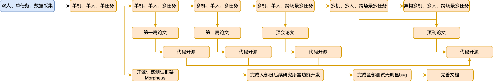

- #多智能体 #协同
- “眼力见”
  从“任务驱动”转向“事件驱动”
  区别：任务由人类下达，而事件自然随机发生
  结果：增加适应性，更接近自主决策能力
- 数据切片成决策
- ## Roadmap
	- 基于[[Project Morpheus]]具备机器人物理仿真的：
	- 单机、单人、单任务
	- 单机、单人、多任务
	- 多机、单人、多任务
	- 多机、单人、跨场景多任务
	- 多机、多人、跨场景多任务
	- 异构多机、多人、跨场景多任务
	- 
- ## Autogame实习规划
	- 多智能体 通过优化：1.环境感知和 2.根据感知决策的多模态大语言模型 主动协同人类玩家完成任务，例如：（短期决策）和玩家一起配合击败敌人，（长期决策）在玩家未下达请求时自主探索环境并收集玩家可能需要的资源
	- ### 对课题组价值
		- 极有潜力的研究方向
		  logseq.order-list-type:: number
		- 模型开发后的开源影响力
		  logseq.order-list-type:: number
		- 论文发表（第一组织）
		  logseq.order-list-type:: number
		- 通过使用现有游戏环境和API支持，节省研发针对协作任务优化的多模态大语言基础模型所需时间，同一个模型理论上可用于游戏人物决策也可用于机器人决策
		  logseq.order-list-type:: number
		- 可以带来大量大模型API算力支持供大家需要时使用
		  logseq.order-list-type:: number
	- ### 对Autogame公司价值
		- 该模型及相关框架的专利、使用权
		  logseq.order-list-type:: number
		- 论文挂名（二作）
		  logseq.order-list-type:: number
	- ### 对个人价值
		- 论文发表（一作）
		  logseq.order-list-type:: number
		- API算力
		  logseq.order-list-type:: number
		- 学习业界实际使用大模型的经验
		  logseq.order-list-type:: number