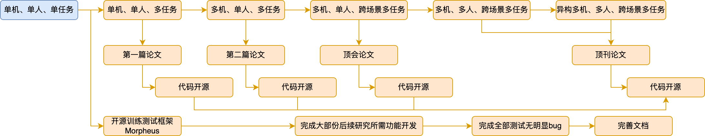

- #多智能体 #协同
- “眼力见”
  从“任务驱动”转向“事件驱动”
  区别：任务由人类下达，而事件自然随机发生
  结果：增加适应性，更接近自主决策能力
- 数据切片成决策
- ## Roadmap
	- 基于[[Project Morpheus]]具备机器人物理仿真的：
	- 单机、单人、单任务
	- 单机、单人、多任务
	- 多机、单人、多任务
	- 多机、单人、跨场景多任务
	- 多机、多人、跨场景多任务
	- 异构多机、多人、跨场景多任务
	- {:height 173, :width 855}
	-