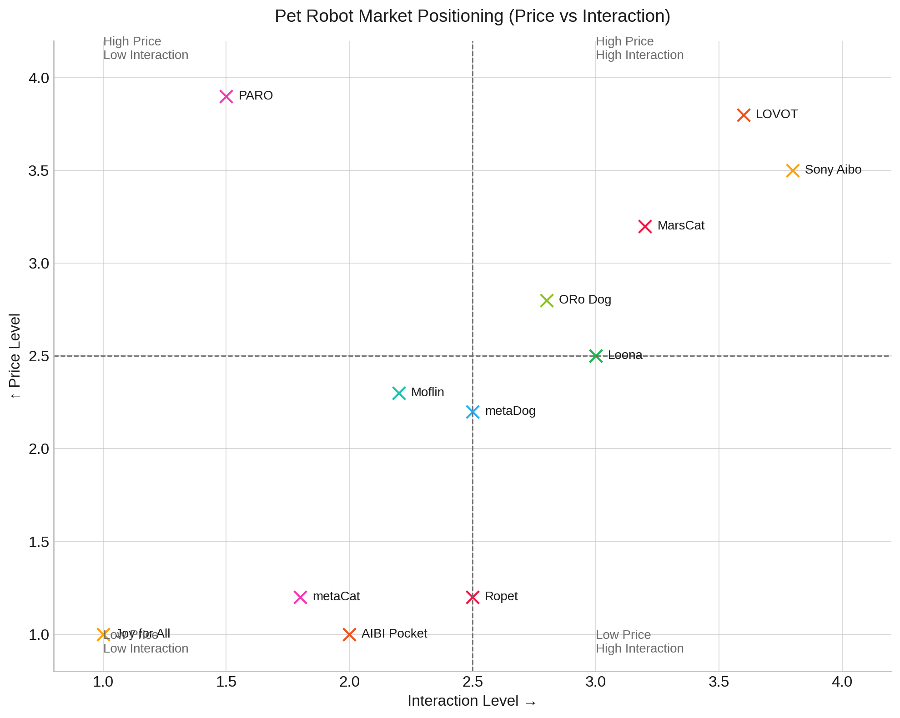

- 下面是一张整合后的全球宠物机器人产品对比表，包含此前调研的非中国产品+来自中国厂商的品牌，保留美元原价，新增人民币价格（汇率约 1 USD ≈ 7 CNY）：
  | 💰 价格区间（USD）     | 产品名称（厂商）                             | 美元价格约   | 人民币价格约  | 🎯 目标人群                          | 🤖 形态与交互体验描述 |
  |------------------------|----------------------------------------------|--------------|----------------|--------------------------------------|-----------------------|
  | **💸 经济型 $100–300** | Joy for All（Ageless Innovation，美国）      | $124.99      | ¥875           | 老人、养老院                          | 拟真猫狗，触摸感应，发声反馈 |
  |                        | Eilik（Energize Lab，中国）                  | $139.99      | ¥980           | 儿童、桌面用户                        | LED表情、触摸互动、社交感应 |
  |                        | metaCat（大象机器人，中国）                  | $159          | ¥1,113         | 儿童、老人                            | 拟真毛发、声音回应、轻互动 |
  |                        | AIBI Pocket（Living.AI，中国）               | $249          | ¥1,743         | 青少年、科技爱好者                    | 掌上AI、语音交互、表情识别 |
  |                        | Emo（Living.AI，中国）                       | $279          | ¥1,953         | 家庭、桌面AI控                        | AI情感宠物，声光互动丰富 |
  |                        | Looi（AI Companion）                         | ~$279         | ~¥1,953        | 与Emo/Eilik类似用户                   | 桌面机器人、萌表情、触摸语音互动 |
  |                        | Cosmo（未知制造商）                          | ~$279         | ~¥1,953        | 儿童、办公桌面                        | 情感AI，富有表情与触觉响应 |
  |                        | Echoear（未知品牌）                          | $200–300      | ¥1,400–2,100   | 家庭、儿童                            | LED情绪反馈、声音识别、互动反馈 |
  |                        | Ropet（萌友智能，中国）                     | $169–299      | ¥1,183–2,093   | 家庭、儿童、疗愈用户                  | 毛绒球型AI，体温模拟+GPT对话 |
  | **⚖️ 中端 $300–800**  | Moflin（日本 Casio）                         | $398          | ¥2,786         | 成年人、抗孤独用户                    | 情感学习，自主表情反应 |
  |                        | Loona（KEYi Tech，中国）                     | $499          | ¥3,493         | 儿童、家庭用户                        | 四足行走，语音、手势、抛球互动 |
  |                        | metaDog/metaPanda（大象机器人，中国）       | $700          | ¥4,900         | 儿童、情感陪伴用户                    | 仿真毛绒狗熊，丰富表情反应 |
  |                        | ORo Dog Companion（Ogmen ORo）              | $799          | ¥5,593         | 忙碌上班族、有狗但不在家的用户        | 自动投喂抛球、监控互动一体 |
  | **🏆 高端 $1000+**     | MarsCat（大象机器人，中国）                 | $1,199        | ¥8,393         | 家庭、科技爱好者、教育机构            | 拟真猫体，边缘AI识人，可编程行为 |
  |                        | Sony Aibo（索尼，日本）                     | $2,899        | ¥20,293        | 高端科技控、研究用户                  | 犬型自主AI，摄像头导航、互动学习 |
  |                        | LOVOT（Groove X，日本）                     | ~$3,000       | ~¥21,000       | 家庭亲子、陪伴疗愈、情感需求高人群    | 圆形身体+机械臂，拥抱、感温感应 |
  |                        | PARO Robot Seal（日本 AIST）                | ~$6,120       | ¥42,840        | 医疗机构、认知障碍照护                | 海豹毛绒形，疗愈用触觉与声控交互 |
- 
- ---
- ### **🧠 总体观察**
- **中国品牌（AIBI、Ropet、meta 系列、MarsCat）**已覆盖中端及部分高端市场，强调情感交互与仿真体验。
- **国际产品**如 Aibo、LOVOT、PARO 等仍主导高端用户与医疗/科研领域。
- 美元原价与人民币换算并存，有助于更直观地评估预算。
  
  若需补充各型号购买渠道、详细技术规格或对比评测，欢迎继续提出！