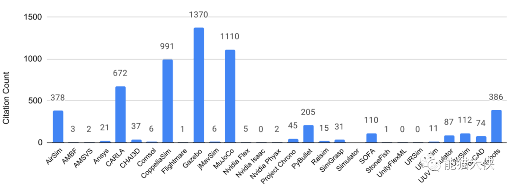
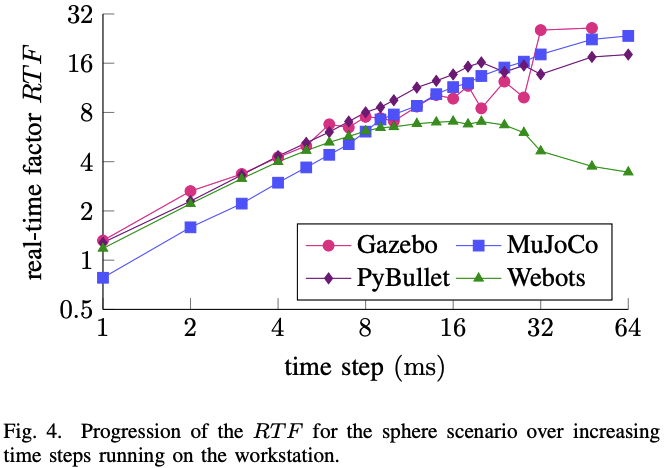
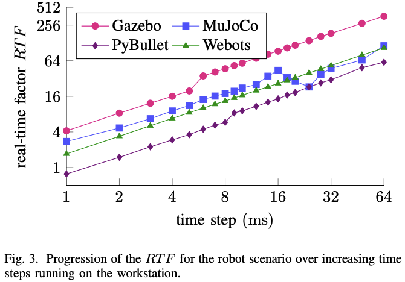

## 目录
	- ((66c10427-27ff-409f-a4d3-973dd0c727d2))
	- ((66c10399-1a88-4ca1-81e5-1474fda3ba38))
	- ((66c10235-0dd4-4ae4-98aa-202524730f4c))
	- ((66c102a1-760d-4578-b22f-fb37a88b1470))
	- ((66c1038d-b9fd-4e3d-b6b4-a2359d77aa90))
- ### 定义
	- 机器人仿真软件定义为一个满足以下所有功能的终端用户软件应用程序：
	- （i）用于真实建模物理现象的物理引擎；
	- （ii）碰撞检测和摩擦模型；
	- （iii）图形用户界面（GUI）；
	- （iv）导入场景和网格的功能；
	- （v）针对机器人社区使用的编程语言（C++/Python）的API；
	- （vi）各种关节、执行器和传感器的现成模型。
	- [机器人仿真软件综述](https://www.lianzhao.xyz/article/simulator_review)
	- 2016年至2020年被评审的仿真软件的使用次数：
		- 
	-
- ### 理想设计方案
  id:: 66c10427-27ff-409f-a4d3-973dd0c727d2
	- [[通用异构多机机器人数字孪生基座]]
- ### 常见仿真平台
  id:: 66c10399-1a88-4ca1-81e5-1474fda3ba38
	- 常见的机器人仿真平台，以及它们各自的优缺点：
	- 1. **Gazebo**：
		- **优点**：
			- 开源且强大：作为ROS生态系统的一部分，Gazebo具有强大的功能，支持多种传感器和机器人平台。
			- 丰富的传感器模型：Gazebo支持多种传感器模型，包括激光雷达、摄像头、惯性测量单元等。
			- 可扩展性：用户可以自定义机器人模型和环境。
		- **缺点**：
			- 学习曲线较陡：对于初学者来说，Gazebo的学习曲线可能较陡峭。
			- 需要一定的计算资源：Gazebo的仿真计算需要一定的计算资源。
	- 2. **Webots**：
		- **优点**：
			- 强大且开源：Webots是一款功能强大的机器人仿真软件，支持多种机器人类型和传感器。
			- 丰富的传感器模型：Webots支持多种传感器，包括激光雷达、摄像头、声纳等。
			- 跨平台：支持Linux、Windows和macOS。
		- **缺点**：
			- 需要付费获取技术支持：虽然已经开源，但获取技术支持仍需付费。
	- 3. **CoppeliaSim（原V-REP）**：
		- **优点**：
			- 强大且支持多平台：CoppeliaSim是一款商用仿真软件，但教育版免费。支持Windows、Linux和macOS。
			- 可视化编程：CoppeliaSim支持可视化编程，使编写仿真代码更加容易。
			- 丰富的传感器和机器人模型：支持多种传感器和机器人类型。
		- **缺点**：
			- 商用版需要付费：商业版本需要购买许可证。
	- 4. **NVIDIA Isaac Sim**：
		- 一款基于 **NVIDIA Omniverse** 的机器人和人工智能仿真应用框架。它支持构建虚拟的机器人世界和实验，具备以下关键功能：
			- 1. **逼真的模拟**：Isaac Sim 利用 Omniverse 平台强大的仿真技术，包括基于 GPU 的物理仿真（使用 NVIDIA PhysX）、实时光线和路径追踪的逼真图像以及基于物理的材质定义（MDL）支持。
			- 2. **模块化架构**：Isaac Sim 的设计目标是满足许多常见用例，包括操作、导航和用于训练数据的合成数据生成。其模块化设计还意味着可以根据需要定制和扩展工具。
			- 3. **可扩展的合成数据生成**：Isaac Sim 支持随机化，用于训练和测试移动机器人和机械臂。3D 资产的环境动态和其他属性（如光照、反射、颜色和位置）都可以随机化。
		- 缺点：
			- 1. **硬件要求高**：由于 Isaac Sim 利用 NVIDIA Omniverse 平台的强大图形和物理仿真技术，因此需要高性能的 GPU 和计算资源。
			- 2. **学习曲线陡峭**：尽管 Isaac Sim 提供了丰富的功能和模块，但对于新手来说，掌握这些功能可能需要较长时间。
			- 3. **复杂性**：由于其模块化设计和广泛的应用场景，Isaac Sim 可能会显得过于复杂，特别是对于只需要基本仿真功能的用户。
-
- ### 机器人仿真难点
  id:: 66c10235-0dd4-4ae4-98aa-202524730f4c
	- 1. **复杂性和多自由度**：
		- **问题**：机器人系统通常具有复杂的结构和多自由度，导致动力学模型变得复杂。
		- **解决方法**：使用高效的动力学引擎，如MuJoCo，来处理复杂的运动学和动力学计算。
	- 2. **硬件平台不易获得**：
		- **问题**：搭建实际硬件平台成本高昂，对于个人和团队来说可能不可行。
		- **解决方法**：使用仿真环境作为廉价的学习和测试平台，以开发和验证软件算法。
	- 3. **精度与速度的权衡**：
		- **问题**：精确的数学模型会增加求解器的负担，但过于简化可能导致不准确的仿真结果。
		- **解决方法**：选择合适的物理引擎，平衡计算精度和速度。
	- 4. **评价指标不一致**：
		- **问题**：不同应用场景对仿真软件的评价标准不一致。
		- **解决方法**：根据具体需求制定统一的评价指标，考虑计算速度、精度、接触模型、兼容性等
-
- ### 物理引擎
  id:: 66c102a1-760d-4578-b22f-fb37a88b1470
	- **[[MuJoCo]]**（Multi-Joint dynamics with Contact）：
		- 特色：一个免费且开源的物理引擎，旨在促进机器人学、生物力学、图形和动画等领域的研究和开发。
		- 优点：它具有速度、精度和建模能力的独特组合，专为模型优化而设计，特别是通过接触进行优化。MuJoCo使得计算密集型技术（如优化控制、物理一致状态估计、系统识别和自动机构设计）得以扩展，并应用于具有丰富接触行为的复杂动力系统。
		- 缺点：无图形界面，缺乏逆运动学和路径规划的支持
	- **Bullet**：
		- **特色**：Bullet是一款开源的物理引擎，支持多种平台，包括Windows、Linux和macOS。它适用于机器人仿真、游戏开发和虚拟现实等领域。
		- **优点**：高性能、易用、跨平台、丰富的功能。
		- **缺点**：对于某些复杂模型，性能可能不如MuJoCo。
	- **ODE**（Open Dynamics Engine）：
		- **特色**：ODE是另一款开源的物理引擎，专注于刚体动力学和碰撞检测。
		- **优点**：高度可定制、支持多种约束类型、适用于机器人控制和仿真。
		- **缺点**：对于柔性物体和流体模拟，ODE的性能较弱。
	- **PhysX**：
		- **特色**：由NVIDIA开发的商业物理引擎，广泛用于游戏开发和虚拟现实。
		- **优点**：高性能、丰富的特性、支持GPU加速。
		- **缺点**：商业许可证需要付费。
	- [[Mujoco与PhysX比较]]
	- {:height 400, :width 300}
	- {:height 400, :width 300}
- ### URDF
  id:: 66c1038d-b9fd-4e3d-b6b4-a2359d77aa90
	- **URDF**（Unified Robot Description Format，统一机器人描述格式）是一种用于描述机器人结构和属性的XML文件格式。它在ROS（Robot Operating System）中被广泛应用，用于机器人导航、仿真和感知等功能。
	  
	  以下是URDF文件中常用的标签和数据结构：
	- 1. **<link> 标签**：
		- 用于描述机器人某个刚体部分的外观和物理属性，包括尺寸、颜色、形状、惯性矩阵和碰撞参数等。
		- 基本语法如下：
		    ```xml
		    <link name="<link name>">
		        <inertial>...</inertial>
		        <visual>...</visual>
		        <collision>...</collision>
		    </link>
		    ```
	- 2. **<joint> 标签**：
		- 用于描述机器人关节的运动学和动力学属性，包括关节运动的位置和速度限制。
		- 必须指定父link和子link，还可以设置关节的其他属性。
		- 基本语法如下：
		    ```xml
		    <joint name="<name of the joint>">
		        <parent link="parent_link" />
		        <child link="child_link" />
		        <!-- Other joint properties -->
		    </joint>
		    ```
	- 3. **<robot> 标签**：
		- 完整机器人模型的最顶层标签，包含一系列的<link>和<joint>。
		- 基本语法如下：
		    ```xml
		    <robot name="<name of the robot>">
		        <link>...</link>
		        <link>...</link>
		        <joint>...</joint>
		        <joint>...</joint>
		    </robot>
		    ```
	- 4. **<gazebo> 标签**：
		- 用于描述机器人模型在Gazebo中仿真所需的参数，包括材料属性和Gazebo插件等。
		- 只有在Gazebo仿真时才需加入。
		- 基本语法如下：
		    ```xml
		    <gazebo reference="link_1">
		        <material>Gazebo/Black</material>
		    </gazebo>
		    ```
	- URDF文件描述了机器人的结构、关节、外观和物理属性，以及与仿真环境的交互信息。
	- 5. **惯性矩阵**
		- 在 **URDF**（Unified Robot Description Format，统一机器人描述格式）文件中，**惯性矩阵**描述了机器人模型中每个刚体部分的惯性特性。它包括刚体的质量、质心位置和惯性张量。让我详细解释一下：
		  
		  1. **质量**（Mass）：
			- 表示刚体的总质量，通常以千克（kg）为单位。
			- 在URDF中，通过 `<inertial>` 标签中的 `<mass>` 元素来定义。
		- 2. **质心位置**（Center of Mass）：
			- 表示刚体的质心相对于刚体坐标系的位置。
			- 通常以三维向量 (x, y, z) 来表示，其中 (0, 0, 0) 通常是刚体的原点。
			- 在URDF中，通过 `<inertial>` 标签中的 `<origin>` 元素来定义。
		- 3. **惯性张量**（Inertia Tensor）：
			- 描述刚体绕其质心旋转的惯性特性。
			- 惯性张量是一个对称的3x3矩阵，通常表示为：
			    ```
			    I = | Ixx  Ixy  Ixz |
			        | Ixy  Iyy  Iyz |
			        | Ixz  Iyz  Izz |
			    ```
			- 其中 Ixx、Iyy 和 Izz 是刚体绕坐标轴的惯性矩，Ixy、Ixz 和 Iyz 是刚体之间的交叉惯性矩。
			- 在URDF中，通过 `<inertial>` 标签中的 `<inertia>` 元素来定义。
		- 惯性矩阵是机器人模型中刚体的重要属性，对于运动学和动力学计算至关重要。
	- 6. **其他格式**
		- 除了 **URDF**（Unified Robot Description Format，统一机器人描述格式），还有一些其他类似的机器人模型描述格式：
		- 1. **SDF**（Simulation Description Format）：
			- SDF是一种用于描述机器人和环境的XML格式，主要用于Gazebo仿真环境。
			- 它支持更丰富的功能，包括传感器、灯光、材料、物理属性等。
			- SDF通常用于机器人仿真和虚拟环境。
		- 2. **Xacro**：
			- Xacro是一种URDF的扩展，允许使用宏和参数来简化URDF文件的编写。
			- 它可以更灵活地生成URDF，减少冗余代码。
		- 3. **Collada**：
			- Collada是一种通用的3D模型描述格式，不仅用于机器人，还用于游戏、动画等领域。
			- 它支持多种3D软件工具，如Blender、Maya、3ds Max等。
-
-