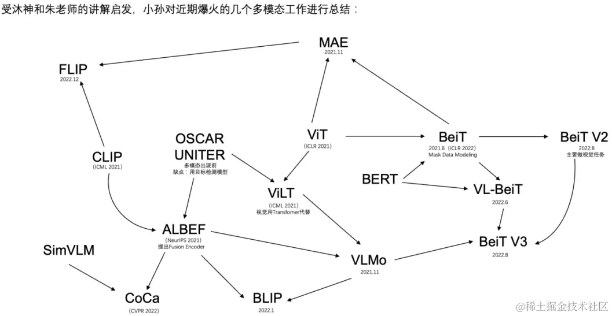
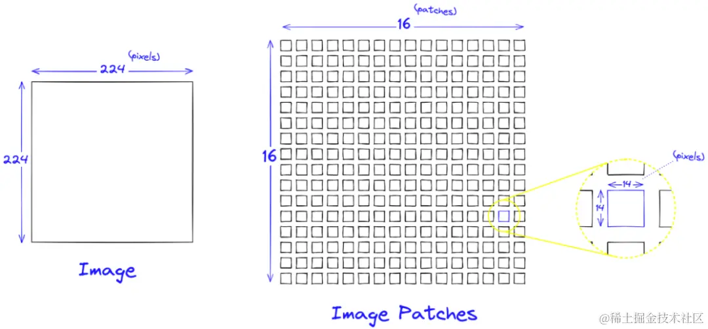

- [[Bert vs GPT]]
- 多模态->全模态快要到来
- 主要是视觉+文本，视觉任务尚未统一
- 
- ### **图像转换Embedding**
	- 图像转Emdedding一般采用Vit Transformer模型。首先，把图像分成固定大小的patch，类比于LLM中的Tokenization操作；然后通过线性变换得到patch embedding，类比LLM中的Embedding操作。由于Transformer的输入就是token embeddings序列，所以将图像的patch embedding送入Transformer后就能够直接进行特征提取，得到图像全局特征的embeddings。具体步骤如下：
	- 
	- 图像预处理：
	- 输入图像大小：224x224像素，3个颜色通道（RGB）+ 预处理：归一化，但不改变图像大小图像切分：
	- 假设每个patch大小为14x14像素，图像被切分成(224/14) × (224/14) =256个patches 线性嵌入：
	- 将每个14x14x3的patch展平成一个一维向量，向量大小为 14×14×3=588
	- 通过一个线性层将每个patch的向量映射到其他维的空间（假设是D维），例如D=768 , 每个patch被表示为一个D维的向量。最后，由于Transformer内部不改变这些向量的大小，就可以用256*768的embeddings表示一张图像。
- 机器人数据对齐文本
- 专属数据集，特殊单词（如open，close）有特殊含义，设计更好的template
- 第一类工作：
	- 多个首个，贡献最多共同一作
- 第二类工作：
	- Markdown新数据范式
-