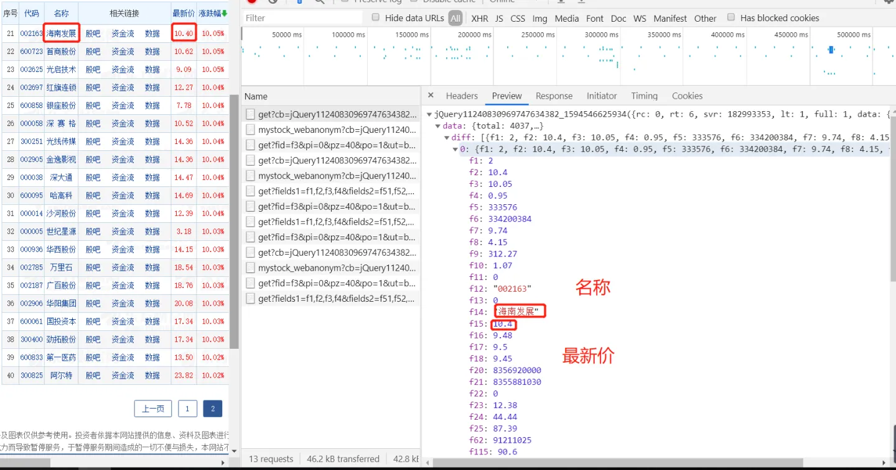

- #股票 #数据分析 #量化交易
- 曾有多家财经网站有公开的交易数据下载端口，如雅虎财经，[新浪财经](https://vip.stock.finance.sina.com.cn/mkt/)，[同花顺](https://data.eastmoney.com/zjlx/detail.html)等，但是都逐一关闭或收费了
- 目前有两种较稳定的免费数据获取方式：
- # 财经网站爬虫
	- 参考[Python 爬虫 | 股票数据的获取](https://zhuanlan.zhihu.com/p/159200115)
	- 打开如同花顺等财经网站股票行情页面，打开浏览器开发者模式，找到数据对应的请求
	- 
	- 从中易得返回值与请求参数的联系，用于开发爬虫
- #
	-